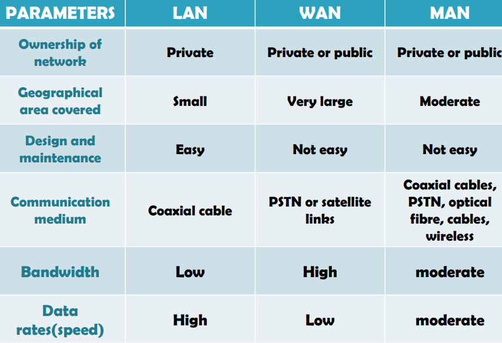
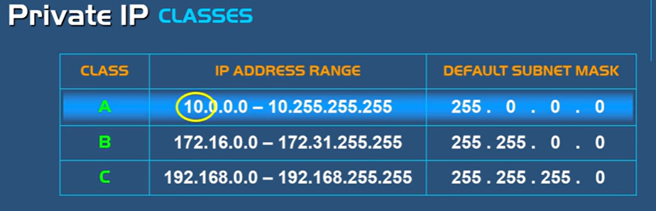
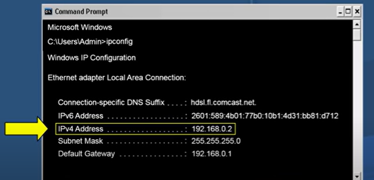
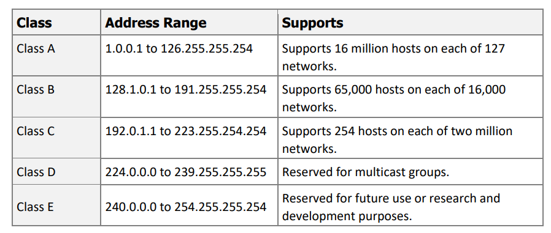

# Networking - Basic

[Back](../index.md)

- [Networking - Basic](#networking---basic)
  - [Computer Networking](#computer-networking)
    - [CLASSIFICATION OF AREA BY THEIR GEOGRAPHY](#classification-of-area-by-their-geography)
  - [IP](#ip)
  - [Public IP Address](#public-ip-address)
  - [Private IP Address](#private-ip-address)
  - [Classes of IP Addresses](#classes-of-ip-addresses)

---

## Computer Networking

- A `computer network` is defined as the interconnection of two or more computers.

  - It is done to enable the computers to communicate and share available resources.

- `Network`:

  - Computers connected to each other to exchange information.

- COMPONENTS OF COMPUTER NETWORK
  - Two or more computers
  - Cables as links between the computers
  - A network interfacing card(NIC) on each computer
  - Switches
  - Software called operating system(OS)

### CLASSIFICATION OF AREA BY THEIR GEOGRAPHY

- LOCAL AREA NETWORK(LAN)

  - LAN is a network which is designed to operate over a small physical area such as an office, factory or a group of buildings.
  - LAN’s are easy to design and troubleshoot
  - Exchange of information and sharing of resourcesbecomes easy because of LAN.
  - In LAN all machines are connected to a singlecable.
  - Different types of topologies such as star, tree,bus, ring, etc Can be used
  - It is usually a privately owned network.

- WIDE AREA NETWORK(WAN)

  - When network spans over a large distance or when the computers to be connected to each other are at widely separated locations a local area network cannot be used. A wide area network(WAN) is installed.
  - The communication between different users of WAN is established using leased telephone lines, satellite links and similar channels.
  - It is cheaper and more efficient to use the phone network for the link.
  - Most WAN networks are used to transfer large blocks of data between its users.

- METROPOLITAN AREA NETWORK(MAN)

- It is in between LAN & WAN technology that covers the entire city.
- It uses similar technology as LAN.
- It can be a single network such as cable TV network, or a measure of connecting a number of LAN’s o a large network so that resources can be shared LAN to LAN as well as device to device.

---

## IP

- `IP`: `Internet Protocol`

  - a set of rules that determine how data is moved over the internet.
  - defines how to address and route each packet to make sure it reaches the right destination.

- `IP address`:

  - An `IP address` is a numeric address.
  - An `IP address` is an **identifier** of a computer or device on a network.
    - Identifies each computer and network device on a network.
    - Allows users to differentiate one computer from another computer on the network.
  - Every device has to have a `IP address` **for communication purpose**.
  - Consists of four blocks of numbers, ranging from 0 to 255, separated with a single dot (note that each block of numbers represents one octet and the entire IP address is four octets long).
  - Reads as 172.16.10.20.
  - Required for network communication.

- `TCP`: `Transmission Control Protocol`

  - Defines rules for establishing and maintaining network communication between two computers.
  - Works in collaboration with IP to ensure that data is delivered to the correct destination.
  - Breaks data into smaller packets, send the packets in sequence and then reassembles them at the destination.
  - Maintains data integrity.
    - guarantees that packets will be delivered in the same order in which they were sent. 保证完整性
  - Establishes an end-to-end connection between the sending and receiving computers before transmitting data.
  - Considered to be reliable because it ensures that data is sent by retransmitting lost data.

- TCP/IP: `Transmission Control Protocol/Internet Protocol`

  - a network protocols to transfer data between computers within the network.

- Two different types of IPv4 addresses
  - public and private

---

## Public IP Address

- are registed on the internet to give access to the world wide web.

  - cannot access to the internet without a public IP address.
  - Used over the Internet.
  - used externally
  - not secure

- are **unique**.

  - there are no duplicate public IP address anywhere in the world
  - A `public IP Address` is assigned to only one subscriber in the world
  - a subscriber may lease more than one public IP address.

- Leased by `Internet service providers(ISP)` at an additional cost on top of their Internet plans.

---

## Private IP Address

- are not publicly registed on the internet

  - only used internally
  - cannot access to internet
  - used internally and tracable
  - more secure, cannot be traced by the outside network

- Leasing IP addresses from the `ISP` is not required.

  - Configured and maintained by a local `administrator`.
  - assigned by router
  - `DHCP`: a service inside a router to assign internal devices `private IPs`
  - its free

- No unique

  - can be used in other networks
  - Assigned to an organization network and must be **unique** within that network.

- `Network Address Translation (NAT)` protocol: a service built inside a router to translate a set of IP address to another set of IP address.

  - Before accessing to the internet, the private IP address must be translate into a public IP address.
  - enable internal computers to connect to the Internet (but is not compatible for Internet communication).
  - translate private into public and vice versa.

- Classes: 区别: 子网容量
  

- To find out the IP address of a device

  - windows: `ipconfig`
  - linux: `ifconfig`

  

---

## Classes of IP Addresses

- Created and arranged by the `Internet Assigned Numbers Authority (IANA)`.

  - Define the possible number of networks and the number of hosts per network.

- Consist of five classes of IP addresses by default (A, B, C, D and E — note that IP addresses from class E are reserved for experimental and research purposes).
  - Distinguished by the **first octet** of the IP address.
  - Configure computer IP addresses using classes A, B and C.
  - Network between special services or protocols using class D.
  - Reserve the address range between 127.0.0.0 to 127.255.255.255 for `loopback` and diagnostic functions.

---

[TOP](#networking---basic)
