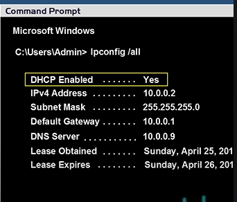

# Networking - Command

[Back](../index.md)

- [Networking - Command](#networking---command)
  - [Windows](#windows)
    - [DHCP](#dhcp)

---

## Windows

- `ipconfig`

  - Displays all current TCP/IP network configuration values and refreshes Dynamic Host Configuration Protocol (DHCP) and Domain Name System (DNS) settings.

- `ping`

  - Used to test the connectivity between two hosts.
  - Allows users to determine issues with the network connection.

- `tracert <domain>`:

  - Used to track the path taken from the source to the destination host.
  - Displays the time taken to transmit to the destination.

- `route print 4`:

  - Used to view the local routing table.
  - Allows users to add and modify the routes in the routing table.

- `netstat`
  - Used to view network connections and statistics.
  - Displays routing tables and the number of network interfaces.

---

### DHCP

- `ipconfig /all`

---

[TOP](#networking---command)
