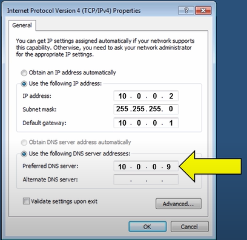

# Networking - DHCP

[Back](../index.md)

- [Networking - DHCP](#networking---dhcp)
  - [IP Configuration Methodology](#ip-configuration-methodology)
  - [DHCP](#dhcp)
    - [Components of DHCP](#components-of-dhcp)
  - [Lease](#lease)
  - [D.O.R.A](#dora)
  - [DHCP Scope](#dhcp-scope)
    - [DHCP Scope Exclusions](#dhcp-scope-exclusions)
    - [DHCP Scope Reservations](#dhcp-scope-reservations)
  - [DHCP Options](#dhcp-options)
  - [DHCP Server Placement Best Practices](#dhcp-server-placement-best-practices)
  - [Pros \& Cons](#pros--cons)
  - [DHCP Troubleshooting Tools](#dhcp-troubleshooting-tools)

---

## IP Configuration Methodology

- `Static`:

  - Describes an IP address that is **manually** configured on the hosts.
  - Consumes a lot of time to configure and is convenient for small networks.
  - Recommends configuration on all **servers** on the network.

- `DHCP Dynamic`:

  - Describes IP addresses that are assigned to computers **automatically** from a single server or device.
  - Recommends use for a large network because it is fast and efficient and eliminates typographical errors.
  - Reduces administrative efforts for maintaining network connectivity.

- `DHCP Reservation`:

  - Ensures consistent use of the same IP address on a specific computer.
  - Keeps the same network address on computers that perform **special tasks**.

- `Automatic Private IP Addresses (APIPAs)`:

  - Function as a built-in service that allows computers to auto-configure IP addresses when there are no static or dynamic IP addresses configured.
  - Assign IP addresses on computers, even when they are not exchanging data on the network.
  - Push computers to assign themselves an address when no IP address is configured.
  - Assign IP addresses ranging from `169.254.0.1` to `169.254.255.254`.

---

## DHCP

- `DHCP`:

  - `Dynamic Host Configuration Protocol`: a network management protocol that is used to dynamically assign the IP address and other information to each host on the network so that they can communicate efficiently.
  - `DHCP` automates and centrally manages the assignment of `IP address` easing the work of network administrator.
  - In addition to the IP address, the DHCP also assigns the `subnet masks`, `default gateway` and `domain name server(DNS)` address and other configuration to the host and by doing so, it makes the task of network administrator easier.
  - DHCP is a service that runs on a server, such as Microsoft server or a Linux server, and runs on routers.

- 逻辑:

  - Every computer on a network has to have an IP address, which is an identifier for a computer or device on a network.
  - 2 ways to assign an IP address, using:

    - a `Static IP`: where a user assigns an IP address manually.
      - configuration:
        - ip address
        - subnet mask
        - gateway
        - DNS
          
      - may raise ip conflict
    - a `Dynamic IP`: where a computer gets an IP address from a `DHCP` server.

---

### Components of DHCP

1. `DHCP Server`: It is typically a **server** or a **router** that holds the network configuration information.
2. `DHCP Client`: It is the endpoint that gets the configuration information from the server like any computer or mobile.
3. `DHCP Relay Agent`: If you have only one `DHCP Server` for **multiple LAN’s** then the DHCP relay agent present in every network will forward the DHCP request to the servers. This because the DHCP packets cannot travel across the router. Hence, the relay agent is required so that DHCP servers can handle the request from all the networks.
4. `IP address pool`: It contains the **list** of `IP address` which are available for assignment to the client.
5. `Subnet Mask`: It tells the host that in which network it is currently present.
6. `Lease Time`: It is the amount of time for which the IP address is available to the client. After this time the client must renew the IP address.
7. `Gateway Address`: The gateway address lets the host know where the gateway is to connect to the internet.

---

## Lease

- The `DHCP server` assigns the IP address as a `lease`.
- `Lease`:
  - the amount of time which the IP address is available to the client.
  - help make sure the `DHCP server` does not run out of IP addresses.
- Assigns IP addresses to computers for a **limited time** only.
- Leases IP addresses for **eight days** for devices connected to a network using a <u>wired connection</u> and **eight hours** for devices connected using a <u>Wi-Fi connection</u>.
- Automatically renews leased IP addresses before the lease expires.
- Reassigns expired leased IP addresses to other devices via the DHCP server.

- Modifying Lease Duration

  - Increases the default lease time if the network environment is steady, such as a police station.
  - Recommends increasing the lease time when at least 20 per cent of IP addresses are available.
  - Decreases the default lease time if the network environment is busy, such as a coffee shop.
  - Recommends reducing the lease time when there is a limited number of IP addresses available.

---

## D.O.R.A

- `DHCP` works at the **application layer** to dynamically assign the IP address to the client and this happens through
  the exchange of a series of messages called DHCP transactions or DHCP conversation.

- `DHCP Discovery`:

  - The `DHCP client` **broadcast** messages to discover the `DHCP servers`. The client computer sends a packet with the default broadcast destination of `255.255.255.255` or the specific subnet broadcast address if any configured.
  - `255.255.255.255` is a `special broadcast address`, which means “this network”. it lets you send a broadcast packet to the network you’re connected to.

- `DHCP Offer`:

  - When the `DHCP server` receives the `DHCP Discover message` then it suggests or offers an `IP address`(form IP address pool) to the client by sending a `DHCP offer message` to the client.
  - This DHCP offer message contains:
    - the <u>proposed IP address for `DHCP client`</u>,
    - <u>IP address of the server</u>,
    - <u>MAC address of the client</u>,
    - <u>subnet mask</u>,
    - <u>default gateway</u>,
    - <u>DNS address</u>,
    - and <u>lease information</u>.

- `DHCP Request`:

  - In most cases, the client can receive multiple DHCP offer because in a network there are many `DHCP servers`(as they provide fault tolerance). If the IP addressing of one server fails then other servers can provide backup. But, the client will **accept only** one DHCP offer.
  - In response to the offer, the client sends a `DHCP Request` **requesting the offered address** from one of the DHCP servers.
  - All the other offered IP addresses from remaining DHCP servers are withdrawn and returned to the pool of IP available addresses.

- `DHCP Acknowledgment`:
  - The server then sends `Acknowledgment` to the client **confirming the DHCP lease** to the client. At this step, the IP configuration is completed and the client can use the new IP settings.
  - The server might send any other configuration that the client may have asked.

---

## DHCP Scope

- `DHCP Scope`:
  - a valid range of IP addresses that a `DHCP Server` can assign (leased) to `DHCP clients`.
- Allows users to define additional network settings such as `lease duration`, `DNS server`, `gateway`, etc.
- Needs to **activate** the DHCP scope before the DHCP server can start leasing out IP addresses to DHCP clients.
- Allows users to create multiple DHCP scopes for the same or different subnets as required.

---

### DHCP Scope Exclusions

- Defines IP addresses that **cannot be leased out** from the DHCP scope, which are spared to be used for servers or in the future.
- Refrains from using excluded IP addresses even if the DHCP scope runs out of IP addresses.

---

### DHCP Scope Reservations

- `Reservations`:
  - an IP address from the `DHCP scope` that has been **dedicated for specific DHCP clients** for special-use computers, such as scanning workstations.
  - ensures that a specific computer or device will always be given the same IP address.
  - typically given to special devices or computers, such as printers, servers, routers, etc.
- Reserved IP addresses will **never be assigned to other computers**, even if the dedicated computers are **offline** for an extended period.

---

## DHCP Options

- Describes additional network settings that can be assigned, along with the IP address.
- Allows configuration of some of the following network settings:

  - `Router`:

    - Specifies the IP address for the **default gateway** that points to the network device that connects the clients to the Internet or to other networks.

  - `DNS servers`

    - Specifies the IP addresses for `DNS servers` that resolve the Domain names to `IP addresses`.

  - `DNS Domain Name`:
    - Specifies the `DNS Domain Name` that the client computer should use when resolving names.

---

## DHCP Server Placement Best Practices

- Choose the location of the DHCP server carefully for a smooth allocation of IP addresses to computers.
- Place the DHCP server on the subnet with the highest number of computers.
- Deploy a DHCP server on the remote site, which is connected using a slow link connection.
- Use more than one DHCP server for fault tolerance if possible.
- Deploy a DHCP server in the perimeter zone (between the firewalls) if there are multiple devices in that zone.
- Test the DHCP server placement in the lab environment before deploying it on the production network.

---

## Pros & Cons

- Advantages of DHCP

1. It is easy to implement, and automatic assignment of an IP address means an accurate IP address.
2. The manual configuration of the IP address is not required. Hence, it saves time and workload for the
   network administrators.
3. Duplicate or invalid IP assignments are not there which means there is no IP address conflict.
4. It is a great benefit for mobile users as the new valid configurations are automatically obtained when
   they change their network.

- Disadvantages of DHCP

1. As the DHCP servers have no secure mechanism for the authentication of the client so any new client
   can join the network. This posses security risks like unauthorized clients being given IP address and IP
   address depletion from unauthorized clients.
2. The DHCP server can be a single point of failure if the network has only one DHCP server.

---

## DHCP Troubleshooting Tools

- Ensure that the DHCP server is authorized by Active Directory to lease IP addresses.
- Verify if there are still IP addresses available in the DHCP scope.
- Ping the loopback address (127.0.0.1) to check if the local network adapter is functioning properly.
- Use Ipconfig.exe to troubleshoot IP configuration-related problems with the following parametres:

  - Ipconfig.exe/all:

    - Used to verify the IP address assigned to the client computer.
    - Displays the DHCP server and media access control (MAC) address.

  - Ipconfig.exe/release:

    - Used to purge all IP configuration from the client computer (note that this command does not affect static IP addresses).

  - Ipconfig.exe/renew:

  - Used to request an IP address from any DHCP server available on the network.
  - Assigns a new IP address and DHCP options if configured.

---

[TOP](#networking---dhcp)
