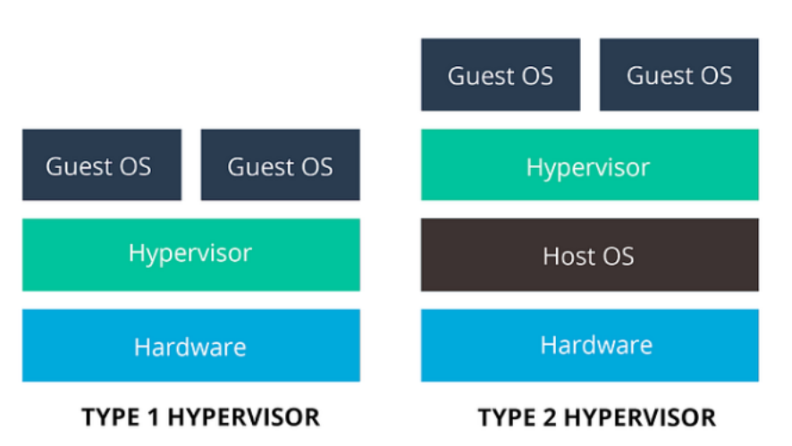
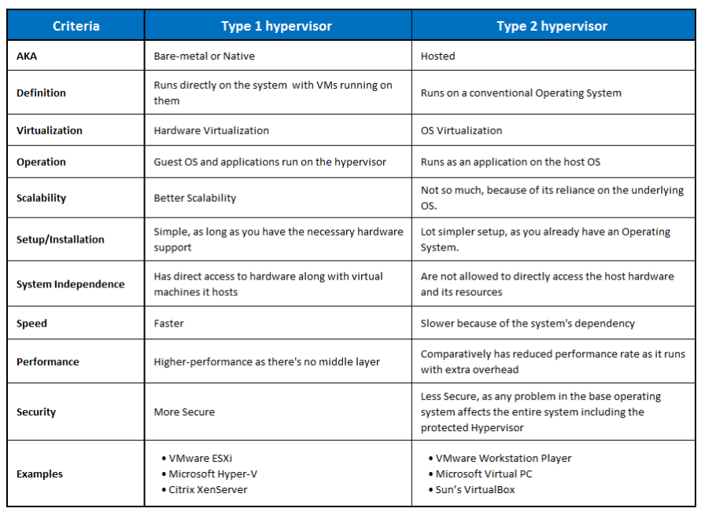

# Advanced Operating System - Virtualization

[Back](../index.md)

- [Advanced Operating System - Virtualization](#advanced-operating-system---virtualization)
  - [Virtualization](#virtualization)
  - [Types of Virtualization](#types-of-virtualization)
  - [Benefits of Virtualization](#benefits-of-virtualization)
  - [Hypervisor](#hypervisor)
  - [Types of Hypervisors](#types-of-hypervisors)

---

## Virtualization

- `Virtualization`

  - the process of **simulating hardware and software** in a virtual environment(software).
  - consolidate different types of OS and Application and run them on just one physical server in a virtual environment.
  - a technique to divide the computer resources logically.
    - It’s achieved by abstracting away the underlying complexity of resource segregation. Although an old technology, it’s still a popular technique and highly relevant in this era of cloud computing.

- `Virtualization` helps us to create software-based or virtual versions of a **computer resource**. These computer resources can include computing devices, storage, networks, servers, or even applications.

  - It allows organizations to partition a single physical computer or server into several virtual machines (VM). Each VM can then interact independently and run different operating systems or applications while sharing the resources of a single computer.

---

## Types of Virtualization

- Virtualization is classified into several categories based on the resource we virtualize.

- `Data Virtualization`

  - With data virtualization, the virtualization software sits in front of multiple data sources and allows them to be treated as a single data source. This facilitates delivering the required data in a specific format.

- `Desktop Virtualization`

  - Desktop virtualization lets us deploy simulated desktop environments to many physical machines at once. Unlike traditional desktop environments that are physically installed, configured, and updated on each machine, desktop virtualization allows admins to perform mass configurations, updates, and security checks on all virtual desktops.

- `Server Virtualization`

  - Servers are computers designed to process a high volume of specific tasks so that other computers such as laptops and desktops can do a variety of different jobs. Virtualizing a server lets it do more of those particular functions and involves partitioning it so that the components can serve multiple purposes.

- `OS Virtualization`

  - Operating system virtualization happens at the OS kernel, and it’s a useful way to run multiple operating systems side-by-side. It reduces hardware costs, increases security, and limits software maintenance (update/patching) costs.

- `Network Functions Virtualization`
  - Network functions virtualization separates the network functions such as IP configuration, file sharing, and directory services. Virtualizing networks helps to reduce the number of physical components such as switches, routers, servers, cables, and hubs.

---

## Benefits of Virtualization

- Cost Savings

  - The ability to run multiple virtual machines in one piece of physical infrastructure drastically reduces the footprint and the associated cost.
  - Moreover, as this consolidation is done at the core, we don’t need to maintain as many servers. We also have a reduction in electricity consumption and the overall maintenance cost.

- Agility and Speed
  - Spinning up a virtual machine is a straightforward and quick approach. It’s a lot simpler than provisioning entirely new infrastructure.
  - For instance, if we need a development/test region for a team, it’s much faster to provision a new VM for the system administrators. Besides, with an automated process in place, this task is swift and similar to other routine tasks.

---

## Hypervisor

- `hypervisor`:（系统）管理程序

  - the software that creates and runs the virtualization.
  - allows one machine to run multiple virtual machines.
  - allocates and controls the share of a machine's resources, such as storage space, ram,CPU, and so on.

- `Hypervisor software` facilitates virtualization.
  - sits on top of an **operating system**
  - installed directly onto the **hardware**.
- `Hypervisors` take physical resources and divide them up so that virtual environments can use them.

  - When a user or program issues an instruction to the VM that requires additional resources from the physical environment, the hypervisor relays the request to the physical system and caches the changes.

- A virtual machine created by a hypervisor function as a single data file, and we can move it from one computer to another, open it there, and it works the same as on any other machine.
  - Thus, it provides a lot of flexibility and **portability**.

---

## Types of Hypervisors

- `Type 1 Hypervisors` (Bare Metal)

  - A `Type 1 hypervisor` is installed directly **on top of the physical machine**.
  - Type 1 hypervisors are also known as `bare-metal hypervisors` due to the nature of their installation type.
  - These categories of hypervisors are more popular and secure than the Type 2 hypervisors.
  - Type 1 hypervisors have a **lower amount of latency** and are the most used in the market.
  - Examples of these hypervisors:
    - VMware ESXi
    - Microsoft Hyper-V
    - open-source Kernel-based VMs (KVMs).

- `Type 2 Hypervisors` (Hosted)
  - `Type 2 hypervisors`, there is a layer of host OS that sits between the physical server and the hypervisor. - For this reason, we call these hypervisors `hosted hypervisors`.
  - They are less common and mostly used for end-user virtualization.
  - They are known to have **more latency compared** to Type 1 due to their hosted nature.
  - Type 2 hypervisors:
    - Oracle VirtualBox
    - VMware Workstation

---

[TOP](#advanced-operating-system---virtualization)
