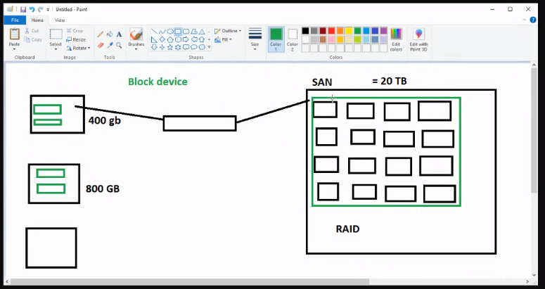
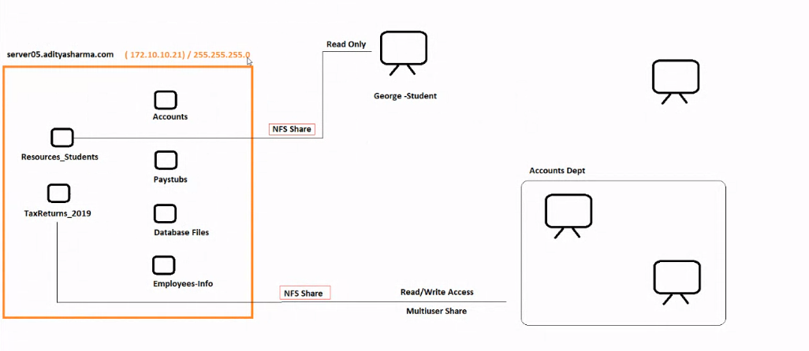

# Storage -SAN & NAS

[Back](../index.md)

- [Storage -SAN \& NAS](#storage--san--nas)
  - [SAN: Storage Area Network](#san-storage-area-network)
  - [NAS: Network-Attached Storage](#nas-network-attached-storage)
  - [Overview](#overview)
  - [NAS](#nas)
  - [SAN](#san)

---

## SAN: Storage Area Network

- Reference: https://www.liquidweb.com/blog/san-vs-nas/

- `SAN`:

  - a network of storage devices that can be accessed by multiple servers or computers, providing a shared pool of storage space.
  - Each computer on the network can access the storage on the SAN as though they were local disks connected directly to the computer.
  - SAN uses SCSI and SATA protocols.

- `SAN` (`storage area network`) is a high-performance, high-speed **network of storage, servers, and devices** that allows access to consolidated, block-level storage.

  - **Multiple client** devices can access it, and it usually **appears to the client OS as a disk**.
  - `SAN` storage **separates** the <u>storage system</u> from the <u>rest of the local area network (LAN)</u>. This way, they improve application performance, data protection, and disaster recovery if needed.

  

- **Consist Of**

  - composed of `SAN` **switches**, **hosts**, and **storage devices** that are connected internally

- **Advantages**

  - **Scalability**: SAN storage can be scaled easily to suit evolving business needs. you will never have more storage than you need.
  - **Backup**: It needs only a single backup server for data that is potentially scattered across multiple locations.
  - **Reduces LAN Bandwidth Issues**: SAN takes data transfers, which cause bandwidth bottlenecks, onto itself, improving the performance of the entire LAN.
  - **Data Security**: Data protection algorithms are consistent within `SAN`. Even when the LAN become compromised, your data would be secure since it is stored on a separate network.
  - **Disaster Recovery**: Centralized data can be easily copied to a separate recovery device.

- **Disadvantages**

  - **Complexity**: A SAN can add additional layers of complexity to existing systems, increasing **workload management**.
  - **Cost**: Implementing and managing a `SAN` can be **cost-prohibitive** for first-time users.
  - **Management**: A SAN may be challenging to manage and may **require a dedicated specialist** to administer it.

- **SAN Protocols**

  - **Fibre Channel Protocol (FCP)**
    - uses Fibre Channel transport protocols embedded with SCSI commands.
    - the most widely used
    - deployed in the majority of the SAN market.
  - **Internet Small Computer System Interface (iSCSI)**:
    - iSCSI incorporates SCSI commands inside an Ethernet frame. For data transport, it uses an IP Ethernet network.
  - **Fibre Channel over Ethernet (FCoE)**:
    - It is similar to iSCSI since it incorporates an FC frame inside an Ethernet datagram. It also uses an IP Ethernet network for transport.

- Example:
  - Oracle Databases
  - Microsoft SQL Server Databases
  - SAP, Large ERP, or CRM Environments

---

## NAS: Network-Attached Storage

- `NAS`:

  - storage devices that are linked to a network and provide file access services to computer systems. These devices generally include an engine that executes the file services and one or more devices on which data is stored.
  - NAS uses file access protocols such as NFS or CIFS.

- `Network-attached storage (NAS)` is a **network-based storage** solution. NAS storage is a method of managing storage centrally and sharing that storage with multiple servers.

  

- **Advantages**:

  - **Architecture**: `NAS` data lives **in volumes of files and folders** instead of blocks in a typical client-server architecture.
  - **Security**: `NAS` provides security via <u>user access controls</u> and <u>redundant data structures</u>.
  - **Efficiency**: `NAS` allows for an easy, quick, and **low-cost method** for data storage.
  - I**nexpensive**: `NAS` is **less expensive** to purchase and maintain, although the cost of a high-end NAS will cost more than an entry-level SAN.
  - **Stability**: Utilizing `NAS` removes individual servers as single points of failure.

- **Disadvantages**:

  - **Single Point of Failure**: Because NAS is considered a local on-site backup drive, failures can occur, leading to **data loss**.
  - **Speed**: Heavy use of a NAS system can cause significant **network congestion** and lower transfer speed.
  - **Scalability**: NAS devices are not easily scalable due to the limitations of the hardware.
  - **Quotas**: System admins must enforce user quotas to prevent overutilization of shared space.
  - **Management**: Basic networking knowledge is required to implement a NAS.
  - **Functionality**: Capabilities will vary depending on manufacturer, chip, and size.

- **NAS Protocols**:

  - **Common Internet File Services/Server Message Block (CIFS/SMB)**: This is the protocol that **Windows** usually uses.
  - **Network File System (NFS)**: NFS was first developed for use with UNIX servers and is also a common **Linux** protocol.

---

## Overview

|                     | SAN (Storage Area Network)                                                                                               | NAS (Network Attached Storage)                                                             |
| ------------------- | ------------------------------------------------------------------------------------------------------------------------ | ------------------------------------------------------------------------------------------ |
| Cost                | Usually More Expensive                                                                                                   | Less Expensive                                                                             |
| Network performence | High-Speed Connections Using the Fibre Channel                                                                           | Speed is Dependent on the Local Ethernet Network                                           |
| Environment         | Typically Used in Enterprise and Professional Environments                                                               | Typically Used in Homes or Small to Medium-Sized Businesses (SMBs)                         |
| Administration      | Requires More Administration                                                                                             | Easier to Manage                                                                           |
| Scalability         | Easily Scalable                                                                                                          | Usually Not Highly Scalable                                                                |
| Architecture        | Requires Architectural Changes                                                                                           | No Architectural Changes Required                                                          |
| Recovery            | Redundant Functionalities and Fault-Tolerant Network                                                                     | Often Has Single Points of Failure                                                         |
| Network Bottleneck  | Not Affected by Network Traffic Bottlenecks                                                                              | Susceptible to Network Bottlenecks                                                         |
| Storage Protocols   | Fibre Channel Protocol (FCP)  Internet Small Computer System Interface (iSCSI)  Fibre Channel over Ethernet (FCoE) | Common Internet File Services/Server Message Block (CIFS/SMB) Network File System (NFS) |
| Access level        | block-level access                                                                                                       | file-level access                                                                          |

---

新版本:

## NAS

- `NAS`

  - a centralized storage device to store data on a network.
  - specialize in storing data and do nothing else.

- Performance

  - recognized as a shared network drive
  - might affected by bottlenecks in a LAN

- Typically, a NAX is a box that will have multiple hard drives in a RAID configuraiont for redundancy and have a network interface card attaching to a switch or router.

  - Data can be accessed over a network. Once it is connected, devices in the network can access as a shared drive.

- Cost:
  - NAS is less expensive than SAN.
- User:

  - used in homes
  - used in small to medium-sized businesses

- Fault tolerance
  - has a single point of failure.
    - if a component fail, such as power supply failure on the nas, all of the other devices will not able to access its data.

---

## SAN

- `SAN`:

  - a special high-speed network that stores and provides access to large amount of data.

- Performance

  - When a server accesses the data on a SAN, it accesses the data as if it was a local hard drive.
  - high-speed network
    - all devices are connected to each other using fiber channel
    - not affected by network traffic

- Fault tolerance

  - Basically, a dedicted network that is used for data storage and this network consists of multiple disk arrays, switches, and servers.
  - Data is shared amond serveral disk arrays. If a switech, disk array, server goes down, the data can be accessed.
  - Because it has more than one of these devices, a SAN is fault tolerant.

- highly scalable

  - adding more storage space can be done without an interruption on the network.

- Cost

  - a standard san use fiber channel to achieve high-speed, so it is expensive.
  - some san use iSCSI(internet Small Computer System Interface), a cheapter alternative to fiber channel

- User
  - mainly usesd by large companies and large organizations due to the high cost

---

[Top](#storage--san--nas)
