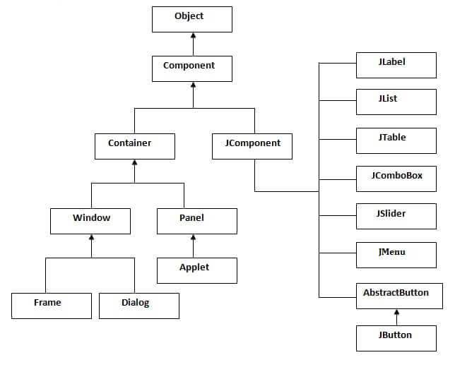

## Java Swing

[Back](../index.md)

---

[TOC]

---

- Design

  - Container

    - [JFrame](./container/jframe.md)
    - [JPanel](./container/jpanel.md)

  - Component

    - [JLabel](./component/jlabel.md)
    - [JTextField](./component/jtextfield.md)
    - [JButton](./component/jbutton.md)
    - [JRadioButton](./component/jradiobutton.md)
    - [JCheckBox](./component/jcheckbox.md)
    - [JComboBox](./component/jcombobox.md)
    - [JList](./component/jlist.md)

  - [LayoutManager](./layout/layoutmanagers.md)
    - [JFlowLayout](./layout/flowlayout.md)
    - [JBorderLayout](./layout/borderlayout.md)
    - [JBoxLayout](./layout/boxlayout.md)
    - [JCardLayout](./layout/cardlayout.md)
    - [JGridLayout](./layout/gridlayout.md)

- ## [Event Handling](./event_handling/event_hanlding.md)

---

## Terminology

- `GUI`: Graphical User Interface, it is mainly made of **graphical components** like buttons, labels, windows, etc. through which the <u>user can interact with an application</u>.
- `JFC`: `Java Foundation Classes`, a set of GUI components which simplify the development of desktop applications.
- `AWT`: `Java Abstract Widget Toolkit (AWT)`, an older, platform dependent **GUI toolkit**.

---

## Java Swing

- `Java Swing` in Java is a **Graphical User Interface (GUI) toolkit** that includes the GUI components.

  - `Java Swing` is a part of `Java Foundation Classes (JFC)` that is used to create **window-based applications**. It is built on the top of `AWT (Abstract Windowing Toolkit)` API and entirely written in java.
  - `Swing` provides a rich set of widgets and packages to make sophisticated **GUI components** for Java applications. The `javax.swing` package provides classes for java swing API such as JButton, JTextField, JTextArea, JRadioButton, JCheckbox, JMenu, JColorChooser etc.

- Package: `import javax.swing.*;`

---

## Hierarchy of Java Swing classes

### Container classes

- `Container classes` are classes that can <u>have other components on it</u>. So for creating a Java Swing GUI, we **need at least one container object**.

- There are **3** types of Java Swing `containers`.

  - `Frame`: It is a **fully functioning window** with its **title** and **icons**.
  - `Panel`: It is a pure container and is **not a window** in itself. The sole purpose of a Panel is <u>to organize the components on to a window</u>.
  - `Dialog`: It can be thought of like a **pop-up window** that pops out when a message has to be displayed. It is **not a fully functioning window** like the Frame.

---

## Commonly used Methods of Component class

| Method                                      | Description                                                   |
| ------------------------------------------- | ------------------------------------------------------------- |
| `public void add(Component c) `             | add a component on another component.                         |
| `public void setSize(int width,int height)` | sets size of the component.                                   |
| `public void setLayout(LayoutManager m)`    | sets the layout manager for the component.                    |
| `public void setVisible(boolean b)`         | sets the visibility of the component. It is by default false. |

---

[Top](#GUI)
