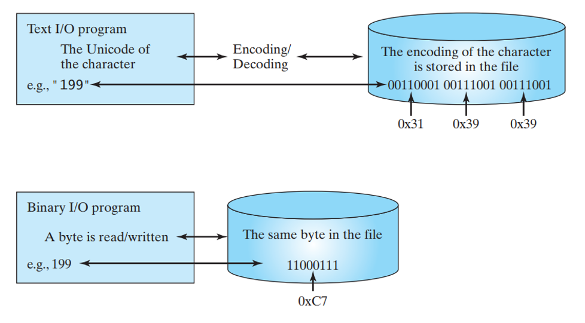
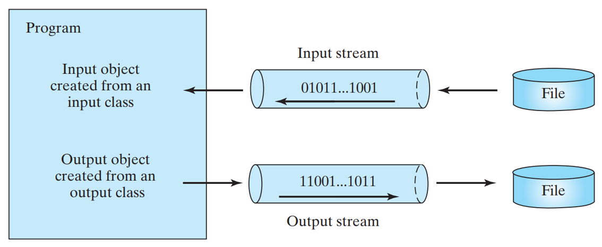
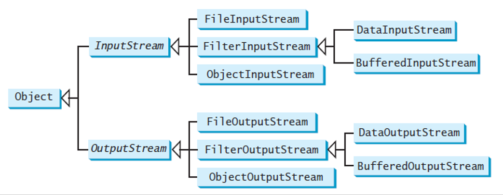

# File Input and Output

[Back](../index.md)

- [File Input and Output](#file-input-and-output)
  - [I/O](#io)
  - [Text File](#text-file)
  - [Binary File](#binary-file)
    - [IO Stream](#io-stream)
    - [Class](#class)
    - [Abstract InputStream and OutputStream](#abstract-inputstream-and-outputstream)

---

## I/O

- A `File` object **does not contain the methods** for creating a file or <u>for writing/reading data to/from a file (referred to as data input and output, or I/O for short)</u>.

- In order to perform I/O, you need to **create objects** using appropriate Java I/O classes. The objects contain the methods for reading/writing data from/to a file.

- There are two types of files:
  - Text
  - Binary.

---

## Text File

- Use the `Scanner` class for **reading text data** from a file and the `PrintWriter` class for **writing text** data to a file.

```java

import java.io.*;
import java.util.*;

public class ReadWriteTextFile {
    public static void main(String[] args) {
        String path = "./text.txt";
        File file = new File(path);

        try (Scanner scanner = new Scanner(file);) {

            //write text file
            PrintWriter writer = new PrintWriter(file);
            writer.println("Suppose you are to write an application ReplaceText.java that" +
                    "replaces all occurrences of a string in a text file with a new string.");
            writer.println("Boolean Result: true String: Hello, This is JavaTpoint.");
            writer.close(); // must close to save string to the file.

            //read text file
            while (scanner.hasNext()) {
                System.out.println(scanner.nextLine());
            }
        } catch (IOException ex) {
            ex.printStackTrace();
        }
    }
}

```

---

## Binary File

- Binary I/O does **not involve encoding or decoding** and thus is **more efficient** than text I/O.





---

### IO Stream



---

### Class

- [File](./file_class.md)
  - Text File
    - [Scanner](./scanner_class.md)
    - [Printwriter](./printwriter_class.md)
  - Binary File
    - Byte [FileOutputStream/FileInputStream](./FileOutputStream_FileOutputStream.md)
    - Primitive-type [DataInputStream/DataOutputStream](./DataInputStream_DataOutputStream.md)
    - Object [ObjectInputStream/ObjectOutputStream](./ObjectInputStream_ObjectOutputStream.md)
    - RandomAccessFile [RandomAccessFile](./RandomAccessFile.md)

---

### Abstract InputStream and OutputStream

- The **abstract** `InputStream` is the root class for reading binary data.

  - `.read()`: Read the next byte of data from the input stream.

- The **abstract** `OutputStream` is the root class for writing binary data.

  - `.write(int b)`: Write the specified byte to output stream.

- If you keep reading data at the end of an `InputStream`, an `EOFException` will occur.
- This exception can be used **to detect the end of a file**.

---

[TOP](#file-input-and-output)
