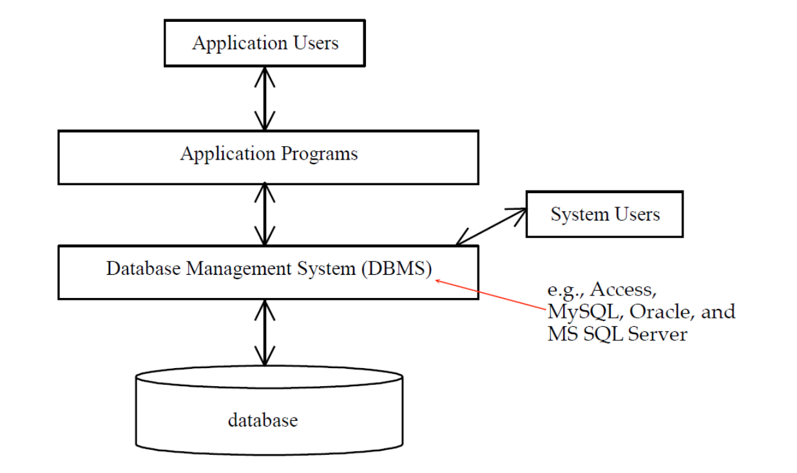
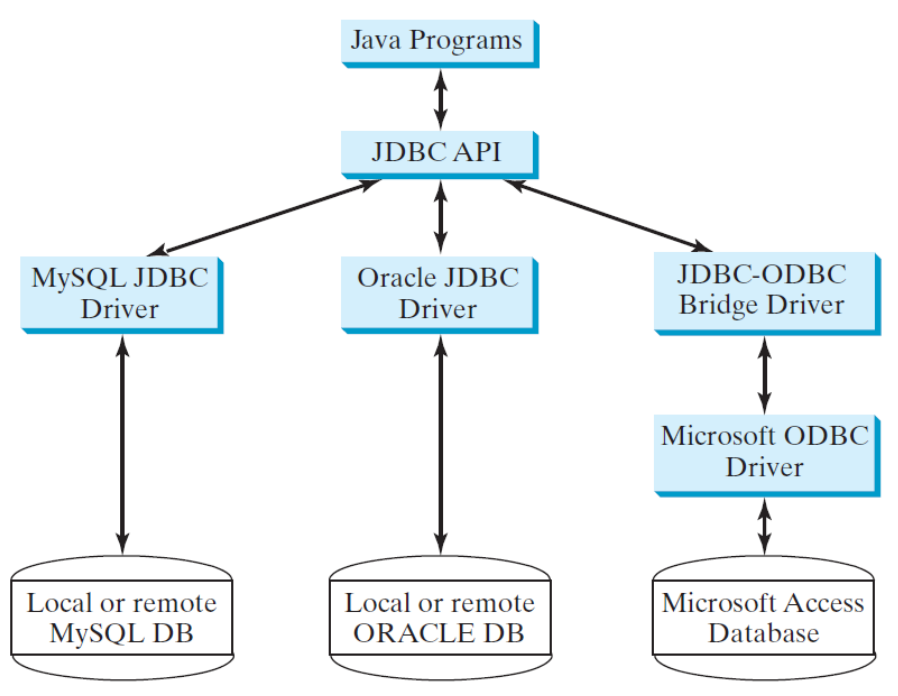

# Java JDBC

[back](../index.md)

- [Java JDBC](#java-jdbc)
  - [SQL](#sql)
  - [JDBC](#jdbc)
  - [Java JDBC (Sun) Packages](#java-jdbc-sun-packages)
  - [Process](#process)
    - [Step 1 Register the driver class](#step-1-register-the-driver-class)
    - [Step 2 Create the connection object](#step-2-create-the-connection-object)
    - [Step 3 Create the Statement object](#step-3-create-the-statement-object)
    - [Step 4 Execute the query](#step-4-execute-the-query)
    - [Step 5 Close the connection object](#step-5-close-the-connection-object)
  - [Template](#template)
  - [Prepared Statement](#prepared-statement)
  - [Example: MySQL](#example-mysql)
  - [Example: Oracle](#example-oracle)
  - [Example: PreparedStatement](#example-preparedstatement)

---

- 速查:

|            | oracle                                    | mysql                                                                   | ODBC                   |
| ---------- | ----------------------------------------- | ----------------------------------------------------------------------- | ---------------------- |
| port 端口  | 1521                                      | 3306                                                                    |                        |
| 驱动名     | `oracle.jdbc.driver.OracleDriver`         | `com.mysql.cj.jdbc.Driver`                                              |                        |
| 连接字符串 | `jdbc:oracle:thin:@host_url:port:grokSID` | `jdbc:mysql://host_name/database_name?user=user_name&password=password` | `jdbc:odbc:dataSource` |

---

- Access: `sun.jdbc.odbc.JdbcOdbcDriver` (Already in JDK )
- iSeries DB2: `com.ibm.as400.access.AS400JDBCDriver` ( from Website)

- Note:
  - The JDBC-ODBC driver for MS Access is bundled in JDK
  - MySQL driver class is in `mysql-connector-java-5.1.xx-bin.jar`
  - Oracle driver class is in `ojdbc7.jar`

## SQL

- To access or write applications for database systems, you need to use the Structured Query Language (SQL).

- SQL is the universal language for accessing relational database systems.

- Application programs may allow users to access a database <u>without directly using SQL</u>, but these applications themselves must **use SQL** to access the database

---

## JDBC

- `JDBC` is the **Java API** for accessing **relational database**, supporting Java programs that access relational databases. `JDBC` is not an acronym, but it is often thought to stand for Java Database Connectivity.

  - `JDBC` provides Java programmers with a **uniform interface** for accessing and manipulating relational databases.

- The `JDBC API` is a set of **Java interfaces** and **classes** used to write Java programs for accessing and manipulating relational databases.

  - Using the `JDBC` API, applications written in the Java programming language can **execute** SQL statements, **retrieve** results, **present** data in a user-friendly interface, and **propagate changes** back to the database.
  - The `JDBC` API can also be used to interact with **multiple** data sources.

- `JDBC` is the standard API for **database-independent connectivity** between Java programming language and a wide range of databases-SQL databases and other tabular data sources, such as spreadsheets or flat files.
  - JDBC is the **trademark name** instead of an acronym.



- `JDBC` drivers are database specific and are normally provided by the database vendors.

  - MySQL database: `MySQL JDBC`
  - databases on the Windows platform: `JDBC-ODBC bridge driver`



- Four key interfaces are needed to develop any database application using Java: `Driver`, `Connection`, `Statement`, and `ResultSet`.

---

## Java JDBC (Sun) Packages

- **`java.sql`**

  - This package contains the **core JDBC API** to access and process the data stored in a database, typically a relational database using the java.
  - Different drivers can be installed dynamically for the access of various databases, using a framework which in-built in this JDBC API.

- **`javax.sql`**
  - This package contains JDBC APIs for accessing the server side data sources from JDBC clients.
  - It is the **essential part for Java EE**, providing the facilities such as connection pooling, distributed transactions and row sets for the enterprise applications.
  - An interface by name `DataSource` is provided in this API as an alternative to `DriverManager` to establish the connection.

---

## Process

- A `JDBC` application loads an appropriate driver using the **Driver interface**, connects to the database using the **Connection interface**, creates and executes SQL statements using the **Statement interface**, and processes the result using the **ResultSet interface** if the statements return results.

  - The JDBC interfaces and classes are the **building blocks** in the development of Java database programs.

- Note that some statements, such as SQL data definition statements and SQL data modification statements, **do not return results**.

- A typical Java program takes the following steps to access a database.
  1. Loading drivers.
  2. Establishing connections.
  3. Creating statements.
  4. Executing statements.
  5. Processing results.

---

### Step 1 Register the driver class

- The `forName()` method of `Class` class is used to **register** the driver class. This method is used to dynamically load the driver class.

- A **driver** is a class that implements the `java.sql.Driver` interface.
- If your program accesses several different databases, **all** their respective drivers must be loaded.
  - The `JDBC-ODBC` driver for Access is bundled in JDK.

```java
// Approach 1 – Class.forName() :
// Oracle
Class.forName("oracle.jdbc.driver.OracleDriver");
Class.forName("oracle.jdbc.driver.OracleDriver").newInstance();

// MySQL
Class.forName("com.mysql.cj.jdbc.Driver");

// Approach 2 – DriverManager.registerDriver() :
Driver myDriver = new com.ibm.as400.access.AS400JDBCDriver();
DriverManager.registerDriver( myDriver );

```

---

### Step 2 Create the connection object

- The `getConnection()` method of `DriverManager` class is used to establish connection with the database.

| Constructor                                                        | Description |
| ------------------------------------------------------------------ | ----------- |
| `Connection getConnection(String url)`                             |             |
| `Connection getConnection(String url,String name,String password)` |             |

- ConnectString:
  - MySQL: `jdbc:mysql://host_name/database_name?user=user_name&password=password`
  - Oracle: `jdbc:oracle:thin:@host_url:port:grokSID`/database
  - ODBC: `jdbc:odbc:dataSource`
  - iSeries: `jdbc:as400://zeus.senecac.on.ca/Bookstore`

```java
// 3 parameters:
String url = "jdbc:oracle:thin:@zenit.humber.on.ca:1521:mydatabase;";
conn = DriverManager.getConnection(String url, String username,String password) ;

// 1 parameter:
String url ="jdbc:oracle:thin:scott/tiger@zenit.humber.on.ca:1521:"
mydatabase;conn = DriverManager.getConnection(String url);


// 2 parameters:
java.util.Properties;

Properties info = new Properties() ;
info.put("user", "scott") ;
info.put("password", "tiger") ;
connection = DriverManager.getConnection(String url, info);

```

---

### Step 3 Create the Statement object

- The `createStatement()` method of Connection interface is used to create statement. The object of statement is responsible to execute queries with the database.

- If a `Connection` object can be envisioned as a cable linking your program to a database, an object of `Statement` can be viewed as a cart that delivers SQL statements for execution by the database and brings the result back to the program.

```java

Statement stmt=con.createStatement();

```

---

### Step 4 Execute the query

- The `executeQuery()` method of Statement interface is used to execute queries to the database. This method returns the object of ResultSet that can be used to get all the records of a table.

  - `execute(String sql)`: The `execute` method should be used if the execution produces **multiple result sets**, **multiple update counts**, or a **combination of result sets and update counts**.
  - `executeQuery(String sql)`: The `executeQuery` method should be used if the execution produces a **single result set**, such as the SQL select statement.
  - `executeUpdate(String sql)`: The `executeUpdate` method should be used if the statement results in a **single update count or no update count**, such as a SQL `INSERT`, `DELETE`, or `UPDATE`, statement.

- SQL data definition language (`DDL`) and update statements can be executed using `executeUpdate(String sql)`.
- An SQL query statement can be executed using `executeQuery(String sql)`. The result of the query is returned in `ResultSet`.

- The `ResultSet` maintains a table whose current row can be **retrieved**.

  - The initial row position is `null`.

- use the `next()` method to **move to the next row** and the various **getter methods** to retrieve values from a current row.

```java
ResultSet rs=stmt.executeQuery("select * from emp");

while(rs.next()){
  System.out.println(rs.getInt(1)+" "+rs.getString(2));
}
```

---

### Step 5 Close the connection object

- By closing connection object statement and `ResultSet` will be closed automatically. The `close()` method of Connection interface is used to close the connection.

```java

if (resultSet != null) {
resultSet.close();
}
if (statement != null) {
statement.close();
}
if (connection != null) {
connection.close();
}

```

---

## Template

```java

import java.sql.*;

public class T {

    public static void main(String[] args) {

        Connection connection = null;
        Statement statement = null;
        ResultSet resultSet = null;

        String urlString = "";
        try {
            // Load Driver
            Class.forName("oracle.jdbc.driver.OracleDriver");
            // Connect To Thin By Using Property Object.
            connection = DriverManager.getConnection(urlString, "scott", "tiger");
            statement = connection.createStatement();
            resultSet = statement.executeQuery("select sysdate from dual");
            while (resultSet.next()) {
                System.out.println("date = '' + resultSet.getDate(1));");
            }
        } catch (ClassNotFoundException cnfex) {
            System.err.println("Failed to load JDBC/ODBC driver.");
        } catch (SQLException e) {
            System.out.println("The error is: " + e.getMessage());
        } finally {
            try {
                if (resultSet != null)
                    resultSet.close();
                if (statement != null)
                    statement.close();
                if (connection != null)
                    connection.close();
            } catch (SQLException e) {
                System.out.println("Exception caught in finally block");
                System.out.println("Exception: " + e.getMessage());
            }
        } // Finally
    } // Execute
} // Class

```

---

## Prepared Statement

The `Prepared` Statement interface is designed to execute **dynamic SQL statements** and **SQL-stored procedures** with parameters.

- These SQL statements and stored procedures are **precompiled** for efficient use when repeatedly executed.

```java

PreparedStatement pstmt = connection.prepareStatement(
    "INSERT INTO users (first_name, last_name, email) + VALUES (?, ?, ?)");

```

---

## Example: MySQL

```java

import java.sql.*;

public class MysqlDemo {
    public static void main(String[] args) {
        String classString = "com.mysql.cj.jdbc.Driver";

        String hostName = "localhost";
        String database = "testdb";
        String userNmae = "root";
        String pwd = "***";
        // String connectionString =
        // String.format("jdbc:mysql://%s/%s?user=%s&password=%s",
        // hostName, database, userNmae, pwd);
        String connectionString = String.format("jdbc:mysql://%s/%s",
                hostName, database);

        String sql = "select * from test_tb;";
        try {
            Class.forName(classString);
            // Connection conn = DriverManager.getConnection(connectionString);
            Connection conn = DriverManager.getConnection(connectionString, userNmae, pwd);
            Statement statement = conn.createStatement();
            ResultSet result = statement.executeQuery(sql);

            while (result.next()) {
                System.out.println(result.getString(1));
            }

            conn.close();
        } catch (Exception e) {
            e.printStackTrace();
        }
    }
}

```

---

## Example: Oracle

```java

import java.sql.*;

public class OracleDemo {
    public static void main(String[] args) {
        String classString = "oracle.jdbc.driver.OracleDriver";

        String hostName = "******";
        String port = "1521";
        String sid = "******";
        String userNmae = "******";
        String pwd = "******";

        String connectionString = String.format("jdbc:oracle:thin:@%s:%s:%s",
                hostName, port, sid);

        String sql = "select * from user_tables";// not ends with semi-colon
        try {
            Class.forName(classString);
            Connection conn = DriverManager.getConnection(connectionString, userNmae, pwd);
            Statement statement = conn.createStatement();
            ResultSet result = statement.executeQuery(sql);
            while (result.next()) {
                System.out.println(result.getString(1));
            }

            conn.close();
        } catch (Exception e) {
            e.printStackTrace();
        }
    }
}

```

---

## Example: PreparedStatement

```java


import java.sql.*;

public class MysqlPreparedStatementDemo {

    public static void main(String[] args) {
        String className = "com.mysql.cj.jdbc.Driver";
        String hostName = "localhost";
        String database = "testdb";
        String userName = "root";
        String pwd = "Simon!23";

        String connectionString = String.format("jdbc:mysql://%s/%s?user=%s&password=%s",
                hostName, database, userName, pwd);

        String insertSQL = "insert into message values(?,?);";

        String updateSQL = "update message set text=? where id=?;";

        String delSQL = "delete from message where id=?;";

        String querySQL = "select * from message;";

        Connection conn;

        try {
            Class.forName(className);
            conn = DriverManager.getConnection(connectionString);

            // insert data
            PreparedStatement inserStatement = conn.prepareStatement(insertSQL);

            inserStatement.setInt(1, 1);
            inserStatement.setString(2, "Hello world!");

            int numInsert = inserStatement.executeUpdate();
            System.out.println(numInsert + " records inserted");

            // select all data
            PreparedStatement queryStatement = conn.prepareStatement(querySQL);
            ResultSet result = queryStatement.executeQuery();

            while (result.next()) {
                System.out.println(result.getInt(1) + result.getString(2));
            }

            // update data
            PreparedStatement updateStatement = conn.prepareStatement(updateSQL);

            updateStatement.setString(1, "oven");
            updateStatement.setInt(2, 1);

            int numUpdate = updateStatement.executeUpdate();
            System.out.println(numUpdate + " records updated");

            // delete data
            PreparedStatement delStatement = conn.prepareStatement(delSQL);

            delStatement.setInt(1, 1);

            int numDelete = delStatement.executeUpdate();
            System.out.println(numDelete + " records deleted");

            conn.close();

        } catch (Exception e) {
            System.out.println("Error:" + e.getMessage());
        }
    }
}


```

---

[TOP](#java-jdbc)
