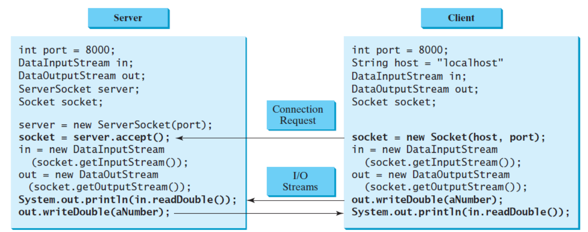
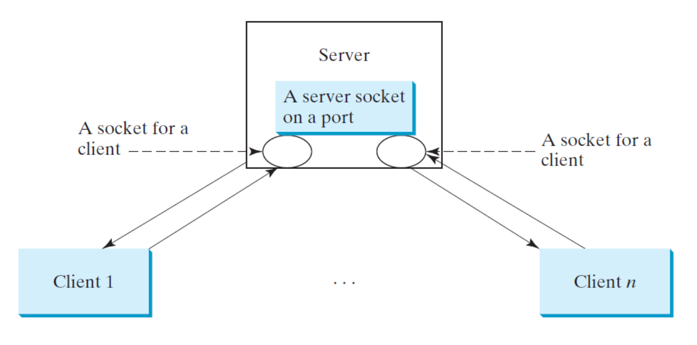

# Java Networking

[Back](../index.md)

- [Java Networking](#java-networking)
  - [Networking](#networking)
    - [Socket](#socket)
    - [Server Sockets](#server-sockets)
    - [Client Sockets](#client-sockets)
  - [Data Transmission through Sockets](#data-transmission-through-sockets)
    - [Example:](#example)
  - [Serving Multiple Clients](#serving-multiple-clients)
    - [Example:](#example-1)

---

## Networking

- Domain Name
- A domain name is a **unique, easy-to-remember** address used to access websites

- Domain Name Server (DNS)

  - A kind of sepecial server that translate host names into IP addresses.
  - translate this domain name into a numeric IP address and then sends the request using the IP address.

- IP (Internet Protocol):

  - An Internet Protocol (IP) address **uniquely identifies** the computer on the Internet.
  - An IP address consists of **four dotted decimal numbers** between 0 and 255, such as 205.207.147.230

- TCP

  - `Internet Protocol` is a low-level protocol for **delivering data** from one computer to another across the Internet in packets.
  - `Transmission Control Protocol (TCP)`: a higher-level protocol used in conjunction with the IP.
  - enables two hosts to establish a connection and exchange streams of data. 用于建立连接
    - guarantees delivery of data 保证传输
    - guarantees that packets will be delivered in the same order in which they were sent. 保证完整性

- stream

  - In computer science, a `stream` is a **sequence of data elements** made available **over time**.

- `Stream-oriented communication`

  - a form of communication in which timing plays an important role.
  - use TCP for data transmission: Transmissions are lossless and reliable, since TCP can detect lost transmissions and resubmit them.
  - Java supports stream-based communications

---

### Socket

- Socket 套接字

  - one **endpoint** of a two-way communication link between two programs running on the network. A socket is bound to 绑定 a port number so that the TCP layer can identify the application that data is destined to be sent to.
  - Sockets are the **endpoints** of logical connections between two **hosts** and can be used to **send and receive data**.
  - Java treats `socket` communications much as it treats I/O operations; thus, programs can **read from** or **write to** sockets as
    easily as they can read from or write to files

- Client/Server Computing

  - Two programs on the Internet communicate through a `server socket` and a `client socket` using I/O streams.
  - `ServerSocket` class: create a **server socket**
  - `Socket` class: create a client socket.

- Connection:

  - The `client` **sends requests** to the server: build connection.
  - The `server` **responds**: accept or deny the connection
  - Once a connection is established, the client and the server communicate **through sockets**.
  - The server **waits for** a connection request from the client. The server must be running when a client attempts to connect to the server.
  - Connection is repeated until one of the two programs terminates

- `java.net`:
  - networking classes package

---

### Server Sockets

- To establish a connection, you need to **create a server socket** and **attach it to a port**, which is where the server **listens** for
  connections

- The port **identifies the TCP service** on the socket.

  - `Port numbers` range from 0 to 65535 (216-1)
  - port numbers 0 to 1023 (`System Ports`) are reserved for privileged services
  - email server: 25
  - Web server: 80.
  - can choose any port number that is not currently used by other programs.

- `java.net.BindException`: create a server socket on a port already in use

```java
// creates a server socket
ServerSocket serverSocket = new ServerSocket(port);

// statement to listen for connections
// This statement waits until a client connects to the server socket
Socket socket = serverSocket.accept();
```

---

### Client Sockets

```java
// request a connection to a server
// opens a socket so that the client program can communicate with the server.
Socket socket = new Socket(serverName, port);

Socket socket = new Socket("205.207.147.230", 8000) //example
Socket socket = new Socket("Humbercollege.ca", 8000);
```

- serverName: `host name` or `IP address`

  - when it is a host name, the JVM asks the DNS to translate the host name into the IP address
  - `localhost` / `127.0.0.1`: refer to the machine on which a client is running.

- `java.net.UnknownHostException`: if the host cannot be found

---

## Data Transmission through Sockets

- After the server accepts the connection, communication between the server and the client is conducted in the same way as for I/O streams.读写方法与 IO 相同.

- The server and client exchange data through `I/O streams` on top of the socket.

- Read Data from a socket:

  - 方法: `socket.getInputStream()`
  - Read bytes: `InputStream`

    - `InputStream input = socket.getInputStream();`

  - Read primitive data + String: `DataInputStream`, `BufferedReader`

    - `DataInputStream input = new DataInputStream(socket.getInputStream());`

- Write Data into a socket: `DataOutputStream`(继承接口: `DataOutput`)

  - 方法: `socket.getOutputStream()`
  - Write bytes: `OutputStream`

    - `OutputStream output = socket.getOutputStream();`

  - Write primitive data + String: `DataOutputStream`, `PrintWriter`

    - `DataOutputStream output = new DataOutputStream(socket.getOutputStream());`



- **Binary I/O** is more efficient than text I/O because text I/O requires encoding and decoding.
  - It is **better to use binary I/O for transmitting data** between a server and a client to improve performance

---

### Example:

---

## Serving Multiple Clients

- A server can serve multiple clients

  - The connection to each client is handled by one thread

- Multithreading enables a server to handle multiple independent clients



### Example:

```java
while (true) {
// Connect to a client
Socket socket = serverSocket.accept();
Thread thread = new ThreadClass(socket);
thread.start();
}

```

---

[TOP](#java-networking)
