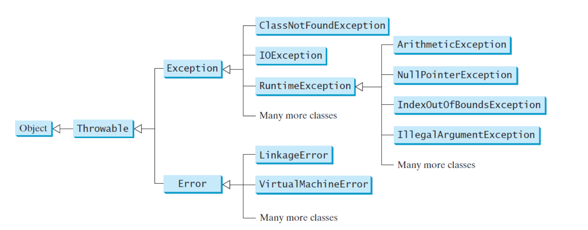
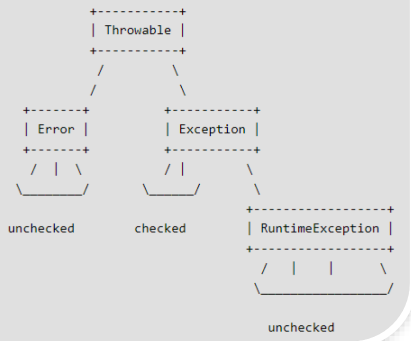

# Exception

[Back](../index.md)

- [Exception](#exception)
  - [Exception Handling](#exception-handling)
  - [Exception Classes](#exception-classes)
  - [Unchecked/Checked Exceptions](#uncheckedchecked-exceptions)

---

## Exception Handling

- `Exception handling` enables a program to deal with <u>exceptional situations</u> and continue its normal execution.

- `Runtime errors` occur **while a program is running** if the `JVM` detects an operation that is **impossible to carry out**.

  - In Java, `runtime errors` are **thrown as exceptions**.异常即错误.

- An `exception` is an object that represents an `error` or a **condition** that **prevents execution from proceeding** normally.

  - If the exception is not handled, the program will terminate abnormally.

- `Exceptions` are thrown from a `method`. The **caller of the method** can **catch and handle** the exception.

  - the **caller** should decide whether to terminate the program; should not let the method terminate the program.调用者必须决定是否终止程序;不应该让方法终止.

- An exception may be thrown directly by using a throw statement in a try block(e.g throw new), or by invoking a method that may throw an exception.
  诱发异常的方法:1.throw 语句;2.在 try 中运行可能异常的代码.

- **advantage**:

  - It enables a method to throw an exception to its caller, **enabling the caller to handle the exception**. Without this capability, the called method itself must handle the exception or terminate the program.让调用者处理异常,而不是方法本身处理.
  - The **key benefit** of exception handling is **separating** the <u>detection of an error</u> (done in a called method) from <u>the handling of an error</u> (done in the calling method). 让异常发现和处理分离.

---

## Exception Classes

- The exception classes can be classified into three major types:

  1. **system errors**: thrown by the JVM and are represented in the `Error` class. The `Error` class describes **internal system errors**, though such errors rarely occur.内部系统错误.

  2. **exceptions**: represented in the `Exception` class, which describes errors **caused by program** and **by external circumstances**. 程序和环境引发的错误.

     - These errors can be caught and handled by program.由程序自行处理.

  3. **runtime exceptions**: represented in the `RuntimeException` class, which describes programming errors, such as bad casting, accessing an out-of-bounds array, and numeric errors.
     - `Runtime exceptions` are generally thrown by the `JVM`.

---

| Type               | Class                       | Reasons for Exception                                                                                         |
| ------------------ | --------------------------- | ------------------------------------------------------------------------------------------------------------- |
| Exceptions         | `ClassNotFoundException`    | Attempt to use a class that does not exist.                                                                   |
| Exceptions         | `IOException`               | Related to input/output operations                                                                            |
| Exceptions         | `InterruptedIOException`    | invalid input                                                                                                 |
| Exceptions         | `FileNotFoundException.`    | open a nonexistent file.                                                                                      |
| Runtime exceptions | `ArithmeticException`       | Dividing an integer by zero. Note that **floating-point arithmetic does not throw exceptions.**除数是浮点除外 |
| Runtime exceptions | `NullPointerException`      | Attempt to access an object through a null reference variable.空值                                            |
| Runtime exceptions | `IndexOutOfBoundsException` | Index to an array is out of range.数组                                                                        |
| Runtime exceptions | `IllegalArgumentException`  | A method is passed an argument that is illegal or inappropriate.非法参数                                      |
| Runtime exceptions | `InputMismatchException`    | occurs if the input entered is not an integer.类型不匹配.                                                     |
|                    |

---

## Unchecked/Checked Exceptions

- `Unchecked exceptions`: `RuntimeException`, `Error`, and their subclasses.

  - In most cases, `unchecked exceptions` reflect programming **logic errors** that are unrecoverable.逻辑错误.

- `Checked exceptions`: All other exceptions. 即 Exception 类中除 RuntimeException 的都是.

  - the compiler forces the programmer to check and deal with them in a try-catch block or declare it in the method header.检查异常要么 try-catch, 要么 throws.

---

[TOP](#exception)
