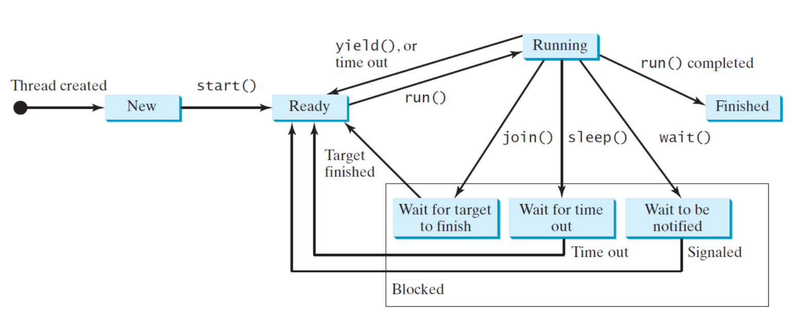

# Java Threads

[Back](../index.md)

- [Java Threads](#java-threads)
  - [Threads](#threads)
    - [Creating Tasks and Threads](#creating-tasks-and-threads)
  - [Methods](#methods)
  - [Thread Priority](#thread-priority)
  - [Thread States](#thread-states)

---

## Threads

- `Multithreading` enables **multiple tasks** in a program to be
  executed <u>concurrently</u>.

- A `thread` is the **flow of execution**, from beginning to end, of a task.
  - These threads can be executed simultaneously in **multiprocessor** systems

---

- In single-processor systems the multiple threads **share CPU time**, known as `time sharing`, and the operating system is responsible for scheduling and allocating resources to them.

  - This arrangement is practical because most of the time the CPU is `idle`. It **does nothing**, for example, while waiting for the user to enter data

- In some cases, multithreaded programs **run faster** than singlethreaded programs even on single-processor systems.

- In Java, each `task` is an instance of the Runnable interface, also called a `runnable object`.

- A `thread` is essentially an **object that facilitates the execution of a task**.

---

### Creating Tasks and Threads

- `Tasks` are objects—To create tasks, you have to first define a class for tasks, which **implements the `Runnable` interface**.

- The `Runnable` interface contains only the `run` method.

  - need to implement this method to tell the system **how your thread is going to run**.

- A `task` must be executed in a `thread`.

- invoke the `start()` method to tell the JVM that the thread is **ready** to run
  - The `start()` method is invoked to start a thread that causes the `run()` method in the task to be executed.
  - When the `run()` method completes, the thread **terminates**.

```java

public class Thread_lab {
    public void someMethod(){

        // Create an instance of TaskClass
        TaskClass task = new TaskClass();

        //create a thread
        Thread thread = new Thread();
        // start a thread: the task is ready
        thread.start();
    }
}

// Custom task class
class TaskClass implements Runnable {

    // Constructor
    public TaskClass() {

    }

    @Override
    public void run() {
        // tell system how to run custom thread

    }
}
```

---

## Methods

| Method                   | Description                                                                                           |
| ------------------------ | ----------------------------------------------------------------------------------------------------- |
| `Thread()`               | create an empyt thread.                                                                               |
| `Thread(task: Runnable)` | create an empyt thread.                                                                               |
| `start()`:void           | start the execution of the thread.                                                                    |
| `isAlive()`:boolean      | Tests whether the thread is currently running                                                         |
| `setPriority()`:void     | changes the priority of the thread.                                                                   |
| `join()`:void            | waits for a thread to die                                                                             |
| `sleep()`:void           | sleeps a thread for the specified amount of time.                                                     |
| `yield()`:void           | causes the currently executing thread object to pause and allow other threads to execute temporarily. |

- **yield()**

  - `yield()` method to temporarily release time for other threads.

- **sleep()**

  - puts the thread to **sleep** for a specified time in milliseconds to allow other threads to execute

  - The `sleep` method may throw an `InterruptedException`, which is a checked exception.
    - Such an exception may occur when a sleeping thread’s `interrupt()` method is called.

- **join()**

  - force one thread to wait for another thread to finish.

---

## Thread Priority

- `setPriority`: increase or decrease the priority of a thread
- `getPriority`: get the thread’s priority

- Priorities are numbers ranging from 1 to 10.
- The `Thread` class has the int constants `MIN_PRIORITY`, `NORM_PRIORITY`, and `MAX_PRIORITY`, representing 1, 5, and 10, respectively.

- Default priority of a thread is `5` (`NORM_PRIORITY`).

- JVM always picks the currently runnable thread with the **highest priority**.
- A **lower-priority** thread can run only when **no higher-priority** threads are running.

- If all runnable threads have equal priorities, each is assigned an **equal portion** of the <u>CPU time</u> in a circular queue. This is called **round-robin** scheduling

---

## Thread States

- A thread can be in one of five states: `New`, `Ready`, `Running`, `Blocked`, or `Finished`.



| Constant                                         | Detail                                                                      |
| ------------------------------------------------ | --------------------------------------------------------------------------- |
| `public static final Thread.State NEW`           | Thread state for a thread which has not yet started.                        |
| `public static final Thread.State RUNNABLE`      | Thread state for a runnable thread.a thread is waiting in the queue to run. |
| `public static final Thread.State BLOCKED`       | Thread state for a thread blocked waiting for a monitor lock.               |
| `public static final Thread.State WAITING`       | Thread state for a waiting thread.                                          |
| `public static final Thread.State TIMED_WAITING` | Thread state for a waiting thread with a specified waiting time.            |
| `public static final Thread.State TERMINATED`    | Thread state for a terminated thread.                                       |

---

[Top](#java-threads)
