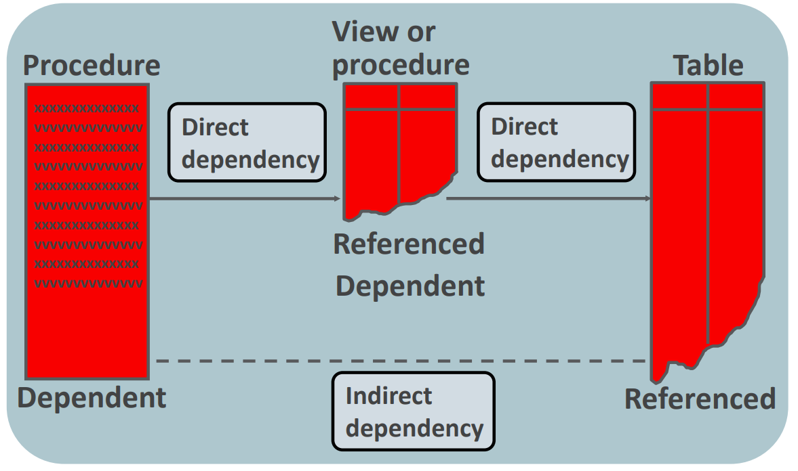

# PLSQL - Dependency

[Back](../index.md)

- [PLSQL - Dependency](#plsql---dependency)
  - [Object in Oracle](#object-in-oracle)
  - [Dependencies Summarized](#dependencies-summarized)

---

## Object in Oracle

- A PL/SQL subprogram can execute correctly only if the **objects that it references exist and are valid**.

- `Dependent object`:

  - the object that references another object.

- `Referenced object`:

  - the object that is referenced by dependent object.

- If the definition of a referenced object was altered, dependent objects might not continue to work properly.
- The Oracle server automatically records dependencies among objects.

  - The `status` column in `USER_OBJECTS` Data Dictionary
    - `valid`
    - `invalid`

- Direct and Indirect Dependency

---

## Dependencies Summarized

| Dependent Objects                        | Referenced Objects                       |
| ---------------------------------------- | ---------------------------------------- |
| Table                                    | Table                                    |
| View                                     | View                                     |
| Function                                 | Function                                 |
| Procedure                                | Procedure                                |
| Database **trigger**                     |                                          |
| Package specification                    | Package specification                    |
| **Package body**                         |                                          |
| User-defined object and collection types | User-defined object and collection types |
|                                          | Sequence                                 |
|                                          | Synonym 別名                             |

---

[TOP](#plsql---dependency)
