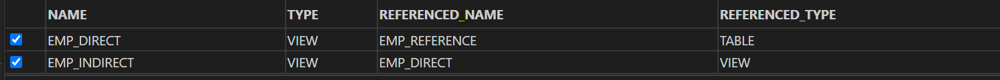
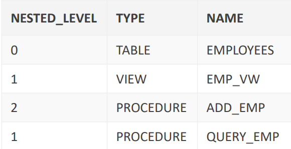

# PLSQL - Local Dependency

[Back](../index.md)

- [PLSQL - Local Dependency](#plsql---local-dependency)
  - [Local Dependency](#local-dependency)
    - [Example](#example)
  - [Direct Dependency](#direct-dependency)
  - [Indirect Dependency](#indirect-dependency)
  - [Scenario of Local Dependencies](#scenario-of-local-dependencies)
  - [Recompiling a PL/SQL Program Unit](#recompiling-a-plsql-program-unit)
  - [Packages and Dependencies](#packages-and-dependencies)

---

## Local Dependency

- `remote dependency`: the referenced object is in a different database

- `local dependencies`: the objects are on the same node in the same database.

  - The `Oracle server` automatically manages **all local dependencies**, using the database’s internal "depends-on" table.
  - When a `referenced object` is **modified**, the `dependent objects` are **invalidated**.

- The Oracle server implicitly attempts to **recompile** any `INVALID object` when the object is next called.

### Example

|                         | referenced object | directly independent object | indirectly independent object |
| ----------------------- | ----------------- | --------------------------- | ----------------------------- |
| before change           | valid             | valid                       | valid                         |
| after change            | valid             | invalid                     | invalid                       |
| 1. call direct object   | valid             | valid                       | invalid                       |
| 2. call indirect object | valid             | valid                       | valid                         |

```sql
-- Demo Direct and Indirect Dependency

-- ---------------------------------Drop
DROP TABLE emp_reference;

DROP VIEW emp_direct;

DROP VIEW emp_indirect;

-- ---------------------------------create table and views
-- referenced object
CREATE TABLE emp_reference AS (
  SELECT * FROM employees
);

-- directly dependent object
CREATE OR REPLACE VIEW emp_direct AS
  SELECT *
  FROM emp_reference;

-- indirectly dependent object
CREATE OR REPLACE VIEW emp_indirect AS
  SELECT *
  FROM emp_direct;

-- ---------------------------------status before alter
SELECT object_name
, object_type
, status
FROM user_objects
WHERE object_name IN (upper('emp_reference')
, upper('emp_direct')
, upper('emp_indirect'));

-- ---------------------------------alter referenced table
-- drop
DROP TABLE emp_reference;

-- alter table
ALTER TABLE emp_reference MODIFY last_name VARCHAR2(30);

-- ---------------------------------status after alter modification
SELECT object_name
, object_type
, status
FROM user_objects
WHERE object_name IN (upper('emp_reference')
, upper('emp_direct')
, upper('emp_indirect'));

-- ---------------------------------01 status after alter calling direct dependent object
SELECT *
FROM emp_direct;

-- emp_reference: valid
-- emp_direct: valid
-- emp_indirect: invalid

SELECT object_name
, object_type
, status
FROM user_objects
WHERE object_name IN (upper('emp_reference')
, upper('emp_direct')
, upper('emp_indirect'));

-- ---------------------------------02 status after alter calling directly dependent object

SELECT *
FROM emp_indirect;

-- emp_reference: valid
-- emp_direct: valid
-- emp_indirect: valid

SELECT object_name
, object_type
, status
FROM user_objects
WHERE object_name IN (upper('emp_reference')
, upper('emp_direct')
, upper('emp_indirect'));
```

---

## Direct Dependency

- Direct dependencies can be viewed through the `USER_DEPENDENCIES` and `ALL_DEPENDENCIES` views.

- `user_dependencies`

```sql
-- direct dependency

-- using user_dependencies
SELECT name
, type
, referenced_name
, referenced_type
FROM user_dependencies
WHERE referenced_name IN (upper('emp_reference')
, upper('emp_direct')
, upper('emp_indirect'));

-- using all_dependencies
SELECT name
, type
, referenced_name
, referenced_type
FROM all_dependencies
WHERE owner = upper('n01555914')
  AND referenced_name IN (upper('emp_reference')
, upper('emp_direct')
, upper('emp_indirect'));
```



---

## Indirect Dependency

- Download and unzip the `utldtree.sql` script from Section 14, Lesson 1 resources in Oracle iLearning.

  - Upload and run the script in your APEX schema (SQL Workshop -> SQL Scripts).

- This script creates four objects:

  - A table deptree_temptab to hold dependency data
  - A procedure deptree_fill to populate the table
  - Two views deptree and ideptree to select and format dependency data from the populated table.

- For each object whose dependencies you want to see:

  - 1. Execute the `DEPTREE_FILL` procedure.

    ```sql
    BEGIN
        deptree_fill('TABLE','SCOTT','EMPLOYEES');
    END;
    ```

    - This populates the `DEPTREE_TEMPTAB` table with information for a particular referenced object.
    - The three parameters for this procedure are:
      - object_type: Type of the referenced object
      - object_owner: Schema of the referenced object
      - object_name: Name of the referenced object

  - 2. Display the dependency data using the `DEPTREE` view.

    ```sql
    SELECT nested_level, type, name
    FROM deptree
    ORDER BY seq#;
    ```

    

---

## Scenario of Local Dependencies

- Scenario 01

  - ADD_EMP procedure => EMP_VW view => EMPLOYEES table
  - QUERY_EMP procedure => EMPLOYEES table

  1. Modification of the internal logic in QUERY_EMP: ADD_EMP valid, 因为 ADD_EMP 和 QUERY_EMP 相互独立.
  2. Alter EMPLOYEES: ADD_EMP invalid, 因为间接依赖
  3. Alter EMP_VW: ADD_EMP invalid, 因为直接依赖

- Scenario 02

  - REDUCE_SAL producre => RAISE_SAL procedure => EMPLOYEES table

  1.  Modification of the internal logic in RAISE_SAL: REDUCE_SAL invalid, but recompile next call.因为参数没有变
  2.  Modification of formal parameters to RAISE_SAL: REDUCE_SAL invalid, but fail to recompile next call.因为参数有变, 原来的 RAISE_SAL 不在存在.

- Scenario 03
  - QUERY_EMP procedure => EMPLOYEES public synonym
  - create EMPLOYEES table(同名)
  1.  QUERY_EMP: invalid
  2.  recompile 时使用的是 MPLOYEES table
  3.  when drop your private EMPLOYEES table: QUERY_EMP: valid, recompile succefully and reference to EMPLOYEES public synonym

---

## Recompiling a PL/SQL Program Unit

- 重新编译的方法:

1. Handled automatically through **implicit run-time recompilation** 隐式调用

2. Handled through explicit recompilation with the `ALTER` statement

```sql

ALTER PROCEDURE [SCHEMA.]procedure_name COMPILE;
ALTER FUNCTION [SCHEMA.]function_name COMPILE;
ALTER PACKAGE [SCHEMA.]package_name
COMPILE [PACKAGE | SPECIFICATION | BODY];
ALTER TRIGGER trigger_name [COMPILE[DEBUG]];
```

- If the recompilation is successful, the object becomes valid.
- If not, the Oracle server returns an error and the object remains invalid.
- When you recompile a PL/SQL object, the Oracle server first recompiles any invalid object on which it depends.

- Unsuccessful Recompilation

  - The referenced object is dropped or renamed. 删除或重命名
  - The data type of the referenced column is changed. 数据类型
  - The referenced column is dropped. 删除引用列
  - A referenced view is replaced by a view with different columns. 更替不同列的视图
  - The parameter list of a referenced procedure is modified. 形参

- Successful Recompilation

  - New columns are added to a referenced table.新列
  - All INSERT statements include a column list.
  - No new column is defined as NOT NULL.
  - The data type of referenced columns has not changed.
  - A private table is dropped, but a public table that has the same name and structure exists.
  - The PL/SQL body of a referenced procedure has been modified and recompiled successfully.

- Minimize dependency failures by:
  - Declaring records with the `%ROWTYPE` attribute
  - Declaring variables with the `%TYPE` attribute
  - Querying with the `SELECT *` notation
  - Including a `column list` with INSERT statements

---

## Packages and Dependencies

- You can simplify dependency management and avoid unnecessary invalidations with packages when
  referencing a package procedure or function from a stand-alone procedure or function.独立的存储过程或函数引用包

  - If the package body changes and the `package specification` **does not change**, then the stand-alone procedure that
    references a package construct **remains valid**.
  - If the `package specification` **changes**, then the outside procedure referencing a package construct is **invalidated**, as is
    the package body.

- If a `stand-alone procedure` that is referenced within the package **changes**, then the entire `package body` is **invalidated**, but the `package specification` **remains valid**.独立被包引用
  - Therefore, it is recommended that you bring the procedure into the package.最好将独立内化为包

---

[TOP](#plsql---local-dependency)
