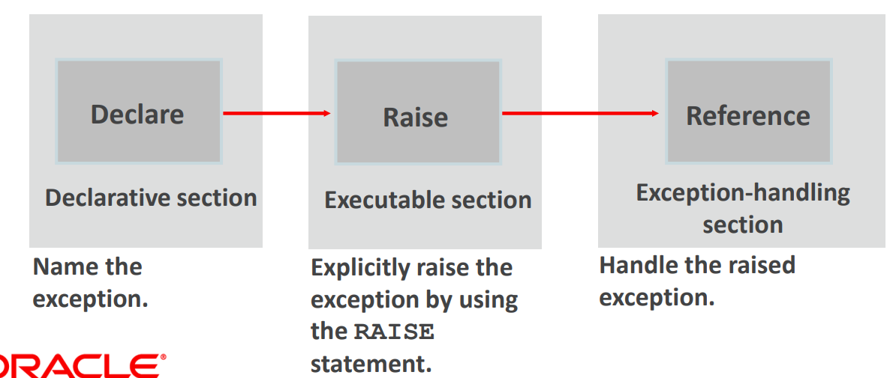

# User-Defined Exceptions

[Back](../index.md)

- [User-Defined Exceptions](#user-defined-exceptions)
  - [Define a User-Defined Exceptions](#define-a-user-defined-exceptions)
    - [Example:](#example)
  - [RAISE statement](#raise-statement)
    - [Example:](#example-1)
  - [`RAISE_APPLICATION_ERROR` Procedure](#raise_application_error-procedure)
    - [Example: with a user-defined error name](#example-with-a-user-defined-error-name)
    - [Example: with no user-defined error](#example-with-no-user-defined-error)
    - [Example: call within the exepction section](#example-call-within-the-exepction-section)

---

## Define a User-Defined Exceptions

- define exceptions depending on the requirements of your application.

  1. Declaring the name of the user-defined exception **within the declarative section**.

  2. Using the `RAISE` statement to raise the exception explicitly **within the executable section**.

  3. Referencing the declared exception name within a `WHEN` clause **in the exception-handling section**.



- Application: 常用场景

  - DML: `update`, `delete`

- **Syntax**

```sql

DECLARE
    exception_name exception;
BEGIN
    -- some DML code;
    IF SQL%NOTFOUND THEN
        RAISE exception_name;
    ELSE
        -- some code when executing successfully
    END IF;

EXCEPTION
    WHEN exception_name THEN
        -- exception handling codes;

```

- Method

| Method                    | Error Name   | Error Number | Error Message |
| ------------------------- | ------------ | ------------ | ------------- |
| `RAISE`                   | User-defined | None         | None          |
| `RAISE_APPLICATION_ERROR` | User-defined | Yes          | Yes           |

### Example:

```sql

DECLARE
    e_update EXCEPTION; -- defined an exception
BEGIN
    UPDATE departments
    SET
        department_name='humber'
    WHERE
        department_id= 2000;
    IF sql%notfound THEN -- raise a user-defined exception
        RAISE e_update;
    END IF;
    dbms_output.put_line('Update completed!');
EXCEPTION
    WHEN e_update THEN -- catch/trap a exception
        dbms_output.put_line('Error: The given department number is invalid!');
END;

```

---

## RAISE statement

- use the RAISE statement to raise exceptions
  - a user-defined exception
  - an Oracle server error

```SQL
-- a user-defined exception
IF v_grand_total = 0 THEN
  RAISE e_invalid_total;
ELSE
  DBMS_OUTPUT.PUT_LINE(v_num_students / v_grand_total);
END IF;

-- an Oracle server error
IF v_grand_total = 0 THEN
  RAISE ZERO_DIVIDE;
ELSE
  DBMS_OUTPUT.PUT_LINE(v_num_students / v_grand_total);
END IF;

```

### Example:

```sql

DECLARE
    v_x          NUMBER := &x;
    v_y          NUMBER := &y;
    v_z          NUMBER;
    e_divide_one EXCEPTION;
BEGIN
    IF v_y = 1 THEN
        RAISE e_divide_one; --raise a user-defined error
    END IF;
    IF v_y = 2 THEN
        RAISE zero_divide; --raise a predefined error
    END IF;
    v_z :=v_x/v_y;
    dbms_output.put_line(v_z);
EXCEPTION
    WHEN e_divide_one THEN  --catch the user-defined error
        dbms_output.put_line('Warning: Divisor cannot be one.');
    WHEN zero_divide THEN   --catch a predefined error
        dbms_output.put_line('Error: Divisor cannot be zero.');
END;

```

---

## `RAISE_APPLICATION_ERROR` Procedure

- `RAISE_APPLICATION_ERROR`: to return **user-defined error** messages from stored subprograms.

- The main advantage of using this procedure instead of `RAISE`, is that `RAISE_APPLICATION_ERROR` allows you to associate your own **error number** and meaningful **message** with the exception.

- Syntax:

```sql

RAISE_APPLICATION_ERROR (error_number, message[, {TRUE | FALSE}]);

```

- Parameter:

  - `error_number` must fall between -20000 and -20999.

    - This range is **reserved** by Oracle for **programmer use**, and is never used for predefined Oracle server errors.

  - `message` is the **user-specified message** for the exception.

  - `TRUE | FALSE `is an optional Boolean parameter.
    - If `TRUE`, the error is **placed on the stack** of previous errors.
    - If `FALSE`, the default, the error **replaces** all previous errors.

- use the RAISE_APPLICATION_ERROR in two different places:
  - Executable section
  - Exception section

### Example: with a user-defined error name

```sql
-- raise error in executable section associating with a user-defined error name

DECLARE
    v_dept_id departments.department_id%type := 123;
    e_name EXCEPTION;
    PRAGMA exception_init(e_name, -20999); -- associate a error name with a error code
BEGIN
    DELETE FROM departments
    WHERE
        department_id = v_dept_id;
    IF sql%notfound THEN
        raise_application_error(-20999, 'This is not a valid manager'); --raise an error with a specific code and message
    ELSE
        dbms_output.put_line('Deleted successfully!');
    END IF;
EXCEPTION
    WHEN e_name THEN -- catch the exception by error name
        dbms_output.put_line('Error code: '||sqlcode); --Error code: -20202
        dbms_output.put_line('Error message: '||sqlerrm); -- Error message: ORA-20202: This is not a valid manager
END;

```

---

### Example: with no user-defined error

```sql

-- RAISE_APPLICATION_ERROR
-- with no user-defined error

DECLARE
    v_dept_id departments.department_id%type := 123;
BEGIN
    DELETE FROM departments
    WHERE
        department_id = v_dept_id;
    IF sql%notfound THEN
        raise_application_error(-20202, 'This is not a valid manager'); --raise an error with a specific error code and message
    END IF;
EXCEPTION
    WHEN OTHERS THEN -- catch/trap all else errors
        dbms_output.put_line('Error code: '||sqlcode); --Error code: -20202
        dbms_output.put_line('Error message: '||sqlerrm); -- Error message: ORA-20202: This is not a valid manager
END;

```

---

### Example: call within the exepction section

```sql
-- RAISE_APPLICATION_ERROR
-- raise error in exception section

DECLARE
    v_dept_id   PLS_INTEGER := 2000;
    v_dept_name departments.department_name%type;
    e_not_found EXCEPTION;
    PRAGMA exception_init(e_not_found, -20201);
BEGIN
    BEGIN
        SELECT department_name INTO v_dept_name
        FROM departments
        WHERE department_id = v_dept_id;
    EXCEPTION
        WHEN no_data_found THEN
            raise_application_error(-20201, 'No department has this id!');
        WHEN too_many_rows THEN
            raise_application_error(-20202, 'Too many employees were found.');
        WHEN e_not_found THEN
            dbms_output.put_line('Error Inner code:'||sqlcode); --not execute, because only one exception handle executes at a time
            dbms_output.put_line('Error Inner message:'||sqlerrm);
    END;
EXCEPTION
    WHEN e_not_found THEN
        dbms_output.put_line('Error outer code:'||sqlcode); --Error outer code:-20201
        dbms_output.put_line('Error outer message:'||sqlerrm); --Error outer message:ORA-20201: No department has this id!
END;
```

---

[TOP](#user-defined-exceptions)
