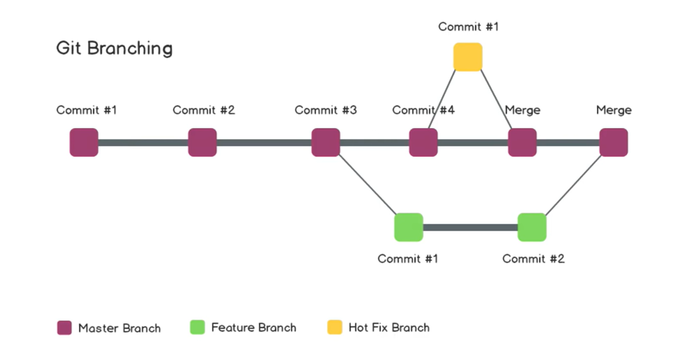

# Git Branch

[Back](./index.md)

---

- [Git Branch](#git-branch)
  - [Git Branching](#git-branching)
  - [List Branches 查看分支](#list-branches-查看分支)
  - [Create a new Branch 创建新分支](#create-a-new-branch-创建新分支)
  - [Switch between branches 切换分支](#switch-between-branches-切换分支)
  - [Rename a local branch 重命名](#rename-a-local-branch-重命名)
  - [Merge Branches 合并分支](#merge-branches-合并分支)
  - [Push the branch to the remote Repository 推送分支到远端](#push-the-branch-to-the-remote-repository-推送分支到远端)
  - [Delete the branch 删除分支](#delete-the-branch-删除分支)

---

## Git Branching

---

## List Branches 查看分支

- Syntax:

| Git Command         | Description                                            |
| ------------------- | ------------------------------------------------------ |
| `git branch`        | List all of the branches in local repository.          |
| `git branch --list` | 同上                                                   |
| `git branch -r`     | List all branches in remote repository                 |
| `git branch -a`     | List both remote-tracking branches and local branches. |

---

## Create a new Branch 创建新分支

| Git Command                     | Description                                                     |
| ------------------------------- | --------------------------------------------------------------- |
| `git branch <new-branch>`       | Creates a new branch in local repository, without checking out. |
| `git checkout -b <new-branch> ` | Creates a new branch in local repository and checks out.        |

---

## Switch between branches 切换分支

| Git Command             | Description                     |
| ----------------------- | ------------------------------- |
| `git checkout <branch>` | Switches to a specified branch. |

- Must commit the changes in the current branch before checking out to another.切换前必须提交修改。

---

## Rename a local branch 重命名

| Git Command               | Description                               |
| ------------------------- | ----------------------------------------- |
| `git branch -m <newname>` | Rename the current branch to `<newname>`. |

---

## Merge Branches 合并分支

- 需要修改哪个分支，则先 checkout 到哪个分支。

| Git Command          | Description                                   |
| -------------------- | --------------------------------------------- |
| `git merge [branch]` | Merge branches on top of the current branch,. |

- 如果有合并的冲突，则推荐使用 IDE 解决冲突问题。然后提交，合并。

---

## Push the branch to the remote Repository 推送分支到远端

| Git Command                  | Description                                       |
| ---------------------------- | ------------------------------------------------- |
| `git push <remote> <branch>` | Push the `<branch>` to the `<remote>` repository. |

- 先使用 checkout 切换到需要的分支，再推送。
- 当以 github 为远端时，会在 github 创建一个分支。
  - 在 github 中可以使用 pull request，将 push 的分支合并到远端的主分支 master。

---

## Delete the branch 删除分支

| Git Command              | Description      |
| ------------------------ | ---------------- |
| `git branch -d <branch>` | Deletes a branch |

---

[Top](#git-branch)

**!Important**: This note is for personal use. Copy right reserved.
