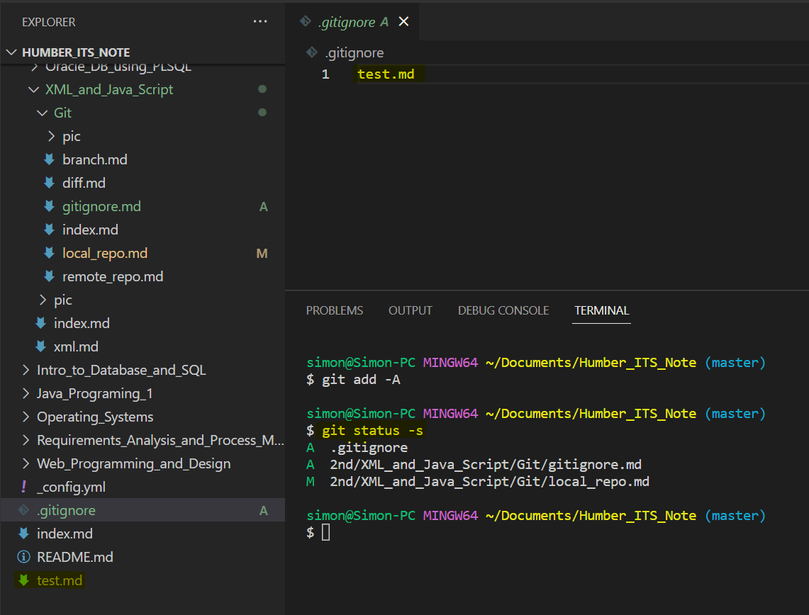

# Gitignore

[Back](./index.md)

1. git bash: `touch .gitignore`
2. 编辑`.gitignore`内容.
   - 将不需要提供 stage 的文件名逐行写入该文件
   - `.gitignore`允许使用文件名匹配。
3. 当使用`git add *`时，在`.gitignore`标记的文件将不会被缓存。

>上例的test.md被添加到.gitignore中,则不会被缓存。
