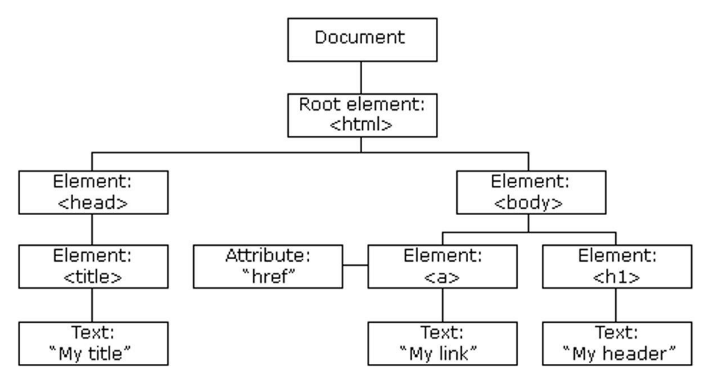

## HTML DOM

[Back](./index.md)

## DOM

- `DOM (Document Object Model)` 译为文档对象模型，是 `HTML` 和 `XML` 文档的编程接口。

  - `HTML DOM` 定义了访问和操作 `HTML` 文档的标准方法。
  - When a web page is loaded, the browser creates a Document Object Model of the page. 每当访问，都会创建一个 DOM
  - The `HTML DOM` model is constructed as a tree of Objects:`DOM` 以**树结构**表达 `HTML` 文档。

---

[Top](#html-dom)
