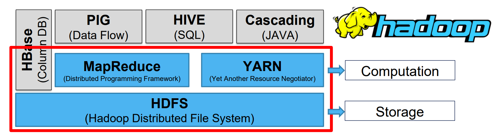
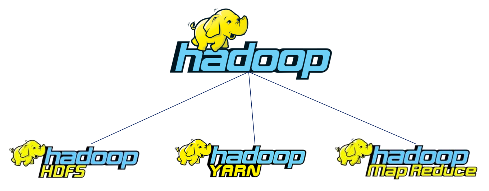
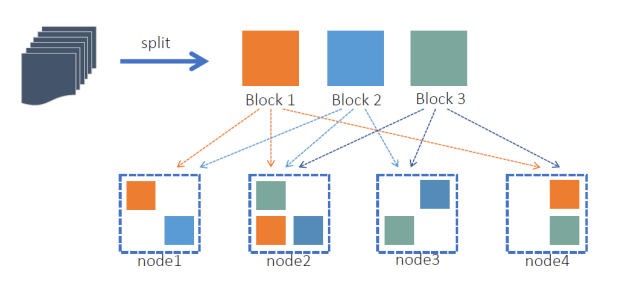
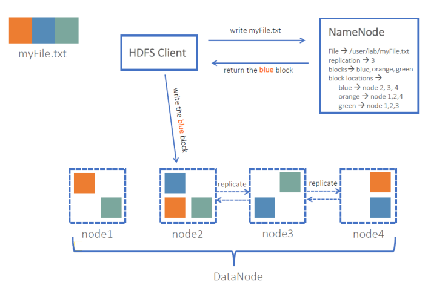
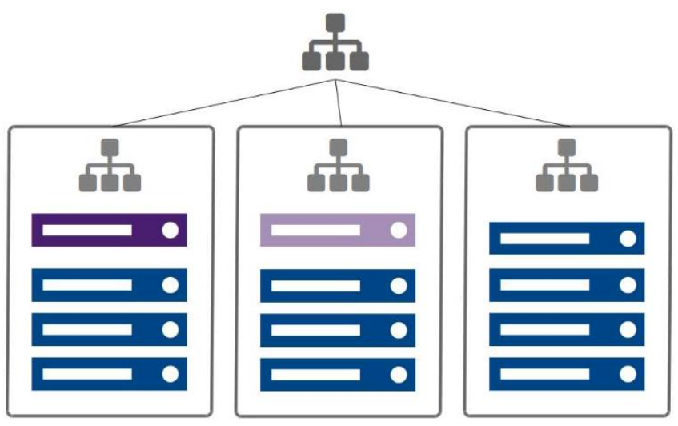
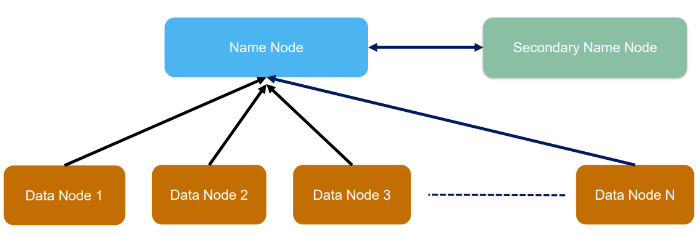
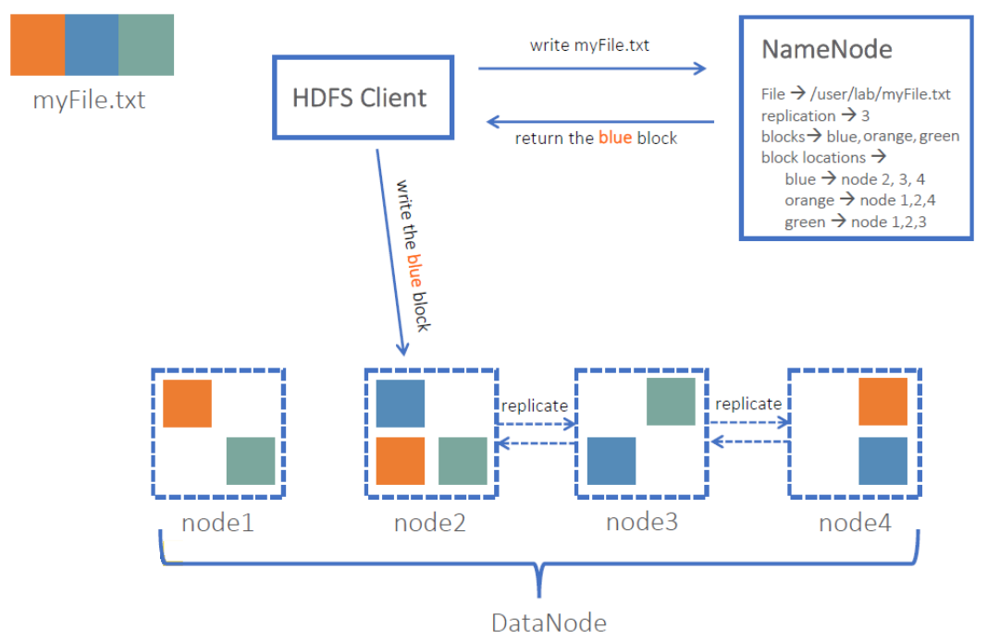
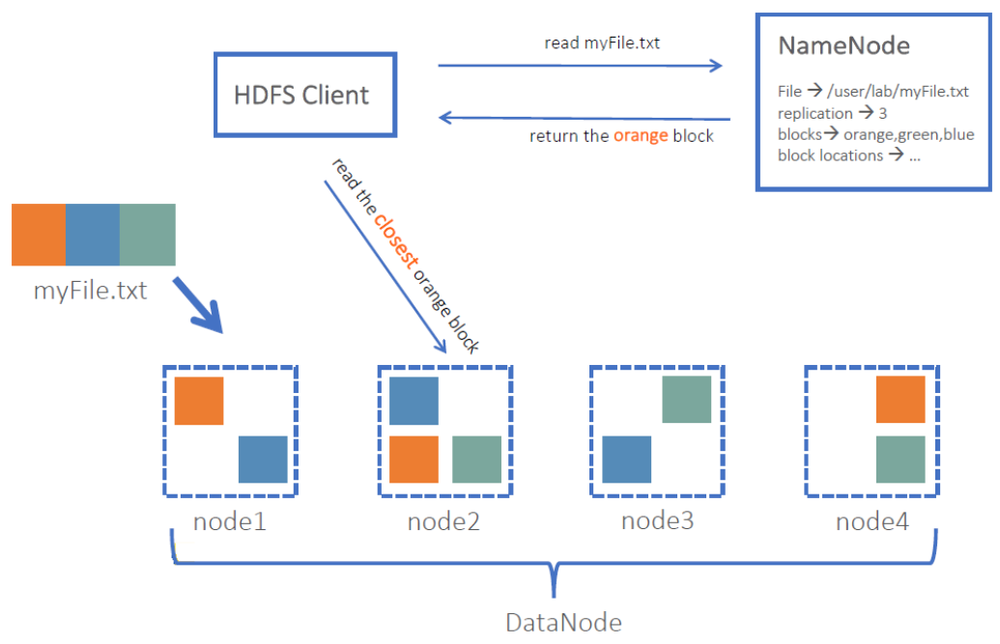

# Big Data - Hadoop

[Back](./index.md)

- [Big Data - Hadoop](#big-data---hadoop)
  - [Hadoop](#hadoop)
    - [Hadoop Ecosystem](#hadoop-ecosystem)
    - [Data Locality](#data-locality)
    - [Components](#components)
  - [Hadoop Distributed File System (HDFS)](#hadoop-distributed-file-system-hdfs)
    - [Blocks](#blocks)
    - [Replication](#replication)
    - [Hadoop Minimal Cluster](#hadoop-minimal-cluster)
  - [Daemon](#daemon)
    - [NameNode (master)](#namenode-master)
    - [DataNode (slave)](#datanode-slave)
    - [Secondary NameNode (master)](#secondary-namenode-master)
  - [File Write and Read](#file-write-and-read)

---

## Hadoop

- `hadoop`
  - An Open-Source framework
  - Parallel computation framework
  - Written in Java
  - Redundant, Fault-tolerant data **storage**
  - Falls under the umbrella of infrastructure for distributed computing
  - Process enormous data in distributed file systems

---

### Hadoop Ecosystem

- Storage
  - `HDFS`:
    - Hadoop Distributed File System
- Computation
  - `YARN`:
    - Yet Another Resource Negotiator
  - `MapReduce`
    - Distributed Programming Framework
    - a computing model that decomposes large data manipulation jobs into individual tasks that can be executed in parallel across a cluster of servers
- `HBase`: Column DB
- `PIG`: Data Flow
- `HIVE`: SQL
- `Cascading`: JAVA

---

### Data Locality

- Hadoop is a data storage and processing platform based on central concept “Data Locality”
- Data locality
  - refers to the processing of data **where it resides**
  - It is not ideal or even possible to move large volumes of data required for processing across the network at compute time.
- Hadoop enables large datasets locally

---

### Components

- Hadoop consists of three key **components**

  

- `HDFS`

  - `Hadoop Distributed File System`
  - A **distributed filesystem** that runs on large **clusters** of commodity machines

- `MapReduce`

  - A distributed data **processing model** and **execution environment** that runs on large clusters of commodity machines

- `YARN`

  - `Yet Another Resource Negotiator`
  - YARN governs and **orchestrates** the processing of data in Hadoop
  - YARN is responsible for **resource management and job scheduling** in a Hadoop cluster

---

## Hadoop Distributed File System (HDFS)

- `HDFS`

  - a **filesystem** designed for storing very large files with **streaming data** access pattern, **running on clusters** on commodity hardware
  - It is the primary **input data source** and target for data processing operations

- **Very large files**:
  - hundreds of megabytes, gigabytes, or terabytes in size
- **Streaming data access**:
  - **write-once**, **read-many**-times pattern
- **Commodity hardware**:

  - commonly available hardware

- HDFS is not a good fit for
  - **Low-latency** data access
  - Lots of **small** files
  - **Multiple writers**, arbitrary file **modifications**

---

### Blocks

- When a file is added to HDFS, it is **split into blocks**

  - 64M by default,
  - Can be configured to 128M, 256M, 1G, etc.
  - **Should not be very small** - Map tasks depends on number of blocks

- Why blocks?

  - **Replication (fault tolerance)**
  - Large file gets **chunked and distributed** easily (There could be files that will not fit on the disk of a single machine)
  - Data-local **distributed computation** (MapReduce)

---

### Replication

- The blocks are replicated to nodes throughout the cluster

  - Based on the **replication factor (3 by default)**
  - Replication increases reliability and performance

- **Reliability**:
  - can **tolerate data loss**
- **Performance**:
  - more opportunities for data locality

---

### Hadoop Minimal Cluster

---

## Daemon

- There’re 3 daemons in “classical” HDFS
  - NameNode (master)
  - Secondary NameNode (master)
  - DataNode (slave)

---

### NameNode (master)

- The `NameNode` stores all **metadata**

  - Information about file **locations** in HDFS
  - Information about file **ownership** and **permissions**
  - **Name**(“blk_xxxxx”) of the individual **blocks**
  - **Locations** of the **blocks**

- Metadata is stored on disk and read into memory when the NameNode daemon starts up
- Changes/Edits to the files are written to the **logs**

---

### DataNode (slave)

- Actual files/data are **chunked into blocks and stored** on the data nodes
- Each block is replicated to different nodes for redundancy
- The DataNode daemon **controls access** to the blocks and **communicates** with the NameNode

---

### Secondary NameNode (master)

- The Secondary NameNode is **not** a backup for the NameNode
- It provides **memory-intensive administrative functions** for the NameNode
- Secondary NameNode periodically combines a prior **snapshot** of the file system metadata and edit logs into a new snapshot
- It then transmits the new snapshot back to the NameNode

---

## File Write and Read

- Data centers are typically organized into racks of multiple machines
  - Closest Network Distance in Hadoop

---

[TOP](#big-data---hadoop)
