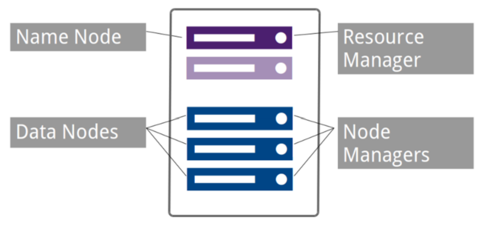

# Big Data - Hadoop

[Back](./index.md)

- [Big Data - Hadoop](#big-data---hadoop)
  - [Hadoop](#hadoop)
    - [Hadoop Ecosystem](#hadoop-ecosystem)
    - [Data Locality](#data-locality)
    - [Components](#components)
  - [Hadoop Distributed File System (HDFS)](#hadoop-distributed-file-system-hdfs)
    - [Blocks](#blocks)
    - [Replication](#replication)
    - [Hadoop Minimal Cluster](#hadoop-minimal-cluster)
  - [Daemon](#daemon)
    - [NameNode (master)](#namenode-master)
    - [DataNode (slave)](#datanode-slave)
    - [Secondary NameNode (master)](#secondary-namenode-master)
  - [File Write and Read](#file-write-and-read)

---

## Hadoop

- `hadoop`
  - An **Open-Source** framework
  - **Parallel** computation framework
  - Written in **Java**
  - Redundant, Fault-tolerant data **storage**
  - Falls under the umbrella of infrastructure for **distributed computing**
  - Process enormous data in **distributed file systems**

---

### Hadoop Ecosystem

- Storage
  - `HDFS`:
    - Hadoop **Distributed File System**
- Computation
  - `YARN`:
    - Yet Another Resource Negotiator
  - `MapReduce`
    - Distributed **Programming** Framework
    - a computing model that decomposes large data manipulation **jobs into individual tasks** that can be executed in parallel across a cluster of servers
- `HBase`: Column DB
- `PIG`: Data Flow
- `HIVE`: SQL
- `Cascading`: JAVA

---

### Data Locality

- Hadoop is a **data storage** and **processing** platform based on central concept “Data Locality”
- `Data locality`
  - refers to the processing of data **where it resides**
  - It is not ideal or even possible to move large volumes of data required for processing across the network at compute time.
- Hadoop enables large datasets locally

---

### Components

- Hadoop consists of three key **components**

  

- `HDFS`

  - `Hadoop Distributed File System`
  - A **distributed filesystem** that runs on large **clusters** of commodity machines

- `MapReduce`

  - A distributed data **processing model** and **execution environment** that runs on large clusters of commodity machines

- `YARN`

  - `Yet Another Resource Negotiator`
  - YARN governs and **orchestrates** the processing of data in Hadoop
  - YARN is responsible for **resource management and job scheduling** in a Hadoop cluster

---

## Hadoop Distributed File System (HDFS)

- `HDFS`

  - a **filesystem** designed for storing very large files with **streaming data** access pattern, **running on clusters** on commodity hardware
  - It is the primary **input data source** and target for **data processing** operations
  - It contains a master/slave architecture. It consist of:
    - **a single NameNode** performs the role of **master**
    - **multiple DataNodes** performs the role of a **slave**.

- **Very large files**:
  - Files should be of hundreds of megabytes, gigabytes or more.
- **Streaming data access**:
  - The time to read **whole** data set is more important than latency in reading the first.
  - HDFS is built on **write-once** and **read-many-times** pattern.
- **Commodity hardware**:

  - It works on low cost hardware.
  - commonly available hardware

- HDFS is not a good fit for
  - **Low-latency** data access
    - Applications that require very less time to access the first data should not use
    - HDFS as it is giving importance to **whole data** rather than time to fetch the **first record**.
  - Lots of **small** files
    - The name node contains the metadata of files in memory and if the files are small in size it takes a lot of memory for name node's memory which is not feasible.
  - **Multiple writers**, arbitrary file **modifications**
    - It should not be used when we have to write multiple times.

---

### Blocks

- When a file is added to HDFS, it is **split into blocks**

  - **64M** by default,
  - Can be configured to 128M, 256M, 1G, etc.
  - **Should not be very small**
  - Map tasks depends on number of blocks

- `Blocks`:

  - the minimum amount of data that it can read or write.
  - HDFS blocks are 128 MB by default and this is configurable.

- Files n HDFS are **broken into block-sized chunks**,which are stored as independent units.

  - Unlike a file system, if the file is in HDFS is smaller than block size, then it does not occupy full block's size, i.e. 5 MB of file stored in HDFS of block size 128 MB takes 5MB of space only.
  - The HDFS block size is large just to minimize the cost of seek.

- Why blocks?

  - **Replication (fault tolerance)**
  - Large file gets **chunked and distributed** easily (There could be files that will not fit on the disk of a single machine)
  - Data-local **distributed computation** (MapReduce)

---

### Replication

- The blocks are replicated to nodes throughout the cluster

  - Based on the **replication factor (3 by default)**
  - Replication increases reliability and performance

- **Reliability**:
  - can **tolerate data loss**
- **Performance**:
  - more opportunities for data locality

---

### Hadoop Minimal Cluster

---

## Daemon

- There’re 3 daemons in “classical” HDFS
  - NameNode (master)
  - Secondary NameNode (master)
  - DataNode (slave)

---

### NameNode (master)

- The `NameNode` stores all **metadata**

  - Information about file **locations** in HDFS
  - Information about file **ownership** and **permissions**
  - **Name**(“blk_xxxxx”) of the individual **blocks**
  - **Locations** of the **blocks**

- **Metadata** is stored on disk and **read into memory** when the` NameNode daemon` starts up
- Changes/Edits to the files are written to the **logs**

- It is **a single master server** exist in the HDFS cluster.
  - As it is a single node, it may become the reason of single point failure.
- It manages the **file system namespace** by executing an operation like the opening, renaming and closing the files.
- It simplifies the architecture of the system.

- `Name Node`
  - HDFS works in **master-worker pattern** where the name node acts as **master**.
- Name Node is controller and manager of HDFS as it knows the status and the metadata of all the files in HDFS; the metadata information being file permission, names and location of each block.
  - The metadata are small, so it is **stored in the memory of name node**,allowing faster access to data.
- Moreover the HDFS cluster is accessed by **multiple clients concurrently**,so all this information is handled bya single machine.
- The file system operations _like opening, closing, renaming_ etc. are executed by it.

---

### DataNode (slave)

- Actual files/data are **chunked into blocks** and **stored on the data nodes**
- Each block is replicated to different nodes for redundancy
- The DataNode daemon **controls access** to the blocks and **communicates** with the NameNode

- The HDFS cluster contains **multiple** DataNodes.
  - Each DataNode contains **multiple** _data blocks_.
    These data blocks are used to store data.
- It is the responsibility of DataNode **to read and write requests** from the file system's clients.
- It performs **block** creation, deletion, and **replication** upon instruction from the NameNode

- `Data Node`
  - They **store and retrieve blocks** when they are told to; by client or name node. 
  - They report back to name node periodically, with list of blocks that they are storing. 
  - The data node being a commodity hardware also does the work of block creation, deletion and replication as stated by the name node.

---

### Secondary NameNode (master)

- The Secondary NameNode is **not** a backup for the NameNode
- It provides **memory-intensive administrative functions** for the NameNode
- Secondary NameNode periodically combines a prior **snapshot** of the file system metadata and edit logs into a new snapshot
- It then transmits the new snapshot back to the NameNode

- `Secondary Name Node`: 
  - It is a separate physical machine which acts as **a helper of name node.** 
  - It performs **periodic check points**.
  - It communicates with the name node and take snapshot of meta data which **helps minimize downtime and loss of data**.

---

## File Write and Read

- Data centers are typically organized into racks of multiple machines

  - Closest Network Distance in Hadoop

- **Write file**: Block -> replication -> node

- **Read file**: Closest

---

[TOP](#big-data---hadoop)
