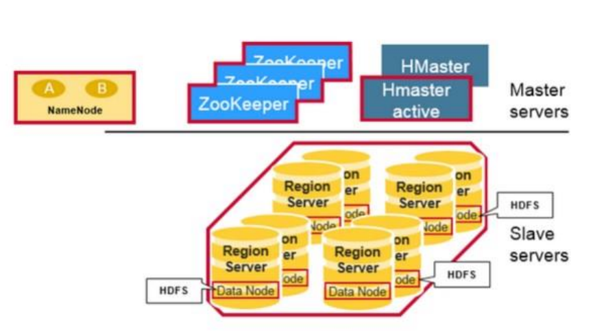

# Big Data - HBase

[Back](../index.md)

- [Big Data - HBase](#big-data---hbase)
  - [`HBase`](#hbase)
    - [Features of Hbase](#features-of-hbase)
    - [Benefits](#benefits)
  - [Data Model](#data-model)
  - [HBASE Architecture](#hbase-architecture)
    - [Region Server \& Regions](#region-server--regions)
    - [Master](#master)
    - [Zookeeper](#zookeeper)
  - [Meta Table](#meta-table)
  - [HBase Read](#hbase-read)
  - [Write](#write)
  - [Region Server Components](#region-server-components)
  - [HBase MemStore](#hbase-memstore)
  - [RDBMS vs HBase(NoSQL)](#rdbms-vs-hbasenosql)
  - [Commands](#commands)
  - [Other info](#other-info)

---

## `HBase`

- `Hbase`

  - an open source and **sorted map data** built on Hadoop.
  - a distributed **column-oriented and horizontally scalable** database built on top of HDFS
  - Based on Google's BigTable
  - not relational and does **not support SQL**
  - `NoSQL` (**key/value** store)

- It is a part of the `Hadoop ecosystem` that provides **random real-time read/write access** to data in the `Hadoop File System`.
  - Hbase is well suited for **sparse data sets** which are very common in big data use cases.
  - Hbase provides **APIs** enabling development in practically **any programming language**.

---

### Features of Hbase

- **Horizontally scalable**:

  - You can **add any number of columns** anytime.

- **Automatic Failover**:

  - a resource that allows a system administrator to **automatically switch data handling to a standby system** in the event of system compromise

- **Integrations** with `Map/Reduce` framework:

  - Al the commands and java codes **internally implement** `Map/ Reduce` to do the task and it is built over `Hadoop Distributed File System`. `HBase` > `Map/Reduce` > `Hadoop`

- A sparse, distributed, persistent, multidimensional **sorted map**, which is **indexed** by `rowkey`, `column key`,and `timestamp`.

- Often referred as a `key value store` or `column family-oriented database`, or **storing versioned** maps of maps.

- Fundamentally, it's a platform for storing and retrieving data with **random access**.

- It **doesn**'t care about **datatypes**(storing an `integer` in one row and a `string` in another for the **same column**).

- It **doesn't enforce relationships** within your data.

- It is designed to **run on a cluster** of computers, built using commodity hardware.

---

### Benefits

- RDBMS get exponentially **slow** as the data becomes large
- Expects data to be **highly structured**, i.e. ability to fit in a well-defined schema
- Any **change** in schema might require a **downtime**
- For sparse datasets, too much of overhead of maintaining `NULL` values

---

## Data Model

- Column family-oriented Data Model

  - It as a sparse, consistent, distributed, multidimensional, sorted map:
    - **labeled** tables of **rows**
    - row consist of **key-value cells**
      - (row key, column family, column, timestamp) -> value

- Data is automatically distributed across the cluster

- `Row-Key`:

  - **Uniquely** identify each **row** in the table
  - the primary index
  - `Key rang`(`regions`)
    - used for **horizontal partitioning**.
    - `Region` = served by nodes(Region Servers)
      - Regions are spread across cluster (horizontal sharding)
  - are Strings
    - kept in strict lexicographic **order**.
  - “Composite” Keys

- `Column` :

  - **Key-Value pair** (Can be added on demand)

- `Column-Family`

  - way to **physically group Columns** (specified at table creation time as part of the schema)
  - Column Families are stored and accessed **separately**.
    - This means that not all parts of a row are picked up in a single I/O operation
  - Stored in separated files (HFile)

- `Timestamp`:

  - **versioning**(history)
  - `Versioning` is **built in**.
    - A put is both an insert (create) and an update, and each one gets its own version.
  - The **most recent** version is **returned**.
  - can configure **how many versions to keep** and this is done **per column family**.
  - When the max number of versions is exceeded, extra records will be eventually **removed**.

- `Cell`
  - Actual value stored in the table
  - Every cell is **stored separately** as pair Key/Value
    - This allows to **store tables sparsely** populated


---

## HBASE Architecture

- Hbase is composed of **3 types of servers** in `master/slave` environment:
  - `Region servers` serve data for **reads** and **writes**
  - HBase `Master` process:
    - **Region assignment**, **DDL** (create, delete tables)
  - `Zookeeper` (part of HDFS) **maintains a live cluster state**.
  - Hbase **data** is stored in HDFS **files**



---

### Region Server & Regions

- `Region` = `Contiguous Keys`

  - HBase Tables are divided horizontally by `row key range` into “`Regions`” (`1GB` size)
  - A region contains all rows in the table between the region's **start key** and **end key**

- `Region Servers`

  - the nodes in the cluster serving for `Regions`
  - A `region server` can serve about **1,000** `regions`.

- `Region servers` serve data for **reads** and **writes**.

---

### Master

- Region **assignment**, **DDL** (create, delete tables) operations
- **Coordinating** the region servers
- **Monitoring** all RegionServer instances (**with Zookeeper**)
- **Interface** for creating, deleting, updating tables

---

### Zookeeper

- `Zookeeper`:
  - a distributed coordination service to maintain server state
- Zookeeper maintains which servers are **alive** and **available**, with heartbeat.
- Provides server **failure notification**

---

## Meta Table

- `META table`

  - holds the **location of the regions** in the cluster.
  - used to find the Region for a given Table key.

- `ZooKeeper` stores the **location** of the `META table`
- The client gets the `Region server` that hosts the META table **from ZooKeeper**.
  - The client will query the `.META.server` to get the **region server** corresponding to the row key it wants to access. The client caches this information along with the
    META table location.
  - It will get the Row from the corresponding `Region Server`.


- `.META.table`
  - like a b tree.
  - structure:
    - **Key**: region **start key**, region **id**
    - **Value**: `RegionServer`


---

## HBase Read

- A read against HBase must be reconciled between the `HFiles`, `MemStore` & `BLOCKCACHE`.

- `BlockCache`

  - designed to keep **frequently accessed data** from the `HFiles` in memory so as to avoid disk reads.
  - Each `column family` has its own `BlockCache`.
  - BlockCache contains data **in form of 'block'**, as unit of data that HBase reads from disk in a single pass.

- `HFile`

  - the underlying **storage format** for HBase.
  - The `HFile` is **physically** laid out as **a sequence of blocks** plus **an index over those blocks**.
    - This means **reading a block** from HBase **requires** only looking up that block's **location in the index** and retrieving it from disk.

- `Block`:

  - the **smallest indexed unit of data**
  - is the **smallest unit of data** that **can be read** from disk.
  - default size `64KB`.

- Scenarios

  - When **smaller** block size is preferred to perform **random** lookups.
    - Having smaller blocks **creates a larger index** and thereby **consumes more memory**.
  - When **larger** block size is preferred to perform **sequential scans** frequently.
    - This allows you to **save on memory** because larger blocks mean fewer index entries and thus a **smaller index**.
  - Summary:
    - random, larger index, more memory
    - sequential, small index, less memory

- **Reading a row** from HBase requires

  - 1. First, the scanner looks for the Row cells in the `Block cache`.
    - **Recently** Read Key Values are **cached** here, and **Least** Recently Used are **evicted** when memory is needed.
  - 2. Next, the scanner looks in the `MemStore`, the **write cache in memory** containing the most recent writes.
  - 3. If the scanner does not find all of the row cells in the MemStore and Block Cache, then HBase will use the Block Cache **indexes** and bloom filters to **load** `HFiles` into memory, which may contain the target row cells.


---

## Write

- When the client issues a `Put` **request**,
  - 1. the first step is to write the data to the `write-ahead log (WAL)`
    - Edits are appended to the **end** of the WAL file that is stored on disk
    - The WAL is used to recover **not-yet-persisted data** in case a server crashes
  - 2. Once the data is written to the WAL, it is placed in the `MemStore`.
  - 3. Then, the put request **acknowledgement** _returns_ to the client..
  - 4. Finally, the data in `Memstore` gets **flushed onto** Hbase data files (also called `Hfiles`)
- WAL > Memstore > Hfiles

- Clients **don't interact directly** with the underlying `HFiles` during writes, rather writes goes to `WAL` & `MemStore` **in parallel**.

  - Every write to HBase requires **confirmation** from both the `WAL` and the `MemStore`.


---

## Region Server Components

- `BlockCache`:

  - the **read cache**.
  - stores **frequently read data in memory**.
  - **Least** Recently Used data is **evicted when full**.

- `WAL` / `Write Ahead Log`

  - a file on the distributed file system used to **store new data** that **hasn't yet been persisted to permanent storage**;
  - also used for **recovery** in the case of failure.

- `MemStore`:

  - the write cache.
  - **stores new data** which has **not yet been written** to disk.
  - **sorted** before writing to disk.
  - There is one `MemStore` **per** `column family` **per** `region`.

- `Hfiles` store the rows as **sorted KeyValues** on disk.


---

## HBase MemStore

- The `MemStore` is a **write buffer** where HBase **accumulates data in memory** _before a permanent write_.

  - Its contents are **flushed to disk** to form an `HFile` when the `MemStore` fills up.
  - It **doesn't write to an existing** `HFile` but instead **forms a new file** on every flush.

- `column family`

  - one `MemStore` per `column family` 一对一
  - A column family can have multiple HFiles. But a `HFiles` belong to a `column family`.一对多

- `hbase.hregion.memstore.flush.size`

  - **size** of the `MemStore` defined in `hbase-site.xml`

- **What happens, when the server hosting a `MemStore` that has not yet been flushed crashes?**
  - Every server in HBase cluster keeps a `WAL` to **record changes** as they happen.
    - The `WAL` is a file on the **underlying file system**.
    - A write isn't considered successful` until the new WAL entry` is successfully written, this guarantees durability.
  - If HBase goes down, the data that **was not yet flushed** from the `MemStore` to the HFile **can be recovered** by replaying the WAL, taken care by Hbase framework.

---

## RDBMS vs HBase(NoSQL)

- Differences between RDBMS and HBase:

  - `Schema/Database` in RDBMS can be compared to `namespace` in Hbase.
  - A `table` in RDBMS can be compared to `column family` in Hbase.
  - A `record` (after table joins) in RDBMS can be compared to a `record` in Hbase.
  - A **collection of tables** in RDBMS can be compared to a `table` in Hbase..

- HBase:
  - Data is accessed and stored together:
    - RowKey is the primary index
    - Column Families Group similar data by row key

---

## Commands

| Command                                                  | Description                          |
| -------------------------------------------------------- | ------------------------------------ |
| `status`                                                 | returns the status of the system     |
| `version`                                                | returns the version of HBase         |
| `list`                                                   | list all the tables in HBase         |
| `create 'tb_name','col_f'`                               | Creates a new table                  |
| `describe 'tb_name'`                                     | returns the description of the table |
| `disable 'tb_name'`                                      | disable the table                    |
| `drop 'tb_name'`                                         | delete a table                       |
| `scan 'tb_name'`                                         | view the data                        |
| `put 'tb_name','r_key','col_f:col_name','value'`         | insert rows into a table             |
| `put 'tb_name','r_key','col_f:col_name','new_value'`     | update an existing cell value        |
| `get 'tb_name','row_k'`                                  | read data from a table               |
| `delete 'tb_name','row_k','col_f:col_name','time_stamp'` | delete a specific cell               |
| `deleteall 'tb_name','row_k'`                            | delete all the cells in a row.       |
| `count 'tb_name'`                                        | count the number of rows             |
| `truncate 'tb_name'`                                     | drops and recreates                  |

- Example 1

- Enter Shell:
  - `hbase shell`

```sh
# create a table1, and a col family
create 'table1', 'colf'
# list all the tables in HBase
list 'table1'
# insert datat
put 'table1', 'row1', 'colf:a', 'value1'
put 'table1', 'row1', 'colf:b', 'value2'
put 'table1', 'row2', 'colf:a', 'value3'
# view the data
scan 'table1'
# read data from a table
get 'table1', 'row1'
```

- Example 2

- Enter Shell:
  - `hbase shell`

```sh
# create a table1, and 2 col families
create 'Movies',{NAME=>'info'},{Name=>'director'}
describe 'Movies'
put 'Movies','1','info:title','Godfather'
put 'Movies','1','info:star','Marlon Brando'
put 'Movies','1','info:star','Al Pacino'
put 'Movies','1','info:type','Crime'
put 'Movies','1','info:type','Drama'
get 'Movies', '1'
put 'Movies','2','info:star','Samuel L. Jackson'
scan 'Movies'
delete 'Movies','1','info:star'
disable 'Movies'
drop 'Movies'
```

---

## Other info

- Data **Replication**:
  - Relies on **HDFS**
- Crash **Recovery**/Data **Recovery**:
  - Performed using `WAL`
- **Minor** **Compaction**:
  - **Smaller** HFiles are combined into one **large** Hfile.
- **Major Compaction**:
  - Merges and rewrites all the `HFiles` in a region to one HFile per column family, and in the process, drops deleted or expired cells.
  - **Heavy** process.
  - Needs to be schedule

---

[TOP](#big-data---hbase)
