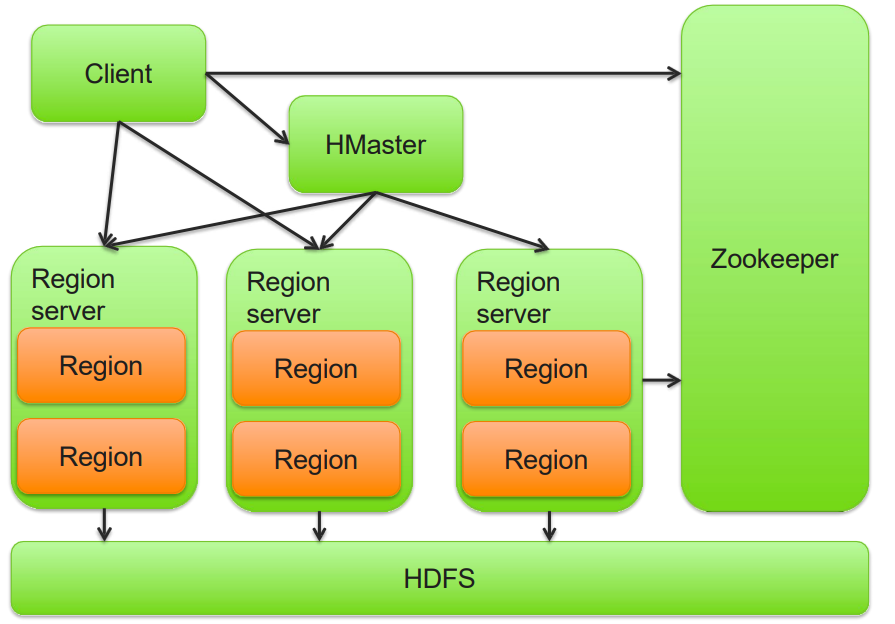
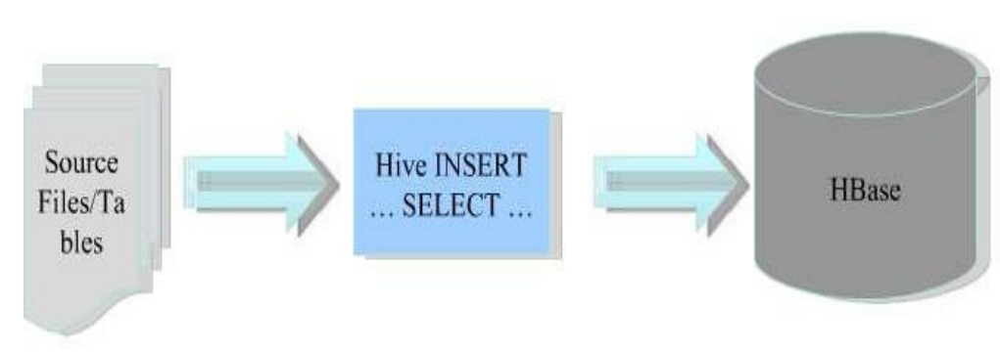
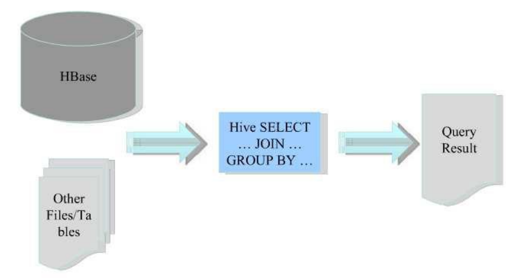
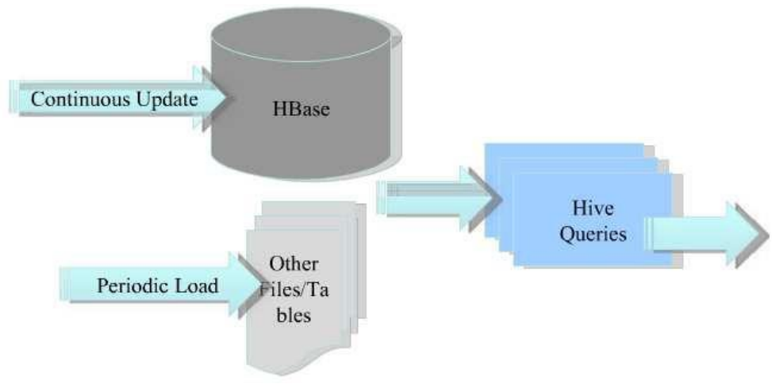

# Big Data - Integration of Apache Hive and HBase

[Back](../index.md)

- [Big Data - Integration of Apache Hive and HBase](#big-data---integration-of-apache-hive-and-hbase)
  - [Apache Hive Overview](#apache-hive-overview)
  - [Overview of Apache HBase](#overview-of-apache-hbase)
  - [Hive + HBase Features and Improvements](#hive--hbase-features-and-improvements)
  - [Hive + HBase Motivation](#hive--hbase-motivation)
  - [Use Case](#use-case)
  - [Storage Handler](#storage-handler)
  - [Schema Mapping](#schema-mapping)
  - [Type Mapping](#type-mapping)
  - [Bulk Load](#bulk-load)
  - [Example](#example)

---

## Apache Hive Overview

- `Apache Hive`
  - a data **warehouse system** for Hadoop
- SQL-like query **language** called `HiveQL`
- Built for **PB(petabyte) scale** data
- Main **purpose** is **analysis** and **ad hoc querying**
- `Database` / `table` / `partition` / `bucket`: DDL Operations
- **SQL** Types + **Complex** Types (ARRAY, MAP, etc)
- Very extensible
- **Not for:**
  - **small data sets**,
  - **low latency** queries,
  - OLTP

---

## Overview of Apache HBase

- `Apache HBase` is the **Hadoop database**
- Modeled after Google’s BigTable
- A sparse, distributed, persistent multi-dimensional **sorted map**
- The map is **indexed** by a `row key`, `column key`, and a `timestamp`
- **Each value** in the map is an **un-interpreted array of bytes**
- **Low latency random data access**



---

## Hive + HBase Features and Improvements

## Hive + HBase Motivation

- Hive and HBase has different characteristics:

| Hive         | HBase        |
| ------------ | ------------ |
| High latency | Low latency  |
| Structured   | Unstructured |
| Analysts     | Programmers  |

- Hive datawarehouses on Hadoop are **high latency**

  - Long `ETL` times
  - Access to **real time data**

- **Analyzing** HBase data with `MapReduce` requires **custom coding**
- `Hive` and `SQL` are already known by many analysts


---

## Use Case

- 1: HBase as **ETL Data Sink**



- 2: HBase as **Data Source**



- 3: Low Latency Warehouse



---

## Storage Handler

- Hive defines `HiveStorageHandler` class for different storage backends:
  - HBase
  - Cassandra
  - MongoDB
- Storage Handler has hooks for
  - Getting **input / output formats**
  - Meta data **operations hook**:
    - CREATE TABLE, DROP TABLE, etc
- Storage Handler is a **table level** concept

  - Does **not support Hive partitions, and bucke**

- For Input/OutputFormat, getSplits(), etc underlying **HBase classes** are used
- **Column selection** and certain **filters** can be pushed down
- HBase tables can be used **with other(Hadoop native) tables and SQL constructs**
- Hive DDL operations are **converted to** HBase DDL operations via the client hook.
  - All operations are performed by the client
  - No two phase commit

---

## Schema Mapping

- Hive table + columns + column types <=> HBase table + column families (+ column qualifiers)
- Every field in Hive table is mapped in order to either
  - The table key (using `:key` as **selector**)
  - A column family (`cf:`) -> MAP **fields** in Hive
  - A column (`cf:cq`)
- Hive table **does not need to include all columns** in HBase

---

## Type Mapping

- Recently added to Hive (0.9.0)
  - Previously all types were being converted to strings in HBase
- Hive has:
  - Primitive types: INT, STRING, BINARY, DATE, etc
  - ARRAY<Type>
  - MAP<PrimitiveType, Type>
  - STRUCT<a:INT, b:STRING, c:STRING>
- HBase does not have types
  - Bytes.toBytes()

---

- Table level property:
  - "hbase.table.default.storage.type” = “binary”
- Type mapping can be given per column after `#`
  - Any prefix of “binary” , eg `u:url#b`
  - Any prefix of “string” , eg `u:url#s`
  - The dash char “-”, , eg `u:url#-`

---

- If the type is not a primitive or Map, it is converted to a `JSON string` and **serialized**
- Still a few rough edges for schema and type mapping:
  - No Hive BINARY support in HBase mapping
  - No mapping of HBase timestamp (can only provide put timestamp)
  - No arbitrary mapping of Structs / Arrays into HBase schema

---

## Bulk Load

- Steps to bulk load:
  - Sample source data for range partitioning
  - Save sampling results to a file
  - Run CLUSTER BY query using HiveHFileOutputFormat and TotalOrderPartitioner
  - Import Hfiles into HBase table
- Ideal setup should be

```sql
SET hive.hbase.bulk=true
INSERT OVERWRITE TABLE web_table SELECT ….
```

---

## Example

- Hbase

```sh
# Create table
create 'short_urls', {NAME =>'u'}, {NAME=>'s'}

# insert data
put 'short_urls', 'bit.ly/aaaa', 's:hits', '100'
put 'short_urls', 'bit.ly/aaaa', 'u:url', 'value=hbase.apache.org/'

put 'short_urls', 'bit.ly/abcd', 's:hits', '123'
put 'short_urls', 'bit.ly/abcd', 'u:url', 'value=example.com/foo'

# view data
scan 'short_urls'

```

- Hive

```sql
CREATE TABLE short_urls(
    short_url   string,
    url         string,
    hit_count   int
)
STORED BY
'org.apache.hadoop.hive.hbase.HBaseStorageHandler'
WITH SERDEPROPERTIES
("hbase.columns.mapping" = ":key, u:url, s:hits")
TBLPROPERTIES
("hbase.table.name" = ”short_urls");
```

---

[TOP](#big-data---integration-of-apache-hive-and-hbase)
