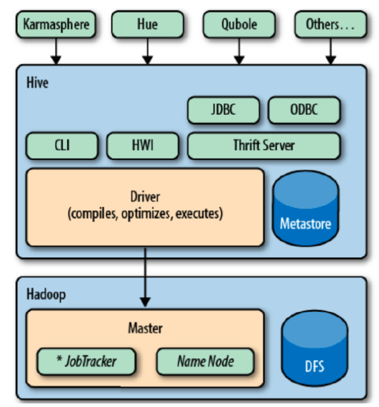
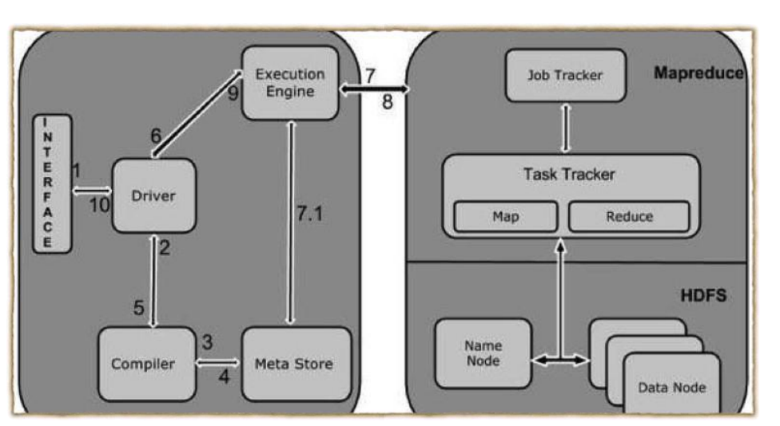

# Big Data - Hive

[Back](../index.md)

- [Big Data - Hive](#big-data---hive)
  - [Hive](#hive)
  - [Architecture of Hive](#architecture-of-hive)
  - [Working of Hive](#working-of-hive)
  - [Data Types](#data-types)
    - [Column Types](#column-types)
    - [Literals](#literals)
    - [Complex Types](#complex-types)

---

## Hive

- `Hive`:

- a **data warehouse system** which is used to **analyze structured data**.
- It is built **on the top of** `Hadoop`.

- Hive provides the functionality of **reading, writing, and managing** large datasets residing **in distributed storage**.
- It runs `SQL` like queries called `HQL` (`Hive query language`) which gets internally **converted to MapReduce jobs**.

- Using Hive, we can **skip the requirement** of the traditional approach of **writing complex MapReduce programs**.

- Hive supports

  - `Data Definition Language` (DDL),
  - `Data Manipulation Language` (DML),
  - and `User Defined Functions` (UDF).

---

- Features

  - Hive is **fast** and **scalable**.
  - It provides **SQL-like queries** (i.e., HQL) that are implicitly transformed to MapReduce or Spark jobs.
  - It is capable of analyzing **large datasets stored in HDFS**.
  - It allows **different storage types** such as plain text, RCFile, and HBase.
  - It uses **indexing to accelerate** queries.
  - It can operate on **compressed data** stored in the Hadoop ecosystem.
  - It supports `user-defined functions` (UDFs) where user can provide its functionality.
  - Hive `Partitions` and `bucketing` of data in the tables **improve the performance**.

- Hive supports **client application**(application runs on the workstation or personal computer) written in Java, PHP, Python, C++ and Ruby.
- It is as an **efficient** `ETL` (`Extract, Transform, Load`) tool.
- Working with HiveQL does not require any knowledge of programming language, Knowledge of basic SQL query is enough.
- We can easily **process structured data** in Hadoop using Hive.
- We can also run **Ad-hoc queries**(loosely typed command/query whose value depends upon some variable) for the data analysis using Hive.
- It can be used for **Data Visualization** and **Apache Tez** (integration with Hive) will provide **real time processing** capabilities.
- Supports to works on the **server side of a cluster**

- **Limitations** of Hive
  - Apache hive does **not** offer **row level updates**
  - Hive is **not** capable of handling **real-time data**.
  - It is **not** designed for **OLTP / online transaction processing**.
  - Hive queries contain **high latency**.
  - Limited **subquery** support.
  - **No** support for **materialized view**.

- Hive Environment
  - Allows users to **read, write, and manage** _petabytes_ of data **using SQL**
  - Uses Hive Query Language (HQL) to query data
  - Create the **map** and **reduce** the functions

---

## Architecture of Hive

- `User Interface`

  - Hive is a data warehouse infrastructure software **that can create interaction between user and HDFS**.
  - The user interfaces that Hive supports are _Hive Web UI_, _Hive command line_, and _Hive HD_.

- `Meta Store`

  - Hive chooses **respective database servers** to store the schema or Metadata of tables, databases, columns in a table, their data types and HDFS mapping.

- `HiveQL Process Engine`

  - HiveQL is similar to SQL for **querying** on schema info on the Megastore.
  - It is one of the replacements of traditional approach for MapReduce program.
  - Instead of writing MapReduce program in Java, we can **write a query for MapReduce job and process it.**

- `Hive Execution Engine`

  - The conjunction part of _HiveQL process Engine_ and _MapReduce_.
  - Execution engine **processes the query and generates results** as same as MapReduce results. It uses the flavor of MapReduce.

- `HDFS or HBASE`
  - `Hadoop distributed file system` or `HBASE` are the **data storage techniques to store data** into the file system.

---

## Working of Hive

- Execute Query

  - The Hive `interface` such as Command Line or Web UI **sends query** `Driver` to execute.

- Get Plan

  - The `driver` takes the help of `query complier` that **parses the query** to check the syntax and query plan or the requirement of query.

- Get Metadata

  - The compiler **sends metadata request** to `Metastore`

- Send Metadata

  - `Metastore` **sends metadata** as a response to the compiler.

- Send Plan

  - The `compiler` **checks the requirement and resends the plan** to the `driver`.
  - Up to here, the **parsing and compiling** of a query is complete.

- Execute Plan

  - the `driver` **sends the execute plan** to the `execution engine`.

- Execute Job

  - Internally, the process of execution job is a `MapReduce job`.
  - The `execution engine` **sends the job** to `JobTracker`, which is in `Name node`
  - Then it assigns this job to `TaskTracker`, which is in `Data node`. - Here, the query **executes MapReduce job**.

- `Metadata Ops`

  - Meanwhile in execution, the execution engine can **execute metadata operations** with Metastore.

- Fetch Result

  - The `execution engine` **receives the results** from `Data nodes`.

- Send Results

  - The `execution engine` **sends those resultant values** to the `driver`.

- Send Results
  - The `driver` sends the results to `Hive Interfaces`.

---

## Data Types

- All the data types in hive are classified into four **types**
  - Column Types
  - Literals
  - Null Values
  - Complex Types

---

### Column Types

- **Integral Types**

  - Integer type data can be specified using integral data types, `INT`.
  - When the data range exceeds the range of INT, you need to use `BIGINT` and if the data range is smaller than the INT, you use `SMALLINT`.
  - `TINYINT` is smaller than `SMALLINT`.

| Type       | Size                  | Range                                                   |
| ---------- | --------------------- | ------------------------------------------------------- |
| `TINYINT`  | 1-byte signed integer | -128 to 127                                             |
| `SMALLINT` | 2-byte signed integer | 32,768 to 32,767                                        |
| `INT`      | 4-byte signed integer | 2,147,483,648 to 2,147,483,647                          |
| `BIGINT`   | 8-byte signed integer | -9,223,372,036,854,775,808 to 9,223,372,036,854,775,807 |

- **String Types**

  - String type data types can be specified using single quotes (' ') or double quotes (" ").
  - It contains two data types:
    - `VARCHAR`: a **variable length** type whose range lies between 1 and 65535, which specifies that the maximum number of characters allowed in the character string.
    - `CHAR`: a **fixed-length** type whose maximum length is fixed at 255.
  - Hive follows C-types escape characters.

- **Timestamp**

  - It supports traditional UNIX timestamp with optional _nanosecond_ precision.

  - As **Integer numeric** type, it is interpreted as UNIX timestamp in **seconds**.
  - As **Floating point numeric** type, it is interpreted as UNIX timestamp in **seconds with decimal precision**.
  - As **string**, it follows java.sql.Timestamp format "YYYY-MM-DD HH:MM:SS.fffffffff" (9 decimal place precision)
    - It supports java.sql.Timestamp format “YYYY-MM-DD HH:MM:SS.fffffffff” and format “yyyy-mm-dd hh:mm:ss.ffffffffff”.

- **Dates**

  - The Date value is used to specify a particular year, month and day, in the form `YYYY--MM--DD`.
  - However, it **didn't provide the time** of the day. The range of Date type lies **between 0000--01--01 to 9999--12--31**.

- **Decimals**

  - The DECIMAL type in Hive is as same as Big Decimal format of Java.
  - It is used for representing **immutable arbitrary precision**.

- **Union Types**
  - Union is a **collection of heterogeneous data types**.
  - You can create an instance using create union.

---

### Literals

- **Floating Point Types**

  - Floating point types are nothing but **numbers with decimal points**.
  - Generally, this type of data is composed of DOUBLE data type.

- **Decimal Type**
  - Decimal type data is nothing but floating point value with higher range than DOUBLE data type.
  - The range of decimal type is approximately -10-308 to 10308.

| Type     | Size   | Range                                  |
| -------- | ------ | -------------------------------------- |
| `FLOAT`  | 4-byte | Single precision floating point number |
| `DOUBLE` | 8-byte | Double precision floating point number |

---

### Complex Types

- Arrays

  - It is a collection of **similar type of values** that **indexable** using zero-based integers.
  - Arrays in Hive are used the same way they are used in Java.
  - Syntax: `ARRAY<data_type>`
  - eg: `array('James','Roy')`

- Maps

  - Maps in Hive are similar to Java Maps.
  - It contains the **key-value tuples** where the fields are accessed using array notation.
  - Syntax: `MAP<primitive_type, data_type>`
  - eg: `map('first','James','last','Roy')`

- Structs
  - It is similar to C struct or an object where **fields are accessed using the "dot" notation**.
  - Structs in Hive is similar to using **complex data with comment**.
  - Syntax: `STRUCT<col_name : data_type [COMMENT col_comment, … ]`
  - eg: `struct('James','Roy')`

---

[TOP](#big-data---hive)
