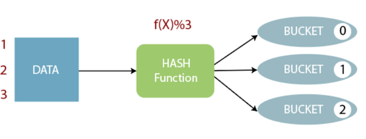

# Big Data - HiveQL

[Back](../index.md)

- [Big Data - HiveQL](#big-data---hiveql)
  - [Database](#database)
  - [Table](#table)
    - [Common Commands](#common-commands)
    - [Internal Table](#internal-table)
    - [Load Data](#load-data)
    - [External Table](#external-table)
  - [Partitioning](#partitioning)
    - [Static Partitioning](#static-partitioning)
    - [Dynamic Partitioning](#dynamic-partitioning)
  - [Bucketing](#bucketing)
    - [Working of Bucketing in Hive](#working-of-bucketing-in-hive)
  - [Partitioning vs Bucketing](#partitioning-vs-bucketing)
    - [Example: Partitioning + Bucketing](#example-partitioning--bucketing)
  - [Query](#query)
    - [Example](#example)
  - [Command Line](#command-line)
  - [Hive Shell](#hive-shell)

---

## Database

- In Hive, the `database` is considered as **a catalog or namespace of tables**.
- So, we can maintain multiple tables within a database where a **unique name** is assigned to each table.
- Hive also provides a **default database** with a name `default`.

| HiveQL                                   | Description              |
| ---------------------------------------- | ------------------------ |
| `SHOW DATABASES;`                        | Listing databases        |
| `CREATE DATABASE db_name;`               | Creating a database      |
| `CREATE DATABASE IF NOT EXISTS db_name;` | Creating a database      |
| `USE db_name;`                           | Selecting a database     |
| `DESCRIBE DATABASE EXTENDED db_name`     | Retrieve information     |
| `DROP DATABASE IF EXISTS demo;`          | Drop Database            |
| `DROP DATABASE IF EXISTS  demo CASCADE;` | Drop Database and tables |

- In Hive, it is **not allowed to drop the database that contains the tables directly**.
- In such a case, we can drop the database either by dropping tables first or use `Cascade` keyword with the command.

- Advance

```sql
/* assigning properties with the database in the form of key-value pair. */
CREATE DATABASE db_name
WITH DBPROPERTIES ('creator' = 'Gaurav Chawla', 'date' = '2019-06-03');
```

---

## Table

### Common Commands

| Command                                                                      | Description                              |
| ---------------------------------------------------------------------------- | ---------------------------------------- |
| `SHOW TABLES;`                                                               | List tables in a db.                     |
| `DESCRIBE tb_name`                                                           | Describe schema                          |
| `CREATE TABLE IF NOT EXISTS tb_name`                                         | Create table                             |
| `CREATE TABLE IF NOT EXISTS tb_name LIKE tb_a`                               | Create table using existing tb schema    |
| `ALTER TABLE old_tb_name rename to new_tb_name;`                             | Rename a table.                          |
| `ALTER TABLE tb_name ADD COLUMNS (col_name type);`                           | Add a new column. Default value is null. |
| `ALTER TABLE tb_name CHANGE old_col_name new_col_name datatype;`             | change the name of the column.           |
| `ALTER TABLE tb_name REPLACE COLUMNS(col_name datatype, col_name datatype);` | change the name of the column.           |
| `INSERT OVERWRITE TABLE target_tb select * from source_tb;  ;`               | Insert data from source tb.              |

- Hive allows us to **delete** one or more columns **by replacing** them with the new columns. Thus, we cannot drop the column directly.

---

### Internal Table

- `internal tables`

  - aka `managed tables`
  - the **lifecycle** of their data is **controlled by the Hive**.
  - Hive moves the data into its warehouse directory.
    - By default, these tables are **stored in a subdirectory** under the directory defined by `hive.metastore.warehouse.dir` (i.e. /user/hive/warehouse).
  - The internal tables are **not flexible** enough to share with other tools like Pig.
  - If we try to drop the internal table, Hive **deletes both** _table schema_ and _data_.

- Security:

  - Hive solely controls the Managed table security.
  - Within Hive, security needs to be managed; probably at the **schema leve**l (depends on organization)

- Use case:

  - When we want Hive to **completely manage the lifecycle** of the data and table.
  - Data is **temporary**

---

- Example

```sql
CREATE TABLE demo.employee (
    Id int,
    Name string ,
    Salary float
    )
ROW FORMAT DELIMITED        # By default, rows are separeted by '\n'
FIELDS TERMINATED BY ','    # columns are separated by specific character, by default it is '\t' or ','
COMMENT 'Table Description' # comment
TBLProperties ('creator'='Gaurav Chawla', 'created_at' = '2019-06-06 11:00:00') #  define the table properties.
STORED AS ORC; # specify the ORC file format
```

- !Imporant:
  - In Hive, if we try to **load unmatched data** (i.e., one or more column data doesn't match the data type of specified table columns), it **will not throw any exception**.
  - However, it stores the `Null` value at the position of unmatched tuple.
  - 注意只针对不匹配的列, 能匹配的相应列会读入数据,不匹配的相应列读入 null.

---

### Load Data

- Once the internal table has been created, the next step is to load the data into it.
  - So, in Hive, we can easily load data from any file to the database.

```sql
# load data
load data local inpath '/home/codegyani/hive/emp_details' into table demo.employee;

# Verify
select * from demo.employee limit 5;
```

- Load data from another tb

```sql
INSERT OVERWRITE TABLE cars_orc SELECT * FROM cars;
```

---

### External Table

- The external table allows us to create and access a table and a data externally.
- The `external` keyword is used to specify the external table, whereas the `location` keyword is used to **determine the location of loaded data**.

- As the table is external, the **data is not present in the Hive directory**.

  - It tells Hive to **refer** to the data that is at an existing location **outside the warehouse directory**.
  - Therefore, if we try to drop the table, the **metadata** of the table will be **deleted**, but the **data still exists**.

- Security:

  - These tables’ files are **accessible to anyone** who has access to HDFS file structure.
  - So, it needs to manage security **at the HDFS file/folder level.**

- Use case:
  - When Data is used outside of Hive.
    - For example, the data files are read and processed by an existing program that does not lock the files.
  - We are **not** creating a table **based on the existing table**.
  - We need data to remain in the underlying location even **after a DROP TABLE**. This may apply if we are **pointing multiple schemas at a single data set**.
  - The hive shouldn’t own data and control settings, directories etc., we may have another program or process that will do these things.

---

- Steps:

  - Step01:

    - Create directory and put data file, such as `.csv`, `.dat`

```BASH
sudo su -
mv students.csv /home/hdfs
sudo su - hdfs
hdfs fs -mkdir /user/andrena
hdfs fs -chmod 777 /user/andrena
hdfs fs -put /home/hdfs/students.csv /user/andrena
hdfs fs -chmod 777 /user/andrena/students.csv
```

- Step02:
  - Create external table

```sql
CREATE EXTERNAL TABLE IF NOT EXISTS names_text(
  student_ID INT,
  FirstName STRING,
  LastName STRING,
  year STRING,
  Major STRING
)
COMMENT 'Student Names'
ROW FORMAT DELIMITED
FIELDS TERMINATED BY ','
LINES TERMINATED BY '\n'
STORED AS TEXTFILE
LOCATION '/user/andrena';
```

- Verify

```sql
SELECT * FROM names_text;
```

---

## Partitioning

- `Partitioning`

  - dividing the table into some parts based on the values of a particular column.

- The advantage of partitioning is that since **the data is stored in slices**, the query **response time becomes faster**.

- Let's assume we have a data of 10 million students studying in an institute. Now, we have to fetch the students of a particular course.

  - If we use a **traditional approach**, we have to go through the entire data. This leads to **performance degradation**.
  - In such a case, we can adopt the better approach i.e., partitioning in Hive and divide the data among the different datasets based on particular columns.

- disadvantage of using too many partitions in Hive tables:

  - It slows down the namenode

- 课件:

- Adding partition:

```sql
ALTER TABLE employee ADD
PARTITION(year ='2013') location '/2012/part2012';
```

- Dropping partition:

```sql
ALTER TABLE employee DROP IF EXISTS PARTITION (year='2013');
```

---

### Static Partitioning

- In static or manual partitioning, it is **required to pass the values of partitioned columns manually while loading the data** into the table.

  - Hence, the **data file doesn't contain the partitioned columns**.

- Example:

```sql
# Create table
CREATE TABLE student (
    id int,
    name string,
    age int,
    institute string
)
PARTITIONED BY (course string)
ROW FORMAT DELIMITED
FIELDS TERMINATED BY ',';

# load datawith partition
LOAD DATA LOCAL INPATH '/home/codegyani/hive/student_details1' INTO TABLE student PARTITION(course= "java");
LOAD DATA LOCAL INPATH '/home/codegyani/hive/student_details2' INTO TABLE student PARTITION(course= "hadoop");

# query all
select * from student;

# query using where
select * from student where course= "hadoop";
select * from student where course="java";
```

---

### Dynamic Partitioning

- In dynamic partitioning, the **values of partitioned columns** exist **within** the table.

  - So, it is **not** required to **pass the values** of partitioned columns **manually**.

- Example:skip

---

## Bucketing

- `bucketing`
  - a data organizing technique used for optimizing the storage and querying performance of large datasets
  - divides **large datasets into more manageable parts**.
- So, we can use bucketing in Hive when the implementation of partitioning becomes difficult.

  - However, we **can also divide partitions further in buckets**.

- Once the data is partitioned, each partition is further divided into buckets.
- A bucket is a **physical file or data file**, and each bucket corresponds to a specific **range of data**.
- The `bucketing column` or `columns` are used to **determine** which bucket a particular record belongs to.
- The **number** of buckets is **determined when the table is created**, and it should be chosen based on the _expected query patterns_ and the _amount of data_.

---

### Working of Bucketing in Hive



- The concept of bucketing is based on the **hashing technique**.
- Here, modules of current column value and the number of required buckets is **calculated** (let say, F(x) % 3).
- Now, based on the resulted value, the data is stored into the corresponding bucket.

---

- Example:

```sql
# Create a dummy table to store the data.
create table emp_demo (
    Id int,
    Name string,
    Salary float
)
row format delimited
fields terminated by ',' ;

# Enable the bucketing by using the following command: -
set hive.enforce.bucketing = true;

# Create a bucketing table
create table emp_bucket(
    Id int,
    Name string,
    Salary float
)
clustered by (Id) into 3 buckets
row format delimited
fields terminated by ',' ;

# insert the data of dummy table into the bucketed table.
insert overwrite table emp_bucket select * from emp_demo;

```

---

## Partitioning vs Bucketing

- `Partitioning` distributes data into **different directories** while `Bucketing` distributes data within a partition into a **fixed number** of buckets

- `Partitioning` helps with **data pruning**, making it **efficient to access specific subsets** of data while `Bucketing` is specifically designed to **improve query performance**.
  - By grouping similar data into `buckets`, it **reduces data shuffling** and **enhances data locality**

---

### Example: Partitioning + Bucketing

```sql
/* tb has no part */
Create TABLE Student(
  Student_id int,
  first_name string,
  last_name  string,
  year int,
  department_id int
)
ROW FORMAT DELIMITED
FIELDS TERMINATED BY ','
STORED AS TEXTFILE ;

/* load */
LOAD DATA INPATH '/user/root/lab/student.csv' OVERWRITE INTO TABLE Student

/* tb has part */
Create TABLE Student_part(
  Student_id int,
  first_name string,
  last_name  string,
  year int
)
PARTITIONED BY(department_id int)
ROW FORMAT DELIMITED
FIELDS TERMINATED BY ','
STORED AS TEXTFILE ;

/* enable part */
SET hive.exec.dynamic.partition = true;
SET hive.exec.dynamic.partition.mode = nonstrict;

/* load data */
INSERT into student_part PARTITION(department_id) select student_id,first_name,last_name,year,department_id from student;

/* enable bucket */
set hive.enforce.bucketing = true;

/* tb has part + bucket */
Create TABLE Student_part_bucket(
  Student_id int,
  first_name string,
  last_name  string,
  year int
)
PARTITIONED BY(department_id int)
CLUSTERED BY(year) INTO 3 BUCKETS
ROW FORMAT DELIMITED
FIELDS TERMINATED BY ','
STORED AS TEXTFILE ;

/* enable bucket */
SET hive.enforce.bucketing = true;
SET hive.exec.dynamic.partition = true;
SET hive.exec.dynamic.partition.mode = nonstrict;

/* load data */
INSERT into student_part_bucket PARTITION(department_id) select student_id,first_name,last_name,year,department_id from student;

```

---

## Query

- `WHERE`
- `ORDER BY`
- function
- `GROUP BY`
- types of joins:
  - `JOIN`
  - `LEFT OUTER JOIN`: all the rows from the left table, even if there are no matches in the right table.
  - `RIGHT OUTER JOIN`: eturns all the rows from the right table, even if there are no matches in the left table.
  - `FULL OUTER JOIN`: combines the records of both the left and the right outer tables that fulfill the JOIN condition.

### Example

```bash
# start hive CLI
sudo su hdfs hive

```

```sql
-- list available databases
show databases;

-- create a database for the twitter related analysis
create database twitter;

-- change to the twitter database
use twitter;

-- check if twitter database has been listed
show databases;

-- show database details
describe database extended twitter;

-- create an empty full_text hive table
create table twitter.full_text (
          id string,
          ts string,
          lat_lon string,
          lat string,
          lon string,
          tweet string)
row format delimited
fields terminated by '\t' ;

-- load data into the twitter.full_text table
load data inpath '/user/root/lab/full_text.txt'
     overwrite into table twitter.full_text;

-- use 'dfs -ls' command in hive to list HDFS directory
-- you should see a directory call "twitter.db"
-- hive databases are just HDFS directories
-- each hive table is an HDFS file
dfs -ls /apps/hive/warehouse;

-- create a new table from an existing table
create table twitter.full_text_2 as
    select *
    from twitter.full_text;

```

---

## Command Line

| Function                   | Hive                                                                          |
| -------------------------- | ----------------------------------------------------------------------------- |
| Run query                  | `hive ‐e 'select a.col from tab1 a'`                                          |
| Run query silent mode      | `hive ‐S ‐e 'select a.col from tab1 a'`                                       |
| Run non-interactive script | `hive ‐f script.sql`                                                          |
| Set hive config variables  | `hive ‐e 'select a.col from tab1 a' ‐hiveconf hive.root.logger=DEBUG,console` |
| Use initialization script  | `hive ‐i initialize.sql`                                                      |

---

## Hive Shell

| Function                              | Hive                         |
| ------------------------------------- | ---------------------------- |
| Run script inside shell               | `source file_name`           |
| Run ls (dfs) commands                 | `dfs –ls /user`              |
| Run ls (bash command) from shell      | `!ls`                        |
| Set configuration variables           | `set mapred.reduce.tasks=32` |
| TAB auto completion                   | `set hive.<TAB>`             |
| Show all variables starting with hive | `set`                        |
| Revert all variables                  | `reset`                      |
| Add jar to distributed cache          | `add jar jar_path`           |
| Show all jars in distributed cache    | `list jars`                  |
| Delete jar from distributed cache     | `delete jar jar_name`        |

---

[TOP](#big-data---hiveql)
