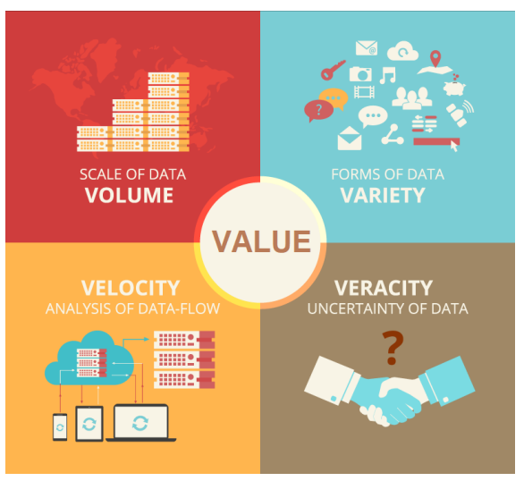

# Big Data - Introduction to Big Data

[Back](../index.md)

- [Big Data - Introduction to Big Data](#big-data---introduction-to-big-data)
  - [Data](#data)
    - [Structured Data](#structured-data)
    - [Unstructured Data](#unstructured-data)
    - [Semi-Structured Data](#semi-structured-data)
  - [Big Data](#big-data)
  - [Big Data Challenges](#big-data-challenges)

---

## Data

- `Data`

  - a collection of **raw facts and figures** gathered through observation, measurement, research, or other means
  - can be in various formats
    - text, numbers, images, audio, video, or other forms of digital content
  - used to derive insights and produce useful information by processing and analyzing

- 3 broad types of data:
  - Structured Data
  - Unstructured Data
  - Semi-Structured Data

---

### Structured Data

- `Structured data`

  - the data that adhere to the **predefined fixed schema** and **strict data model structure**

- Consider a table in a relational database system where each row contains **a fixed number of columns** with identical types to those in other rows as per the table's **predefined schema**.
  - The data in this table is structured, and any changes to the schema are rare, resulting in a **rigid data model**.

---

### Unstructured Data

- `Unstructured data`

  - an open form structure and **doesn’t have any identifiable internal schema**
  - It constitutes most data in enterprises today

- Examples are but not limited to:
  - Graphic images, web pages, audio or video, streaming instruments data, blogs, articles, emails, word documents, pdf documents, sheets and slides

---

### Semi-Structured Data

- `Semi-Structured data`

  - the hybrid between `structured data` and `unstructured data`
  - It **doesn’t have a pre-defined schema or nonrigid schema**

- Unlike a table in a relational database system where each row contains a fixed number of columns, semi-structured data can **have different number of attributes and nested entities** as well.

- Examples are but not limited to:
  - JavaScript Object Notation (JSON), and Extensible Markup Language (XML)

---

## Big Data

- “Big data is a term that describes the large volume of data – both structured and unstructured – that inundates a business on a day-to-day basis”

- “Big data can be **analyzed** for insights that lead to better **decisions and strategic business moves**.

- mainstream definition of big data as the three V’s
  - `Volume`: Measured by the **physical volume**
  - `Variety`: **Diverse** data can have heterogeneous
  - `Velocity`: Data is **regularly updated**
  - `Veracity`: **Quality** of data
  - `Value`: Something **valuable**

- `Volume`: **Scale” of Big Data**

  - Data is now in petabytes and exabytes and Big Data
  - **Hard** to process on single **node architecture**

- Vendors
  - Big Data vendors
    - Cloudera
    - Hortonworks (public)
    - MapR
    - DataStax
    - Databricks
  - Traditional Vendors
    - Oracle
    - SAS
    - IBM
    - Microsoft
  - Open Source Communities
    - RHadoop
    - RapidMiner
    - NoSQL

---

- What made Big Data possible

  - Hardware
    - Big cluster of commodity machines at lower cost
    - Faster processor
    - Cheaper memory
    - Bigger hard drive space
    - Faster network bandwidth
  - Software
    - Algorithms to allow parallel computing (map-reduce)

---

## Big Data Challenges

- “Big Data” is NOT about “big”
  - we’ve done it for many years (costly)
  - isn’t it expected anyway with the growth of the Internet
  - it is a mentality
  - You don’t need big data sometimes
- Having big data and Hadoop cluster doesn’t solve your problems… it may create new problems if you can’t harness it
  - you need the right tools, right talent, right management support and team structure
- Just a different tool or platform

  - How you do analytics haven’t fundamentally changed
  - Bigger doesn’t mean better
  - Big data vs small data

- Reality is that Hadoop is still hard to use (usability for business analysts)
  - Requires low-level Map Reduce programming to achieve sophisticated task
  - Mostly command line, GUI is not user friendly (improving)
- SQL-on-hadoop not delivering the promise yet
  - The SQL vs. NoSQL war
  - NewSQL (Google’s F1 paper: structured and unstructured data)
- Rapid growth causes confusions

  - Emerging stack such as Spark
  - Uncertainty in direction
  - Vendors and confusions

- Most companies are still in very early stage, leveraging Hadoop for data storage and ETL\*
  , not really taking the full advantage of the stacks
- Building data pipelines is hard
  - Pipelines are the glues between data analytics jobs
  - Different platforms/tools cause frictions
  - Hadoop stack works
  - Spark is the challenger
- Talent gap
  - High quality data scientists/engineers hard to find
  - Unicorns are rare

---

[TOP](#big-data---introduction-to-big-data)
