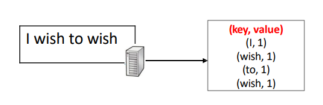

# Hadoop - MapReduce

[Back](./index.md)

- [Hadoop - MapReduce](#hadoop---mapreduce)
  - [MapReduce](#mapreduce)
  - [Map Phase](#map-phase)
  - [Combiner Phase](#combiner-phase)
  - [Shuffle \& Sort Phase](#shuffle--sort-phase)
  - [Reduce Phase](#reduce-phase)
    - [MapReduce – With Single Reducer](#mapreduce--with-single-reducer)
    - [MapReduce – With Multiple Reducers](#mapreduce--with-multiple-reducers)
  - [Summary](#summary)
  - [Data Access - Hadoop](#data-access---hadoop)
  - [MapReduce Execution](#mapreduce-execution)
    - [Job Tracker: Name Node, Master](#job-tracker-name-node-master)
    - [Task Tracker: Data Node, Slave](#task-tracker-data-node-slave)

---

## MapReduce

- `MapReduce`
  - a programming **model**
  - Process data-sets **in-parallel**
    - Scale across thousands of nodes on commodity hardware
  - A MapReduce is a **data processing tool** which is used to process the data **parallelly** in a distributed form.
- **Reliable** and **Fault Tolerant**
- Complex details are **abstracted** away

  - No I/O
  - No networking code
  - No synchronization

- MapReduce works by breaking the processing into two phases:

  - the **map phase**
  - the **reduce phase**
  - Can also use a 3rd phase **for scaling out**
    - **Combiner Function**

- Each phase has `<key, value>` pairs **as input and output**
- Each node processes data stored on that node (locality)

- (input) -> **map** -> `<k2, v2>` -> combine -> `<k3, v3>` -> **reduce** -> (output)

---

## Map Phase

- Hadoop creates **one map task** for each **split/block**

  - Each **mapper** processes **a single input split** from HDFS
  - Each map task process data **one line at a time**
  - Each line is transformed into a key and a value (**key-value pair**)

- The **number of maps** is usually driven by the total size of the inputs, that is, the **total number of blocks of the input files**.
  - Number of maps driven by total number of blocks of the files.

- The map takes data in the form of pairs and returns a list of `<key, value>` pairs. The keys will **not be unique** in this case.

---

## Combiner Phase

- Same as the Reducer
- Occurs on the **same node as the Map Process**
- Performs **local aggregation**, after being sorted on the keys

- May **not be appropriate for all** algorithms
  - Example: It may not be suitable for “mean” calculation

---

## Shuffle & Sort Phase

- Makes sure that all the values associated with the **same intermediate key** are sent to the **same reducer**
- **Performed automatically**;
  - Programmer does not have to code this phase

- Using the output of Map, sort and shuffle are applied by the Hadoop architecture. This sort and shuffle acts on these list of `<key, value>` pairs and **sends out unique keys** and **a list of values **associated with this unique key `<key, list(values)>`.

---

## Reduce Phase

- Reducer **receives the key** and associated **list of values** and then does the **reduce operations**

- Reducer **writes output** to HDFS
- By **default**, there is a **single** reducer

- An output of sort and shuffle sent to the reducer phase. The reducer performs a defined function on a list of values for unique keys, and **Final output** `<key, value>` will be stored/displayed.

---

### MapReduce – With Single Reducer

---

### MapReduce – With Multiple Reducers

---

## Summary

- **Automatic parallelization** and **distribution**
  - It makes M/R programming much easier
- Developer simply need to **focus on writing the map** and **reduce functions**
- M/R is written in **Java**
- It also supports **Python** Streaming
  - writing map and reduce function in python
- Typically, **compute nodes** and the **storage nodes** are the same
- Takes Advantage of **Data Locality**

---

## Data Access - Hadoop

- `Data Locality`
  - Hadoop tries to process data on the **same machine** that stores it
- This improves performance and conserves bandwidth
- **Brings computation to the data** (该处是将计算前移到数据所在处, 不是汇合数据.)
- Improve performance

---

## MapReduce Execution

- **Terminology**

- `Job`

  - Consists of **a Mapper**, **a Reducer**, and a list of **input files**

- `Task`

  - An **individual unit of work**
  - A `job` is broken down into many `tasks`
    - map tasks or reduce tasks

- `Client`
  - Machine on which the program runs

---

- **Architecture**

---

### Job Tracker: Name Node, Master

- Manages the **MapReduce execution**

  - **Client** contacts `Job Tracker` to **launch jobs**
  - It communicates with `NameNode` to **get data locations**
  - **Identifies** `TaskTrackers` to executes the job (accounts for data locality or proximity)
  - **Monitors** `TaskTrackers`;
  - Provides job status updates to the client

- The role of Job Tracker:

  - **accept the MapReduce jobs** from client
  - **process the data** by using NameNode.
  - In response, NameNode provides **metadata** to Job Tracker.

- When JobTracker is **down** – **no** MapReduce (Similar to NameNode failure)

- To view jobs:
  - http://sandbox-hdp.hortonworks.com:8088

---

### Task Tracker: Data Node, Slave

- Runs on `Data Nodes` (that’s how it can take advantage of **data locality**)
- TaskTracker **execute individual Map and Reduce processes**
- Sends **periodic updates** (heartbeats) **to JobTracker**

- It works as a **slave node** for Job Tracker.

  - **receives task** and code from Job Tracker
  - **applies** that code on the file.
    - This process can also be called as a **Mapper**.

- If Task Tracker **fails** then JobTracker will **reassign** the job to another Task Tracker

---

[TOP](#hadoop---mapreduce)
