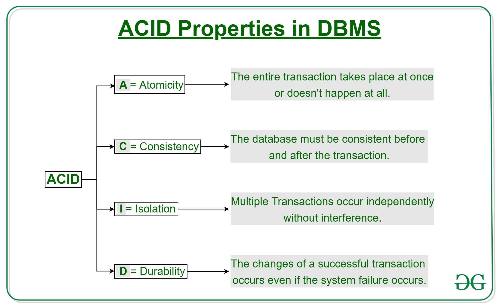

# Big Data: NoSQL

[Back](../index.md)

- [Big Data: NoSQL](#big-data-nosql)
  - [NoSQL](#nosql)
    - [Traditional Relational Databases](#traditional-relational-databases)
    - [NoSQL Databases](#nosql-databases)
    - [Comparing NoSQL and RDMSs](#comparing-nosql-and-rdmss)
  - [Types](#types)
    - [Document Stores](#document-stores)
    - [Key-Value Stores](#key-value-stores)
    - [Columnar Databases](#columnar-databases)

---

## NoSQL

### Traditional Relational Databases

- Based on **relational model** of data
- **Database relationships** are treated in the form of `tables`
  - The tables are **related to each other**
  - **Rigid Schema**
- Provides `ACID` properties

- `ACID`:

  - `Atomicity`:
    - either the entire transaction takes place at once or doesn’t happen at all.
  - `Consistency`:
    - integrity constraints must be maintained so that the database is **consistent before and after the transaction**.
    - It refers to the **correctness** of a database
  - `Isolation`:
    - multiple transactions can **occur concurrently** without leading to the inconsistency of the database state.
    - Transactions occur independently without interference.
  - `Durability`:
    - once the transaction has completed execution, the updates and modifications to the database are stored in and written to disk and they persist even if a system failure occurs.

---

### NoSQL Databases

- `BASE` properties:

  - `Basically Available`:
    - the system guarantees Availability
    - database system should **always be available** to respond to user requests, even if it cannot guarantee immediate access to **all** data.
    - **brief** periods of **unavailability**
    - designed to **minimize downtim**
    - provide **quick recovery** from failures.
  - `Soft-State`:
    - the state of the database can change over time
  - `Eventual Consistency`:
    - the system will eventually become consistent
    - the database should eventually converge to a consistent state
    - contrast to the immediate consistency required by traditional `ACID`-compliant databases.

- Main **characteristics** of NoSQL databases include:
  - No strict **schema** requirements
  - **Consistency** is traded in favor of **Availability**
  - Based on `BASE` properties
    - No strict adherence to `ACID` properties

---

### Comparing NoSQL and RDMSs

| NoSQL                                    | Databases Relational Databases                   |
| ---------------------------------------- | ------------------------------------------------ |
| Designed for **performance**             | Designed for **integrity**                       |
| **No** relational schema                 | Predefined **schema**                            |
| **Various** storage models               | Stored as **individual** records                 |
| Better for a lot of **reads and writes** | Better for a lot of **search and query**         |
| **Auto**-sharding                        | **Sharding** is **not** implicitly supported     |
| **Limited query** abilities              | Well-defined, advanced and standardized language |

---

## Types

- Major types of NoSQL databases:
  - Document Stores: `MongoDB`
  - Graph Databases: `Neo4j`
  - Key-Value Stores: `JSON`
  - Columnar Databases: `HBase`

---

### Document Stores

- `Documents`

  - are stored in some standard format or encoding (e.g., XML, JSON, PDF or Office Documents)
  - These are typically referred to as `Binary Large Objects (BLOBs)`

- Documents can be **indexed**
  - This allows document stores to **outperform** traditional file systems
  - E.g., MongoDB

---

### Key-Value Stores

- `Key`
  - mapped to (possibly) more **complex value** (e.g., lists)
  - can be stored in a **hash table and** can be distributed easily
- Such stores typically support regular `CRUD (create, read, update, and delete)` operations
- That is, **no joins and aggregate** functions

- E.g.,
  - `Amazon DynamoDB`
  - `Apache Cassandra`

---

### Columnar Databases

- In `columnar databases` values are stored in **groups of zero or more columns**, but in **Column-Order** (as opposed to Row-Order)
- A big table, with column families
  - Every row can have **its own schema**
  - Helps capture more **“messy” data**
- `Map Reduce` for querying/processing
- E.g., HBase

---

[TOP](#big-data-nosql)
