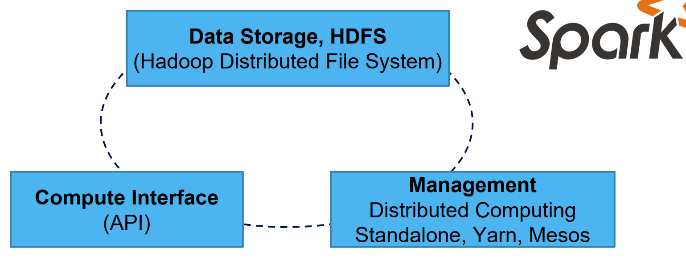
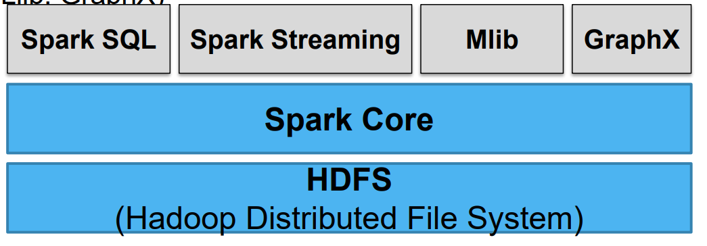
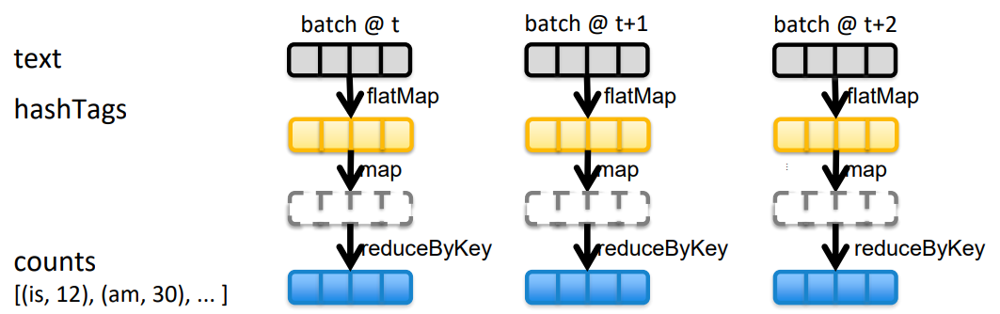
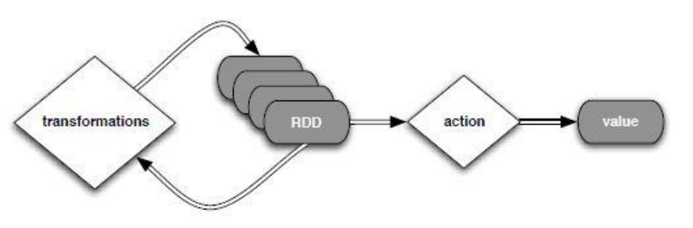
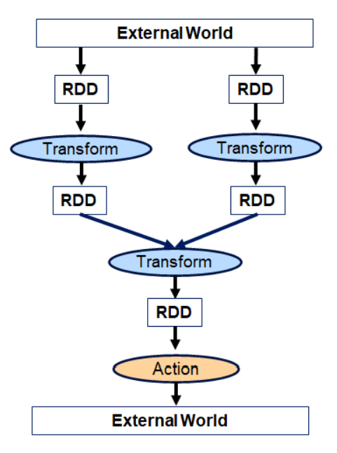
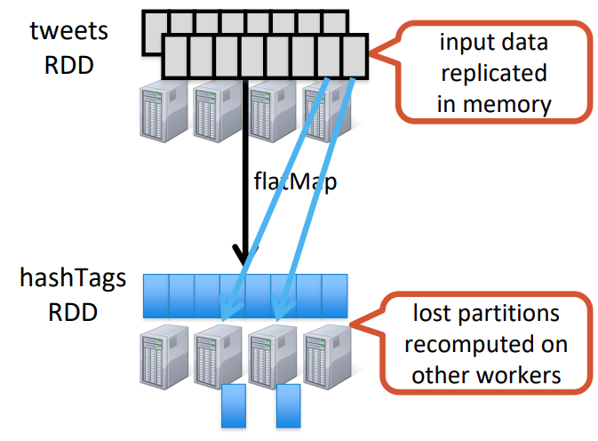
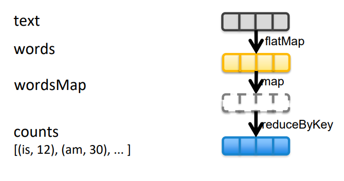
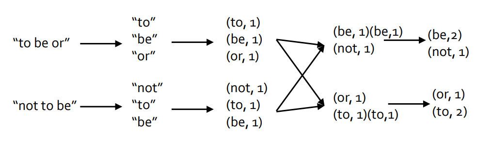

# Big Data - Spark

[Back](../index.md)

- [Big Data - Spark](#big-data---spark)
  - [Spark](#spark)
    - [Features of Apache Spark](#features-of-apache-spark)
    - [Spark Architecture](#spark-architecture)
    - [Motivation](#motivation)
  - [Spark Components](#spark-components)
    - [Spark Core](#spark-core)
    - [Spark SQL](#spark-sql)
    - [Spark Streaming](#spark-streaming)
      - [Example: Streaming](#example-streaming)
    - [Spark MLlib](#spark-mllib)
    - [Spark GraphX](#spark-graphx)
  - [Resilient Distributed Datasets(RDD)](#resilient-distributed-datasetsrdd)
    - [ways to create RDDs:](#ways-to-create-rdds)
      - [Parallelized Collections](#parallelized-collections)
      - [External Datasets](#external-datasets)
    - [Operations](#operations)
      - [Transformations](#transformations)
      - [Actions](#actions)
    - [Fault-tolerance](#fault-tolerance)
    - [Example: Spark Core + RDD](#example-spark-core--rdd)
  - [Example: Basic Actions](#example-basic-actions)
  - [Example: WordCount](#example-wordcount)

---

## Spark

- `Apache Spark`

  - a unified **analytics engine** for large-scale **data processing** including built-in modules for **SQL**, **streaming**, **machine learning** and **graph processing**.

  - an open-source cluster computing framework.
    - **Iterative analysis** on massive data volumes
    - Primarily written in `Scala`
    - Runs on `Java Virtual Machine (JVM)`
    - Keeps a large portion of the **data** required **in-memory** and avoids expensive and time-consuming disk `I/O`

- Spark is built **on the top of** the `Hadoop MapReduce` and optimized to **run in memory**

- Spark Goal
  - Its primary purpose is to **handle the real-time generated data**.
  - Provide **distributed memory abstractions** for clusters to support apps with `working sets`
  - **Retain** the attractive properties of MapReduce:
    - **Fault tolerance** (for crashes & stragglers)
    - Data **locality**
    - **Scalability**

---

### Features of Apache Spark

- **Fast**

  - It provides **high performance** for both **batch** and **streaming data**, using a state-of-the-art DAG scheduler, a query optimizer, and a physical execution engine.

- **Easy to Use**

  - It facilitates to write the application in `Java`, `Scala`, `Python`, `R`, and `SQL`.
  - It also provides more than 80 high-level **operators**.

- **Generality**

  - It provides a collection of **libraries** including SQL and DataFrames, MLlib for machine learning, GraphX, and Spark Streaming.

- **Lightweight**

  - It is a light unified analytics engine which is used for large scale data processing.

- **Runs Everywhere**
  - It can easily run on Hadoop, Apache Mesos, Kubernetes, standalone, or in the cloud.

---

### Spark Architecture

- The Spark follows the `master-slave architecture`.

  - Its cluster consists of **a single** `master` and **multiple** `slaves`.

- The Spark architecture depends upon two abstractions:
  - `Resilient Distributed Dataset (RDD)`
  - `Directed Acyclic Graph (DAG)`

---

### Motivation

- Current **popular programming models** for clusters

  - transform **data flowing** from stable storage to stable storage

    - E.g., MapReduc

  - Benefits of **data flow**:

    - runtime can decide **where to run tasks** and can automatically **recover from failures**

  - Acyclic(非循环的) data flow is a powerful abstraction, but is not efficient for **applications that repeatedly reuse a working set of data**:

    - **Iterative** algorithms (many in machine learning)
    - **Interactive** data mining tools (R, Excel, Python)

- `Spark` makes `working sets` a first-class concept to efficiently **support these apps**

---

## Spark Components



- **Data Storage**:

  - HDFS(Hadoop Distributed File System)

- **Management**:
  Distributed Computing, Standalone, Yarn, Mesos

- **Compute Interface**:
  - (API)

---



- Apache Spark’s goal has been to **generalize MapReduce** on top of a core engine.
- A unified platform that supports many data processing needs including
  - **Batch** processing (Spark)
  - **Stream** processing (Spark Streaming)
  - **Interactive** (Spark SQL)
  - **Iterative** (MLlib, GraphX)

---

### Spark Core

- `Spark Core` contains the **basic functionality** of Spark

  - task **scheduling**,
  - **memory** management,
  - **fault** recovery,
  - **interacting** with storage system.

- **Home** to the `API` that defines `resilient distributed datasets (RDD)`
  - A collection of items **distributed** across many **compute nodes**
  - Can be processed in **parallel**

---

### Spark SQL

- Spark’s **package** for working with **structured data**
- Seamlessly mix SQL queries with Spark programs.

- The Spark SQL is built **on the top of** `Spark Core`.
- It provides support for **structured data**.

  - It allows to query the data via `SQL` (`Structured Query Language`) as well as `HQL` (`Hive Query Language`).

- It supports `JDBC` and `ODBC` connections that establish a relation between Java objects and existing databases, data `warehouses` and business intelligence tools.

- It also supports various **sources of data** like Hive tables, Parquet, and JSON.

---

### Spark Streaming

- `Spark Streaming`

  - a Spark component that supports scalable and fault-tolerant processing of **streaming data**.

- Data can be **ingested** from many **sources** like Kafka, Flume, Twitter

- It uses Spark Core's fast scheduling capability to perform **streaming analytics**.
- It accepts data in **mini-batches** and performs RDD transformations on that data.
- Its design ensures that the **applications** written for streaming data can be **reused** to analyze batches of historical data with little modification.
- The **log files** generated by web servers can be considered as a real-time example of a data stream.

---

#### Example: Streaming

```py
# create RDD to store text file
val text = sc.textFile("SOURCE")

# transform
val words = text.flatMap(line => line.split())
wordsMap = words.map(word => (word,1))

# Action: return value
val counts = wordsMap.reduceByKey(_+_)
```



---

### Spark MLlib

- `MLlib`

  - a Machine Learning **library** that contains various machine learning algorithms.

- These include correlations and hypothesis testing, classification and regression, clustering, and principal component analysis.

  - Provides classification, regression, clustering, and collaborative filtering

- All these methods are designed to scale out across a cluster
- It is nine times faster than the disk-based implementation used by Apache Mahout.

---

### Spark GraphX

- A **library** for manipulating **graphs**
- Offers **graph-parallel** computations
- Extends Spark RDD with Graph abstraction

- `GraphX`

  - a **library** that is used to manipulate graphs and perform graph-parallel computations.

- It facilitates to create a **directed** graph with **arbitrary properties** attached to each vertex and edge.

- To manipulate graph, it supports various fundamental operators like subgraph, join Vertices, and aggregate Messages.

---

## Resilient Distributed Datasets(RDD)

- `Resilient Distributed Datasets`

  - the group of **data items** that can be **stored in-memor**y on **worker nodes**.
  - **Resilient**:
    - Restore the data on **failure**.
  - **Distributed**:
    - Data is distributed **among different nodes**.
  - **Dataset**:
    - Group of **data**.

- There are **two** types of operations on RDDs:

  - **Transformations** (lazy – **not computed immediately**)
  - **Actions** (**return a value** to app, or storage)



---

### ways to create RDDs:

- **Parallelizing** an **existing** data in the driver program
- **Referencing** a dataset in an **external** storage system, such as a shared filesystem, HDFS, HBase, or any data source offering a Hadoop InputFormat.

---

#### Parallelized Collections

- To create parallelized collection, call `SparkContext`'s **parallelize method** on an **existing** collection in the driver program.
- Each element of collection is copied to form a distributed dataset that can be operated on in parallel.

```java
val info = Array(1, 2, 3, 4)
val distinfo = sc.parallelize(info)
// we can operate the distributed dataset (distinfo) parallel such like distinfo.reduce((a, b) => a + b).
```

---

#### External Datasets

- In Spark, the distributed datasets can be created **from any type of storage sources** supported by Hadoop such as HDFS, Cassandra, HBase and even our local file system.
- Spark provides the support for text files, SequenceFiles, and other types of Hadoop InputFormat.

- `SparkContext`'s **textFile** method can be used to create RDD's text file.

  - This method takes a URI for the file (either a local path on the machine or a hdfs://) and reads the data of the file.

- Example:

```java
// # create rdd to store text file
val text = sc.textFile("HDFS:///user/root/lab/shakespeare_100.txt")
```

---

### Operations

- The RDD provides the two types of operations:

  - Transformation
  - Action

- map
- filter
- groupBy
- sort
- union
- join
- leftOuterJoin
- rightOuterJoin
- reduce
- count
- fold
- reduceByKey
- groupByKey
- cogroup
- cross
- zip
- sample
- take
- first
- partitionBy
- mapWith
- pipe
- save

---

#### Transformations

- `Transformations`:

  - build RDDs through **deterministic operations** on other RDDs.
  - include `map`, `filter`, `join`, `union`, `intersection`, `distinct`
  - Lazy evaluation:

    - **Nothing computed** until an action requires it
    - But it can be **persisted** into **memory** or **disk**.

- In Spark, the role of transformation is to **create a new dataset** from an **existing** one.

- The transformations are considered **lazy** as they **only computed when an action requires a result to be returned** to the driver program.
  - A `transformed RDD` is **recomputed** when an **action runs** on it.

---

#### Actions

- `Actions`
  - to return value or export data
  - include `count`, `collect`, `reduce`, `save`
  - can be applied to RDDs; actions **force calculations** and return values

In Spark, the role of action is to **return a value** to the driver program after running a computation on the dataset.



---

### Fault-tolerance

- `RDDs` are **remember the sequence of operations** that created it **from the original** fault-tolerant **input data**

- **Batches** of input data are **replicated in memory** of multiple worker nodes, therefore faulttolerant

- Data lost due to worker failure, **can be recomputed** from input data



---

### Example: Spark Core + RDD

```py
# create rdd to store text file
val text = sc.textFile(“HDFS:///user/root/lab/shakespeare_100.txt”)
# transform
val words = text.flatMap(line => line.split())
wordsMap = words.map(word => (word,1) )
# Action: return value
val counts = wordsMap.reduceByKey(_+_)
```




---

## Example: Basic Actions

- Basic Actions

```scala
Pyspark
nums = sc.parallelize([1, 2, 3])

// Retrieve RDD contents as a local collection
nums.collect()

// Return first K elements
nums.take(2)

// Count number of elements
nums.count()

// Merge elements with an associative function
nums.reduce(lambda x, y: x + y)

// Write elements to a text file in HDFS
nums.saveAsTextFile("file.txt")

// To save to local file system
X = nums.collect()

// Quit pyspark
quit()

```

---

## Example: WordCount

```scala
Pyspark
text = sc.textFile("/user/root/lab/shakespeare_100.txt")
words = text.flatMap(lambda line: line.split())
wordsMap = words.map(lambda word: (word,1) )
counts = wordsMap.reduceByKey(lambda v1,v2 : v1+v2)

// See the counts of words (only 10 of them)
counts.take(10)

```

---

[Top](#big-data---spark)
