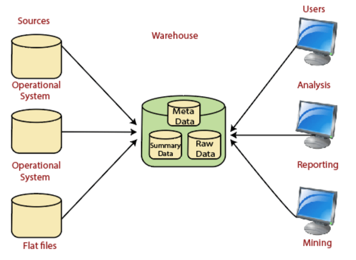
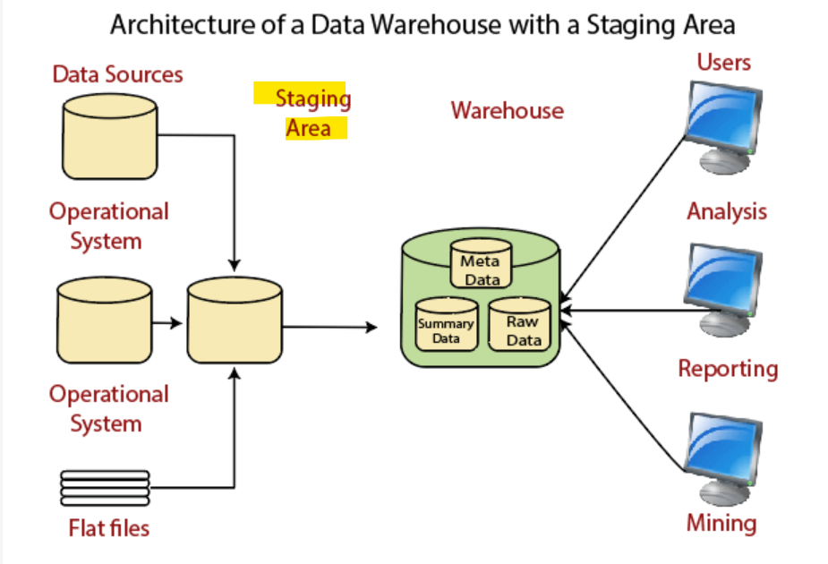
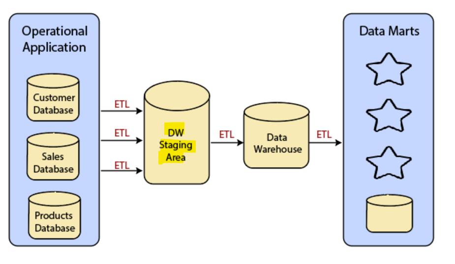
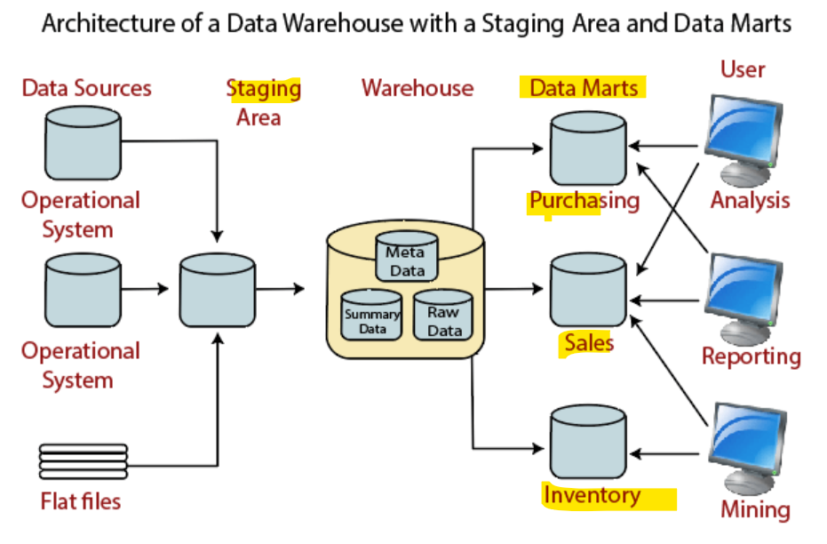

# Warehouse - architectures

[Back](../index.md)

- [Warehouse - architectures](#warehouse---architectures)
  - [common architectures](#common-architectures)
  - [Basic](#basic)
  - [With Staging Area](#with-staging-area)
  - [With Staging Area and Data Marts](#with-staging-area-and-data-marts)

---

## common architectures

Three common architectures are:

Data Warehouse Architecture: Basic
Data Warehouse Architecture: With Staging Area
Data Warehouse Architecture: With Staging Area and Data Marts

---

## Basic

- `Operational System`

  - refer to a system that is used to process the day-to-day transactions of an organization.

- `Flat Files`

  - A Flat file system is a system of files in which transactional data is stored, and every file in the system must have a different name.

- `Meta Data`

  - A set of data that defines and gives information about other data.
  - Meta Data used in Data Warehouse for a variety of purpose, including:
    - Meta Data summarizes necessary **information about data**, which can make finding and work with particular instances of data more accessible. For example, author, data build, and data changed, and file size are examples of very basic document metadata.
  - Metadata is used to direct a query to the most appropriate data source.

- Lightly and highly `summarized data`

  - The area of the data warehouse saves all the **predefined** lightly and highly `summarized (aggregated) data` generated by the **warehouse manager**.
  - The goals of the summarized information are to **speed up query performance**. The summarized record is updated continuously as new information is loaded into the warehouse.

- End-User access Tools
  - The principal purpose of a data warehouse is to provide information to the business managers for strategic decision-making. These customers interact with the warehouse using end-client access tools.

---

## With Staging Area

- A staging area **simplifies** `data cleansing` and `consolidation` for operational method coming from multiple source systems, especially for enterprise data warehouses where all relevant data of an enterprise is consolidated.

- `Data Warehouse Staging Area` 
  - a **temporary** location where a record from source systems is copied.
  - A place where data is processed **before** entering the warehouse.

---

## With Staging Area and Data Marts

- We may want to **customize** our warehouse's architecture **for multiple groups** within our organization.
    - We can do this by adding `data marts`. 

- `data mart`
  - a **segment** of a data warehouses that can provided information for reporting and analysis on a section, unit, department or operation in the company, 
  - e.g., sales, payroll, production, etc.

---

[TOP](#warehouse---architectures)
