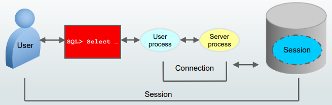

# DBA - Architecture: Database Instance

[Back](../index.md)

- [DBA - Architecture: Database Instance](#dba---architecture-database-instance)
  - [Database Instance](#database-instance)
    - [Connecting](#connecting)

---

## Database Instance

- A database instance **cannot be shared**.

  - Each database instance is associated with **only one database**.

    - If there are **multiple databases** on the same server, then there is **a separate and distinct database instance for each** database. Instance 专属一个 db.
    - An `Oracle Real Applications Cluster (RAC)` database usually has **multiple instances** on separate servers **for the same shared database**. RAC:共享 DB 可以对多个 instance.

- In this model, the same database is associated with each RAC instance, which meets the requirement that, at most, only one database is associated with an instance.
- 以上都遵循不共享 instance 原则.
  - local: 一对一
  - clustered: db 共享, instance 专属.

---

### Connecting

- `Connection`:

  - a **communication pathway** between a `user process` and an Oracle `Database instance`.
  - A communication pathway is established by **using** available _interprocess communication mechanisms_ (on a computer that runs both the user process and Oracle Database) or _network software_ (when different computers run the database application and Oracle Database and communicate through a network).

- `Session`:

  - **Specific connection** of a user to an instance through a user process
  - A session represents **the state of a current user login to the database instance**.

    - For example, when a user starts SQL\*Plus, the user must provide a valid username and password, and then a session is established for that user.

  - A session **lasts** from the time _a user connects_ until _the user disconnects or exits_ the database application.

  - **Multiple sessions** can be created and exist **concurrently** for a single Oracle database user by **using the same username**.
    - For example, a user with the username/password of HR/HR can connect to the same Oracle Database instance several times.

---

[TOP](#dba---architecture-database-instance)
