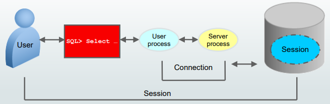
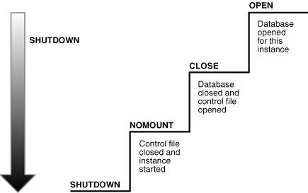
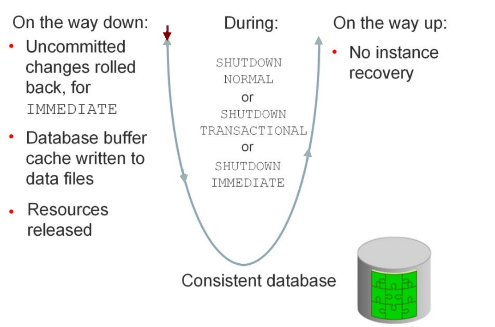
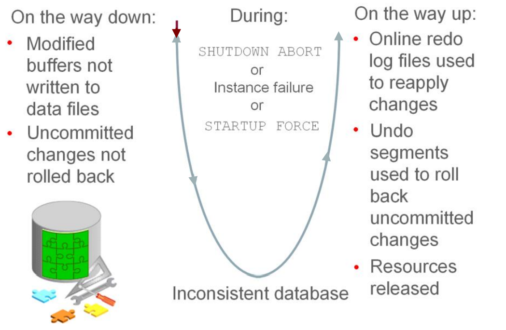

# DBA - Database Instance

[Back](../index.md)

- [DBA - Database Instance](#dba---database-instance)
  - [Database Instance](#database-instance)
    - [Connecting](#connecting)
  - [Instance and Database Startup](#instance-and-database-startup)
    - [Phase: No mount](#phase-no-mount)
    - [Phase: Mounted](#phase-mounted)
    - [Phase: Open](#phase-open)
    - [Read/Write and Read-Only Mode](#readwrite-and-read-only-mode)
    - [Database File Checks](#database-file-checks)
  - [Database and Instance Shutdown](#database-and-instance-shutdown)
    - [Shutdown Modes](#shutdown-modes)
    - [Phase: `CLOSE`](#phase-close)
      - [Normal Shutdown](#normal-shutdown)
      - [Abnormal Shutdown](#abnormal-shutdown)
    - [Phase: `Unmounted`](#phase-unmounted)
    - [Phase: `Shut Down`](#phase-shut-down)

---

## Database Instance

- `database instance`

  - provides user access to a database.

- Prerequisites to start a database instance

  - The database is statically **registered** with an `Oracle Net listener`.
  - Client is connected to the database with the `SYSDBA` **privilege**.

- The `listener` creates a **dedicated server**, which can start the database instance. listener 是中介.

---

- A database instance **cannot be shared**.

  - Each database instance is associated with **only one database**.

    - If there are **multiple databases** on the same server, then there is **a separate and distinct database instance for each** database. Instance 专属一个 db.
    - An `Oracle Real Applications Cluster (RAC)` database usually has **multiple instances** on separate servers **for the same shared database**. RAC:共享 DB 可以对多个 instance.

- In this model, the same database is associated with each RAC instance, which meets the requirement that, at most, only one database is associated with an instance.
- 以上都遵循不共享 instance 原则.
  - local: 一对一
  - clustered: db 共享, instance 专属.

---

### Connecting

- `Connection`:

  - a **communication pathway** between a `user process` and an Oracle `Database instance`.
  - A communication pathway is established by **using** available _interprocess communication mechanisms_ (on a computer that runs both the user process and Oracle Database) or _network software_ (when different computers run the database application and Oracle Database and communicate through a network).

- `Session`:

  - **Specific connection** of a user to an instance through a user process
  - A session represents **the state of a current user login to the database instance**.

    - For example, when a user starts SQL\*Plus, the user must provide a valid username and password, and then a session is established for that user.

  - A session **lasts** from the time _a user connects_ until _the user disconnects or exits_ the database application.

  - **Multiple sessions** can be created and exist **concurrently** for a single Oracle database user by **using the same username**.
    - For example, a user with the username/password of HR/HR can connect to the same Oracle Database instance several times.

---

## Instance and Database Startup

- Phases: `STARTUP`

  - from a shutdown state to an open database state.

| Phase | Mount State | Command           |
| ----- | ----------- | ----------------- |
| 1     | No mount    | `STARTUP NOMOUNT` |
| 2     | Mounted     | `STARTUP MOUNTED` |
| 3     | Open        | `STARTUP OPEN`    |

- **NOMOUNT**:

  - Instance is started.
  - Instance is not yet associated with a database.

- **MOUNTED**:

  - Instance is started.
  - Instance is associated with a database by reading its **control file**.
  - The database is closed to users.

- **OPEN**:
  - The instance is started.
  - The instance is associated with an open database.
  - The data contained in the **data files** is **accessible** to authorized users.

---

### Phase: No mount

- When Oracle Database starts an instance, it **proceeds through stages**.

- The stages are as follows:

  - **Searches** for a `server parameter file(SPFILE)` in a platform-specific default location and, if not found, for a `text initialization parameter file(PFILE)` (specifying `STARTUP` with the `SPFILE` or `PFILE` parameters **overrides** the default behavior)
  - **Reads** the parameter file to determine the **values of initialization parameters**
  - **Allocates** the `SGA` based on the initialization parameter settings
  - Starts the **Oracle background processes**
  - **Opens** the _alert log_ and _trace files_ and **writes** all _explicit parameter settings_ to the alert log in valid parameter syntax

- At this stage, **no database is associated** with the instance.

- **Scenarios** that require a `NOMOUNT` state include:
  - **database creation**
  - certain **backup** and **recovery** operations.

---

### Phase: Mounted

- The instance **mounts** a database to **associate** the database with this instance.

- To mount the database,

  - the Oracle software associates the database (`CDB`) with the previously started database instance
  - the instance obtains the **names** of the `database control files` specified in the `CONTROL_FILES` **initialization parameter** and opens the files.
  - Oracle Database **reads** the `control files` to find:
    - the **names** of the `data files`
    - the `online redo log files` that it will attempt to access when opening the database.
  - No checks, however, are performed to **verify the existence** of the `data files` and `online redo log files` at this time.

- In a mounted database, the **database is closed** and **accessible only** to `database administrators`.

  - Administrators can keep the database closed while completing **specific maintenance operations**.
    - such as _renaming_ data files and performing full database _recoveries_.
  - However, the database is **not available for normal operations**.

---

- If Oracle Database allows multiple instances to **mount the same database concurrently**, then the `CLUSTER_DATABASE` **initialization parameter setting** can make the database available to multiple instances. Database behavior depends on the setting:
  - If `CLUSTER_DATABASE` is `false` (default) for the **first instance** that mounts a database, then only this instance can mount the database.
  - If `CLUSTER_DATABASE` is `true` for the **first instance**, then other instances can mount the database if their `CLUSTER_DATABASE` parameter settings are set to `true`.
  - The **number** of instances that can mount the database is subject to a predetermined **maximum** specified when creating the database.

---

### Phase: Open

- **Default**
- Usually, a database administrator opens the database to make it **available for general use**.

  - Opening a mounted database makes it **available** for normal database operation.
  - Any valid user can connect to an open database and access its information.

- When you open the database, Oracle Database performs the following actions:

  - **Opens** the `online data files` in **tablespaces** other than undo tablespaces
    - If a **tablespace was offline** when the database was previously shut down, then the tablespace and its corresponding `data files` **will be offline** when the database reopens.
  - **Acquires** an `undo tablespace`

    - If multiple undo tablespaces exists, then the `UNDO_TABLESPACE` initialization parameter designates the undo tablespace to use.
    - If this parameter is not set, then the **first** available undo tablespace is chosen.

  - **Opens** the `online redo log files`

- `PDBs` are not, by default, started when you open the database.

---

### Read/Write and Read-Only Mode

- `Read/Write mode`

  - **Default** mode when the database opens.
  - In this mode, users can **make changes** to the data, **generating redo** in the online redo log.
  - Alternatively, you can open in read-only mode to prevent data modification by user transactions.

- `Read-Only Mode`

  - **restricts database access** to read-only transactions, which **cannot write** to _data files_ or to _online redo log files_.
  - By default, a physical **standby database** opens in `read-only mode`.

- However, the database can perform **recovery** or **operations** that change the database state **without generating redo**.
  - For example, in read-only mode:
    - **Data files can be taken offline** and online. However, you cannot take permanent tablespaces offline.
    - Offline data files and tablespaces can be **recovered**.
    - The **control file remains available** for updates about the state of the database.
    - **Temporary tablespaces** created with the `CREATE TEMPORARY TABLESPACE` statement are read/write.
    - Writes to operating system **audit trails**, **trace files**, and **alert logs** can continue.

---

### Database File Checks

- If any of the `data files` or `redo log files` are not present when the instance attempts to open the database, or if the files are present but **fail consistency tests**, then the database **returns an error**.
  - Media recovery may be required.

---

## Database and Instance Shutdown

- shut down the database

  - making it unavailable for users while you perform maintenance or other administrative tasks.

- Phases: `SHUTDOWN`

  - From an open state to a consistent shutdown.

- **CLOSE**:

  - `online data files` and `redo log files` are closed.
  - The database is still mounted

- **NOMOUNTED**:

  - The instance is started
  - The instance is **no longer associated** with the **control file** of the database.

- **SHUTDOWN**:

  - The database instance is no longer started.

- Oracle Database **does not go through all** of the preceding steps in an **instance failure** or `SHUTDOWN ABORT`, which immediately terminates the instance.

---

### Shutdown Modes

- A database administrator with `SYSDBA` or `SYSOPER` privileges can shut down the database using the SQL\*Plus `SHUTDOWN` command or Enterprise Manager.

- The `SHUTDOWN` command has **options** that determine shutdown behavior.

The possible SHUTDOWN statements are:

- `SHUTDOWN ABORT`

  - This mode is intended **for emergency situations**, such as when no other form of shutdown is successful.
  - This mode of shutdown is **the fastest**.
  - However, a subsequent open of this database may take substantially **longer** because instance **recovery** must be performed to make the data files consistent.

    - Because `SHUTDOWN ABORT` does **not checkpoint** the open data files, **instance recovery is necessary** before the database can reopen.
    - The **other** shutdown modes **do not require instance recovery** before the database can reopen.

  - In a PDB, issuing `SHUTDOWN ABORT` is equivalent to issuing `SHUTDOWN IMMEDIATE` at the CDB level.

- `SHUTDOWN IMMEDIATE`

  - This mode is typically the **fastest** next to SHUTDOWN ABORT.
  - Oracle Database **terminates** any executing SQL statements and **disconnects** users.
  - Active transactions are **terminated**
  - Uncommitted changes are **rolled back**.

- `SHUTDOWN TRANSACTIONAL`

  - This mode **prevents** users from starting **new transactions**, but **waits** for all **current transactions** to complete before shutting down.
  - This mode can take a **significant amount of time** depending on the nature of the current transactions.

- `SHUTDOWN NORMAL`
  - This is the **default** mode of shutdown.
  - The database **waits** for all connected users to **disconnect** before shutting down.

| Database Behavior                               | ABORT | IMMEDIATE | TRANSACTIONAL | NORMAL |
| ----------------------------------------------- | ----- | --------- | ------------- | ------ |
| Permits **new user connections**                | No    | No        | No            | No     |
| Waits until current **sessions end**            | No    | No        | No            | Yes    |
| Waits until current **transactions end**        | No    | No        | Yes           | Yes    |
| Performs a **checkpoint** and closes open files | No    | Yes       | Yes           | Yes    |

---

### Phase: `CLOSE`

#### Normal Shutdown

- When a database is closed as part of a `SHUTDOWN` with _any option_ other than `ABORT`, Oracle Database **writes** data in the SGA to the `data files` and `online redo log files`.

- Afterward, the database **closes** `online data files` and `online redo log files`.

  - Any offline data files of offline tablespaces have been closed already.
  - When the database reopens, any tablespace that was offline remains offline.

- At this stage, the database is closed and **inaccessible** for normal operations.
- The `control files` **remain open** after a database is closed.

---

#### Abnormal Shutdown

- If a `SHUTDOWN ABORT` or **abnormal termination** occurs, then the instance of an open database closes and shuts down the database **instantaneously**.

- In an abnormal shutdown, Oracle Database **does not write data** in the buffers of the SGA to the `data files` and `redo log files`.
- The subsequent reopening of the database **requires instance recovery**, which Oracle Database performs automatically.

- The database becomes **inconsistent** when you perform an `ABORT` shutdown, whereas it stays **consistent** during the other shutdown modes.

- Also note that you **need to recover** the database instance after you perform an `ABORT` shutdown; whereas with the other shutdown modes, you don't need to do so.

---

### Phase: `Unmounted`

- After the database is closed, Oracle Database unmounts the database to **disassociate** it from the instance.

- After a database is unmounted, Oracle Database **closes** the `control files` of the database.
  - At this point, the database instance **remains in memory**.

---

### Phase: `Shut Down`

- The **final step** in database shutdown is shutting down the instance.

  - When the database instance shuts down, the **SGA ceases to occupy memory**, and the **background processes terminate**.

- In **unusual circumstances**, shutdown of a database instance may not occur cleanly.

  - **Memory** structures may not be removed from memory or one of the **background processes** may not be terminated.
  - When remnants of a previous instance exist, a subsequent instance **startup may fail**.
    - In such situations, you can **force** the new instance to **start** by removing the remnants of the previous instance and then starting a new instance, or by issuing a `SHUTDOWN ABORT` statement.

- In some cases, process cleanup itself can encounter errors, which can result in the termination of `process monitor (PMON)` or the instance.
  - The dynamic initialization parameter `INSTANCE_ABORT_DELAY_TIME` specifies how many seconds to delay an internally generated instance failure. This delay gives you a chance to respond.
  - The database writes a message to the `alert log` when the delayed termination is initiated.
  - In some circumstances, by allowing certain database resources to be quarantined, the instance can avoid termination.

---

[top](#dba---database-instance)
