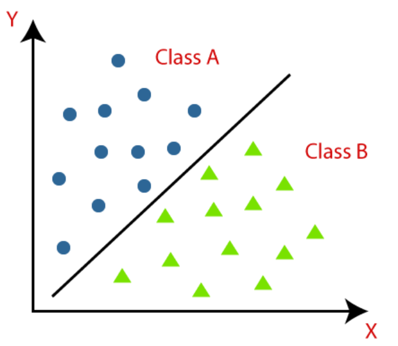

# ML - Classification

[Back](../index.md)

- [ML - Classification](#ml---classification)
  - [Classification Algorithm](#classification-algorithm)
  - [Types of Classifications](#types-of-classifications)
  - [Learners in Classification Problems](#learners-in-classification-problems)
  - [Types of ML Classification Algorithm](#types-of-ml-classification-algorithm)
  - [Evaluating a Classification model](#evaluating-a-classification-model)
    - [Log Loss or Cross-Entropy Loss](#log-loss-or-cross-entropy-loss)
    - [Confusion Matrix](#confusion-matrix)
    - [AUC-ROC curve](#auc-roc-curve)
  - [Use cases of Classification Algorithms](#use-cases-of-classification-algorithms)

---

## Classification Algorithm

- `Classification Algorithm`

  - a Supervised Learning technique that is used to **identify the category of new observations** on the basis of training data.

- In **Classification**, a program learns from the given dataset or observations and then **classifies new observation** into a number of **classes or groups.**

  - Such as, `Yes` or `No`, `0` or `1`, `Spam` or `Not Spam`, `cat` or `dog`, etc.
  - `Classes` can be called as `targets/labels` or `categories`.

- Output

  - Unlike regression, the **output variable** of Classification is a **category**, **not a value**, such as "Green or Blue", "fruit or animal", etc.
  - In classification algorithm, a **discrete output** `function(y)` is mapped to input `variable(x)`.

- `classifier`
  - The `algorithm` which implements the classification on a dataset.

---

## Types of Classifications

- `Binary Classifier`:

  - If the classification problem has only **two** _possible outcomes_.

- `Multi-class Classifier`:
  - If a classification problem has **more than two** _outcomes_

---

## Learners in Classification Problems

- In the classification problems, there are two types of learners:

  - `Lazy Learners`:

    - Lazy Learner firstly stores the training dataset and **wait until it receives the test dataset.**
    - In Lazy learner case, classification is done on the basis of **the most related data** stored in the training dataset.
    - It **takes less time** in _training_ but **more time** for _predictions_.
    - ie: `K-NN` algorithm, `Case-based reasoning`

  - `Eager Learners`:
    - Eager Learners develop a classification model based on a training dataset **before receiving a test dataset**.
    - Opposite to Lazy learners, Eager Learner **takes more time** in _learning_, and **less time** in _prediction_.
    - ie: Decision Trees, Naïve Bayes, ANN.

---

## Types of ML Classification Algorithm

- two category:

  - `Linear Models`

    - Logistic Regression
    - Support Vector Machines

  - `Non-linear Models`
    - K-Nearest Neighbours
    - Kernel SVM
    - Naïve Bayes
    - Decision Tree Classification
    - Random Forest Classification

---

## Evaluating a Classification model

### Log Loss or Cross-Entropy Loss

- It is used for evaluating the performance of a classifier, **whose output** is a **probability value between the `0` and `1`**.
- `log loss`
  - The **lower** `log loss` represents the **higher accuracy** of the model.
  - For a good binary Classification model, the **value** of `log loss` should be near to `0`.
  - The value of log loss **increases** if the `predicted value` **deviates** from the `actual value`.

---

### Confusion Matrix

- `confusion matrix`
  - provides us a matrix/table as output and **describes the performance** of the model.
  - known as the `error matrix`.

|                    | Actual Positive | Actual Negative |
| ------------------ | --------------- | --------------- |
| Predicted Positive | True Positive   | False Positive  |
| Predicted Negative | False Negative  | True Negative   |

- `Accuracy = TP + TN / Total`

---

### AUC-ROC curve

- `ROC curve` / `Receiver Operating Characteristics Curve`
- `AUC` / `Area Under the Curve`

- `AUC-ROC curve`

  - a graph that shows the performance of the classification model **at different thresholds**.
  - used to **visualize the performance** of the multi-class classification model.

- The `ROC curve` is plotted with `TPR` and `FPR`, where `TPR (True Positive Rate)` on Y-axis and `FPR(False Positive Rate)` on X-axis.

---

## Use cases of Classification Algorithms

- Classification algorithms can be used in different places. Below are some popular use cases of Classification Algorithms:
  - Email Spam Detection
  - Speech Recognition
  - Identifications of Cancer tumor cells.
  - Drugs Classification
  - Biometric Identification, etc.

---

[TOP](#ml---classification)
