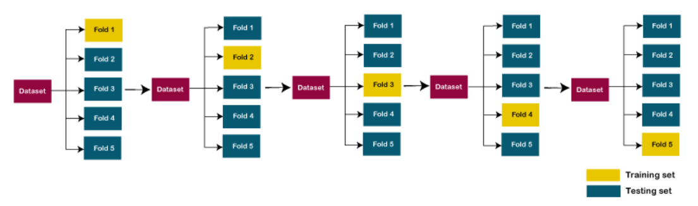

# Machine Learning - Cross Validation

[Back](../index.md)

- [Machine Learning - Cross Validation](#machine-learning---cross-validation)
  - [Cross-validation](#cross-validation)
  - [Methods used for Cross-Validation](#methods-used-for-cross-validation)
    - [K-Fold Cross-Validation](#k-fold-cross-validation)
  - [Implementation of Cross Validation](#implementation-of-cross-validation)

---

## Cross-validation

- `Cross-validation`

  - allow to **compare** different machine learning methods and get a sense of **how well** they will work in practice.
  - a technique for **validating the model efficiency** by **training it on the subset** of input data and **testing on previously unseen subset** of the input data.

  - a **resampling** procedure used to evaluate machine learning models on a **limited** data sample.
    - The procedure has a single parameter called `k` that refers to the number of groups that a given data sample is to be split into and hence called `k–fold cross validation`.

- In machine learning, there is always the need to **test the stability** of the model.

  - It means based only on the training dataset; we can't fit our model on the training dataset.
  - For this purpose, we **reserve** a particular **sample** of the dataset, which was not part of the training dataset.
  - After that, we **test** our model on that sample before deployment, and this complete process comes under cross-validation.
  - This is something **different** from the general train-test split.

- **Steps of cross-validations**

  - **Reserve** a subset of the dataset as a `validation set`.
  - Provide the **training** to the model using the training dataset.
  - Now, **evaluate** model performance using the `validation set`.
    - If the model performs well with the `validation set`, perform the further step, else check for the issues.

---

## Methods used for Cross-Validation

- Methods used for Cross-Validation
  - Validation Set Approach
  - Leave-P-out cross-validation
  - Leave one out cross-validation
  - K-fold cross-validation
  - Stratified k-fold cross-validation

---

### K-Fold Cross-Validation

- `K-fold cross-validation` approach

  - divides the input dataset into `K` groups of samples of equal sizes. These samples are called `folds`.
  - For each `learning set`, the prediction function uses k-1 folds, and the **rest** of the folds are used for the `test set`.
  - This approach is a very popular CV approach because it is easy to understand, and the output is **less biased** than other methods.

- The steps for k-fold cross-validation are:
  - **Split** the input dataset into K groups
  - For each group:
    - Take one group as the **reserve** or test data set.
    - Use **remaining** groups as the **training dataset**
    - **Fit** the model on the training set and **evaluate** the performance of the model using the test set.



---

## Implementation of Cross Validation

```py
import numpy as np
import pandas as pd
data = pd.read_csv("Regression_Data.csv")

X = data.iloc[:,:-1].values
y = data.iloc[:,-1].values
X.shape

# Linear Regression
from sklearn.linear_model import LinearRegression

model = LinearRegression()
lr_model_fit = model.fit(X_train,y_train)

y_pred = lr_model_fit.predict(X_test)

# validate
from sklearn import metrics
print('RMSE:', np.sqrt(metrics.mean_squared_error(y_test, y_pred)))

# apply Cross Validation
from sklearn.model_selection import KFold
from sklearn.model_selection import cross_val_score
from sklearn.model_selection import cross_val_predict

k = 5
cv = KFold(n_splits=k, random_state = 42 , shuffle=True)

# Build multiple linear regression model
model = LinearRegression()

#use k-fold CV to evaluate model
scores = cross_val_score(model, X, y, scoring='neg_root_mean_squared_error',
                         cv=cv, n_jobs=-1)  # n_jobs = -1 means using all preprocessors
scores

```

---

[TOP](#machine-learning---cross-validation)
