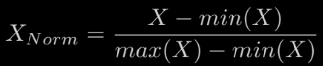
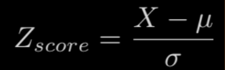

# ML - Data Processing

[Back](../index.md)

- [ML - Data Processing](#ml---data-processing)
  - [Feature Scaling](#feature-scaling)
    - [Feature scaling in pca](#feature-scaling-in-pca)
  - [Data leakage](#data-leakage)

---

## Feature Scaling

- `Feature scaling`

  - a technique used in machine learning **to standardize the range** of `independent variables` or `features` of the data.
  - - The goal is to ensure that all features **have the same scale** so that **no single feature dominates** the others.

- This is particularly important for algorithms that **rely on distance calculations or gradient-based optimization**, as it helps them **converge faster** and **perform better**.

  - Feature scaling is **not always necessary**, but it can be **beneficial** for algorithms that are **sensitive to the scale of input features**, such as `k-nearest neighbors`, support vector machines, and algorithms based on **gradient descent**.
  - `Trees-based algorithms` (e.g., `decision trees`, `random forests`) are generally **insensitive** to feature scaling.

- Common **methods** of feature scaling include:

  - `Min-Max Scaling (Normalization)`:

    - This method scales the features to **a specific range**, typically between `0` and `1`. The formula for Min-Max Scaling is:



- `Standardization (Z-score normalization)`:

  - This method scales the features to have a **mean of 0** and a **standard deviation of 1**. The formula for standardization is:



- `Robust Scaling`:

  - This method is similar to standardization but uses the **median** and the `interquartile range (IQR)` instead of the mean and standard deviation. It is **less sensitive to outliers**.

- It's important to note that the choice of scaling method **depends on the characteristics of the data** and the **requirements of the specific algorithm** being used.

---

### Feature scaling in pca

- an essential step when applying Principal Component Analysis (PCA)
- PCA is **sensitive to the scale** of the features
  - if the features have different scales, those with larger scales may dominate the analysis

```py
from sklearn.decomposition import PCA
from sklearn.preprocessing import StandardScaler
from sklearn.model_selection import train_test_split

# Assume X is your feature matrix, and y is your target variable
# Split the data into training and testing sets
X_train, X_test, y_train, y_test = train_test_split(X, y, test_size=0.25, random_state=0)

# Standardize the data using StandardScaler
scaler = StandardScaler()
X_train_scaled = scaler.fit_transform(X_train)
X_test_scaled = scaler.transform(X_test)

# Apply PCA to the standardized training data
pca = PCA(n_components=10)  # You can choose the number of components
X_train_pca = pca.fit_transform(X_train_scaled)

# Transform the test data using the same PCA object
X_test_pca = pca.transform(X_test_scaled)
```

- 注意:
  - `fit_transform()` for `training dataset`
  - `transform()` for `test dataset`

---

## Data leakage

- `Data leakage`

  - the unintentional or unexpected **introduction of information** from the **testing** or validation dataset into the **training dataset**.

- This leakage can lead to **overly optimistic model evaluations**, as the model has learned **patterns that won't generalize well** to new, unseen data.
- Data leakage can severely compromise the integrity of a machine learning model and lead to misleading
  performance metrics.

- `Data Preprocessing Leakage`:

  - If data preprocessing steps, such as **feature scaling** or imputation, are applied using information from the **entire dataset (including the test set)**, it can lead to data leakage.
  - These preprocessing steps should be based only on the training data.

- **Solution to prevent**:
  - it's essential to carefully **partition** the data into `training` and `testing sets`, ensuring that the testing set only contains information that would have been available at the time of model training.
  - `Cross-validation` can also help detect and mitigate data leakage by revealing inconsistencies in model performance across different folds.
  - Additionally, maintaining a **clear understanding** of the business context, the source of data, and the relationships between variables is crucial to identifying and preventing data leakage in machine learning projects.

```py
from sklearn.preprocessing import StandardScaler
scaler = StandardScaler()
X_scaled = scaler.fit_transform(X)    # line that might cause data leakage
X_scaled
```

- `fit_transform()` used to both **fit** the **scaler** on the **entire** dataset (X) and transform it.

  - If you later use the scaled data for training a machine learning model, you could inadvertently introduce information from your entire dataset, **including the test set**, into the training process. This can lead to data leakage.

- **Best practice**:
  - Because it ensures that the **scaling parameters** (mean and standard deviation) are calculated based **only on** the `training set`.
  - Then, these parameters are used to **transform** both the `training` and `testing sets` consistently.

```py
from sklearn.model_selection import train_test_split
X_train, X_test, y_train, y_test = train_test_split(
    X, y, test_size=0.25, random_state=0)

from sklearn.preprocessing import StandardScaler
sc = StandardScaler()
# scale the features in the training and testing sets separately
X_train = sc.fit_transform(X_train)
X_test = sc.transform(X_test)
```

---

[TOP](#ml---data-processing)
