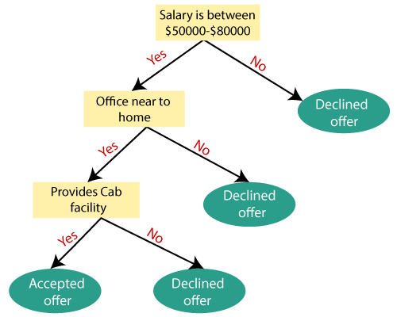

# ML - DT

[Back](../index.md)

- [ML - DT](#ml---dt)
  - [Decision Tree](#decision-tree)
    - [Terminologies](#terminologies)
    - [Advantages and Disadvantages](#advantages-and-disadvantages)
  - [Decision Tree algorithm](#decision-tree-algorithm)
    - [`Attribute Selection Measures`](#attribute-selection-measures)
      - [Information Gain/Entropy](#information-gainentropy)
      - [Gini Index](#gini-index)
    - [Pruning: Getting an Optimal Decision tree](#pruning-getting-an-optimal-decision-tree)
  - [Python Implementation](#python-implementation)
    - [Data Pre-Processing](#data-pre-processing)
    - [Fitting a Decision-Tree algorithm to the Training set](#fitting-a-decision-tree-algorithm-to-the-training-set)
    - [Predicting the test result](#predicting-the-test-result)
    - [Test accuracy of the result (Creation of Confusion matrix)](#test-accuracy-of-the-result-creation-of-confusion-matrix)
    - [Visualizing the training set result](#visualizing-the-training-set-result)
    - [Visualizing the test set result](#visualizing-the-test-set-result)

---

## Decision Tree

- `Decision Tree`

  - a **Supervised** learning technique that can be used for both classification and Regression problems, but mostly it is preferred for solving Classification problems.
  - a **graphical representation** for getting **all the possible solutions** to a problem/decision based on given conditions.

- a **tree-structured** classifier, where

  - `internal nodes` represent the **features** of a dataset,
  - `branches` represent the **decision rules**
  - each `leaf node` represents the **outcome**.

- In a Decision tree, there are two **nodes**:

  - `Decision Node`:
    - used to **make any decision** and have **multiple branches**
  - `Leaf Node`
    - the **output** of those decisions
    - do **not** contain any **further branches**.

- `CART` algorithm / `Classification and Regression Tree algorithm`

  - the algorithm used to build a tree

- The decisions or the test are performed **on the basis of features** of the given dataset.
- A decision tree simply asks a question, and **based on the answer (Yes/No)**, it further split the tree into subtrees.

- Structure:


---

### Terminologies

- `Root Node`:

  - the node from which the decision tree **starts**.
  - represents the **entire dataset**, which further gets divided into two or more homogeneous sets.

- `Leaf Node`:

  - the final output node, and the tree **cannot be segregated further** after getting a leaf node.

- `Splitting`:

  - the process of **dividing** the `decision node`/`root node` into `sub-nodes` according to the given conditions.

- `Branch`/`Sub Tree`:

  - A tree **formed by splitting** the tree.

- `Pruning`:

  - the process of **removing the unwanted branches** from the tree.

- `Parent`/`Child node`:
  - The **root node** of the tree is called the parent node,
  - and other nodes are called the child nodes.

---

### Advantages and Disadvantages

- **Advantages**

  - It is **simple to understand** as it follows the same process which a human follow while making any decision in real-life.
  - It can be very useful for **solving decision-related problems**.
  - It helps to think about **all the possible outcomes** for a problem.
  - There is **less requirement of data cleaning** compared to other algorithms.

- **Disadvantages**
  - The decision tree contains lots of **layers**, which makes it **complex**.
  - It may have an **overfitting** issue, which can be resolved using the `Random Forest` algorithm.
  - For more class **labels**, the **computational complexity** of the decision tree may increase.

---

- Example:


- feature to split
- asm(gini/entropy)
  - leaf:0
- sample to split
- value: array after split

---

## Decision Tree algorithm

- Step-1: Begin the tree with the `root node`, says S, which contains the complete dataset.
- Step-2: **Find** the best attribute in the dataset using `Attribute Selection Measure (ASM)`.
- Step-3: **Divide** the S into subsets that contains possible values for the best attributes.
- Step-4: **Generate** the decision tree node, which contains the best attribute.
- Step-5: **Recursively** make new decision trees using the subsets of the dataset created in step -3.
- Continue this process until a stage is reached where you **cannot further classify** the nodes and called the final node as a leaf node.



---

### `Attribute Selection Measures`

- the main issue arises that how to **select the best attribute** for the root node and for sub-nodes.

- `Attribute selection measure or ASM`
  - the technique to select the best attribute
  - 2 popular techniques:
    - Gini Index
    - Information Gain

---

#### Information Gain/Entropy

- `Information gain`

  - the measurement of **changes in entropy** after the segmentation of a dataset based on an attribute.

- It calculates **how much information a feature provides** us about a class.

  - According to the value of information gain, we **split** the node and build the decision tree.

- A decision tree algorithm always tries to **maximize** the value of `information gain`, and a node/attribute **having the highest** information gain is split first.

- `Entropy`:
  - a metric to **measure the impurity** in a given attribute.
  - It specifies **randomness** in data.

低 entropy, 高 information gain

---

#### Gini Index

- `Gini index`
  - a measure of **impurity or purity** used while creating a decision tree in the CART(Classification and Regression Tree) algorithm.
- An attribute with the **low** Gini index should be **preferred** as compared to the high Gini index.
- It only creates **binary splits**

低 Gini index

---

### Pruning: Getting an Optimal Decision tree

- `Pruning`

  - a process of **deleting the unnecessary nodes** from a tree in order to **get the optimal** decision tree.
  - a technique that **decreases the size** of the learning tree **without reducing accuracy**

- Reason:

  - A **too-large** tree increases the risk of **overfitting**
  - a **small** tree may **not capture all the important features** of the dataset.

- There are mainly two types of tree pruning technology used:
  - Cost Complexity Pruning
  - Reduced Error Pruning.

---

## Python Implementation

### Data Pre-Processing

```py
# importing libraries
import numpy as nm
import matplotlib.pyplot as mtp
import pandas as pd

#importing datasets
data_set= pd.read_csv('user_data.csv')

#Extracting Independent and dependent Variable
x= data_set.iloc[:, [2,3]].values
y= data_set.iloc[:, 4].values

# Splitting the dataset into training and test set.
from sklearn.model_selection import train_test_split
x_train, x_test, y_train, y_test= train_test_split(x, y, test_size= 0.25, random_state=0)

#feature Scaling
from sklearn.preprocessing import StandardScaler
st_x= StandardScaler()
x_train= st_x.fit_transform(x_train)
x_test= st_x.transform(x_test)
```

---

### Fitting a Decision-Tree algorithm to the Training set

```py
#Fitting Decision Tree classifier to the training set
from sklearn.tree import DecisionTreeClassifier
# criterion='entropy': Criterion is used to measure the quality of split, which is calculated by information gain given by entropy.
classifier= DecisionTreeClassifier(criterion='entropy', random_state=0)
classifier.fit(x_train, y_train)
```

---

### Predicting the test result

```py
#Predicting the test set result
y_pred= classifier.predict(x_test)
```

---

### Test accuracy of the result (Creation of Confusion matrix)

```py
#Creating the Confusion matrix
from sklearn.metrics import confusion_matrix
cm= confusion_matrix(y_test, y_pred)
```


---

### Visualizing the training set result

```py
#Visulaizing the trianing set result
from matplotlib.colors import ListedColormap
x_set, y_set = x_train, y_train
x1, x2 = nm.meshgrid(nm.arange(start = x_set[:, 0].min() - 1, stop = x_set[:, 0].max() + 1, step  =0.01),
nm.arange(start = x_set[:, 1].min() - 1, stop = x_set[:, 1].max() + 1, step = 0.01))
mtp.contourf(x1, x2, classifier.predict(nm.array([x1.ravel(), x2.ravel()]).T).reshape(x1.shape),
alpha = 0.75, cmap = ListedColormap(('purple','green' )))
mtp.xlim(x1.min(), x1.max())
mtp.ylim(x2.min(), x2.max())
fori, j in enumerate(nm.unique(y_set)):
mtp.scatter(x_set[y_set == j, 0], x_set[y_set == j, 1],
        c = ListedColormap(('purple', 'green'))(i), label = j)
mtp.title('Decision Tree Algorithm (Training set)')
mtp.xlabel('Age')
mtp.ylabel('Estimated Salary')
mtp.legend()
mtp.show()
```


---

### Visualizing the test set result

```py
#Visulaizing the test set result
from matplotlib.colors import ListedColormap
x_set, y_set = x_test, y_test
x1, x2 = nm.meshgrid(nm.arange(start = x_set[:, 0].min() - 1, stop = x_set[:, 0].max() + 1, step  =0.01),
nm.arange(start = x_set[:, 1].min() - 1, stop = x_set[:, 1].max() + 1, step = 0.01))
mtp.contourf(x1, x2, classifier.predict(nm.array([x1.ravel(), x2.ravel()]).T).reshape(x1.shape),
alpha = 0.75, cmap = ListedColormap(('purple','green' )))
mtp.xlim(x1.min(), x1.max())
mtp.ylim(x2.min(), x2.max())
fori, j in enumerate(nm.unique(y_set)):
mtp.scatter(x_set[y_set == j, 0], x_set[y_set == j, 1],
        c = ListedColormap(('purple', 'green'))(i), label = j)
mtp.title('Decision Tree Algorithm(Test set)')
mtp.xlabel('Age')
mtp.ylabel('Estimated Salary')
mtp.legend()
mtp.show()
```


---

[TOP](#ml---dt)
