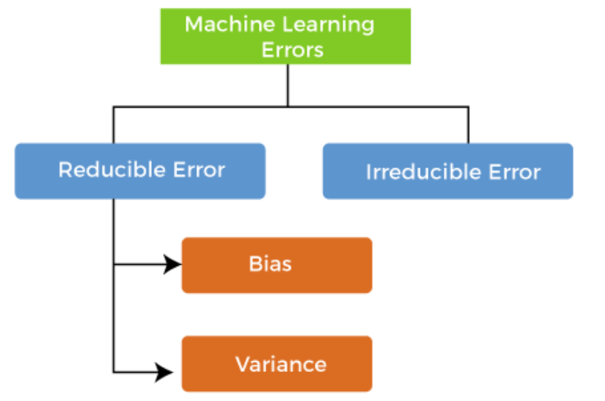
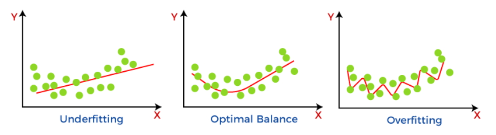
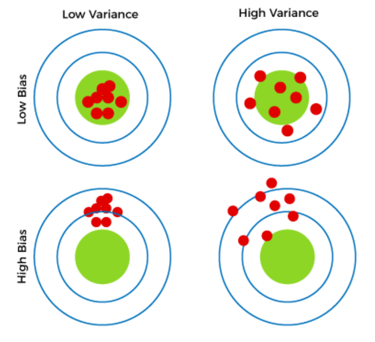
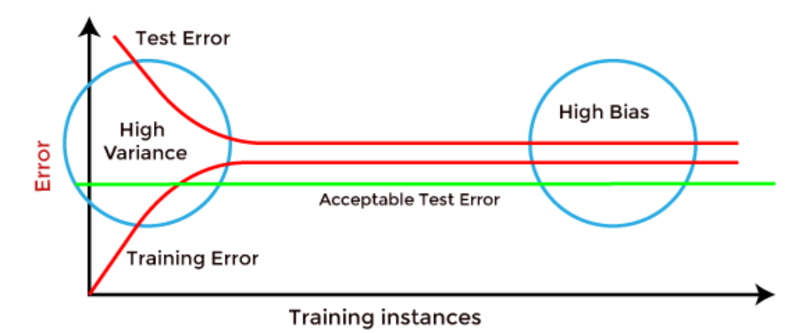
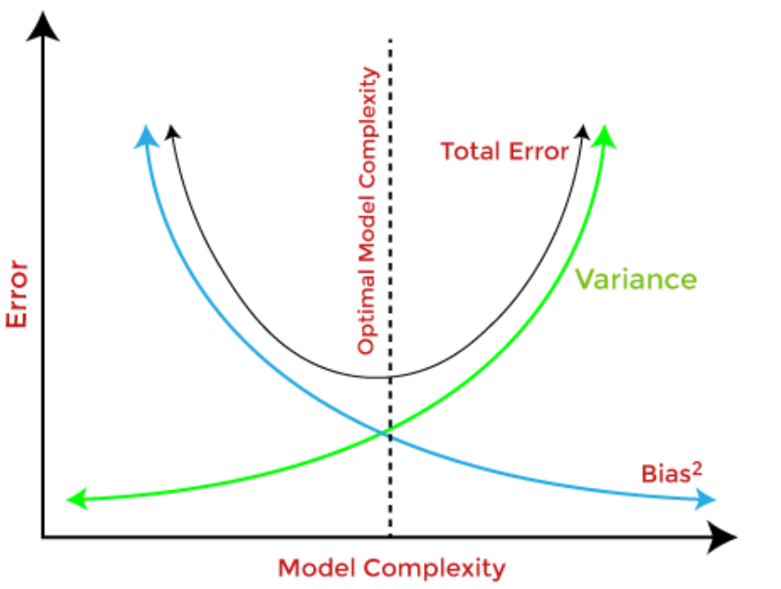

# Machine Learning - Bias and Variance

[Back](../index.md)

- [Machine Learning - Bias and Variance](#machine-learning---bias-and-variance)
  - [Errors](#errors)
  - [Bias](#bias)
    - [Ways to reduce High Bias:](#ways-to-reduce-high-bias)
  - [Variance Error](#variance-error)
    - [Ways to Reduce High Variance:](#ways-to-reduce-high-variance)
  - [Four possible combinations of bias and variances](#four-possible-combinations-of-bias-and-variances)
  - [Identify High variance or High Bias](#identify-high-variance-or-high-bias)
  - [Bias-Variance Trade-Off](#bias-variance-trade-off)

---

## Errors

- `error`:

  - a measure of **how accurately** an algorithm can make **predictions** for the previously **unknown** dataset.

- There are mainly two types of errors in machine learning, which are:

  - `Reducible errors`:

    - These errors **can be reduced to improve** the model **accuracy**.
    - Such errors can further be classified into `bias` and `Variance`.

  - `Irreducible errors`:
    - These errors will **always be present** in the model
    - The cause of these errors is unknown variables whose value can't be reduced.

---

## Bias

- `Bias`

  - difference between **prediction values** and **actual values**.

- In general, a machine learning model **analyses the data**, **find patterns** in it and make predictions.

  - While training, the model **learns** these patterns in the dataset and **applies** them to test data for prediction.
  - While making predictions, a **difference** occurs between **prediction values** made by the model and **actual values/expected values**, and this difference is known as `bias errors` or `Errors` due to bias.

- It can be defined as an **inability** of machine learning algorithms such as Linear Regression to capture the true relationship between the data points.

- Each algorithm **begins with some amount of bias** because bias occurs from **assumptions** in the model, which makes the target function simple to learn.

- A model has either:

  - `Low Bias`:

    - A low bias model will make **fewer assumptions** about the form of the target function.

  - `High Bias`:
    - A model with a high bias makes **more** assumptions, and the model becomes **unable to capture the important features** of our dataset.
    - A high bias model also cannot perform well on new data.
    - Oversimplified model.

- The **simpler** the algorithm, the **higher** the bias it has likely to be introduced.

  - Generally, a **linear** algorithm has a **high** bias, as it makes them learn fast.

    - ie:
      - `Linear Regression`,
      - `Linear Discriminant Analysis`
      - and `Logistic Regression`.

  - Whereas a **nonlinear** algorithm often has **low** bias.
    - ie:
      - `Decision Trees`,
      - `k-Nearest Neighbours`
      - and `Support Vector Machines`.

---

### Ways to reduce High Bias:

- High bias **mainly** occurs due to a much **simple model**. - Below are some ways to reduce the high bias:
  - **Increase** the input **features** as the model is **underfitted**.
  - **Decrease** the **regularization** term.
  - Use more **complex** models, such as including some polynomial features.

---

## Variance Error

- The `variance` would

- `variance`

  - tells that **how much a random variable is different** from its expected value.
  - specify the amount of variation in the prediction if the **different training data was used**.

- Ideally, a model should not vary too much from one training dataset to another, which means the algorithm should be good in understanding the hidden mapping between inputs and output variables.
- `Variance errors` are either of **low variance** or **high variance**.

- `Low variance`

  - the model has a **small** variation in the prediction of the target function with changes in the training data set.

- `High variance`

  - shows a **large** variation in the prediction of the target function with changes in the training dataset.

- A model that shows `high variance` learns a lot and **perform well** with the `training dataset`, and does **not generalize well** with the `unseen dataset`.

  - As a result, such a model gives **good results** with the `training dataset` but shows **high error rates** on the `test dataset`.
  - Since, with `high variance`, the model **learns too much** from the dataset, it leads to `overfitting` of the model.

- A model with `high variance` has the below **problems**:
  - A high variance model leads to `overfitting`.
  - Increase **model complexities**.

- machine learning algorithms with `low variance` are:

  - `Linear Regression`,
  - `Linear Discriminant Analysis`
  - and `Logistic Regression`.

- Usually, **nonlinear** algorithms have a lot of flexibility to fit the model, have `high variance`.

  - ie:
    - `decision tree`,
    - `Support Vector Machine`,
    - and `K-nearest neighbours`

---

### Ways to Reduce High Variance:

- **Reduce** the input **features** or number of parameters as a model is overfitted.
  - Do **not** use a much **complex** model.
  - Increase the training data.
  - Increase the **Regularization** term.

---

## Four possible combinations of bias and variances

- **Low-Bias, Low-Variance**:

  - an **ideal** machine learning model.
  - However, it is **not possible** practically

- **Low-Bias, High-Variance**:

  - model predictions are **inconsistent** and **accurate** on average.
  - This case occurs when the model learns with **a large number of parameters** and hence leads to an `overfitting`

- `High-Bias, Low-Variance`:

  - predictions are **consistent** but **inaccurate** on average.
  - This case occurs when a model **does not learn well** with the training dataset or uses **few numbers of the parameter**.
  - It leads to `underfitting` problems in the model.

- `High-Bias, High-Variance`:
  - predictions are **inconsistent** and also **inaccurate** on average.

---

## Identify High variance or High Bias

- `High Bias` can be identified if the model has:

  - **High** `training error` and the `test error` is almost **similar** to `training error`.

- `High variance` can be identified if the model has:

  - **Low** `training error` and **high** `test error`.

---

## Bias-Variance Trade-Off

- `Bias-Variance trade-off`:

  - balance between the `bias error` and `variance error`.
  - a central issue in `supervised learning`

- `Bias-Variance trade-off` is about finding the sweet spot to make a balance between bias and variance errors.

- If the model is very simple **with fewer parameters**, it may have `low variance` and `high bias`.
- Whereas, if the model has a **large number of parameters**, it will have `high variance` and `low bias`.

---

[TOP](#machine-learning---bias-and-variance)
