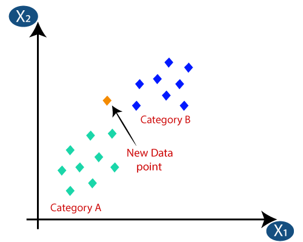

# ML - K-Nearest Neighbour

[Back](../index.md)

- [ML - K-Nearest Neighbour](#ml---k-nearest-neighbour)
  - [K-Nearest Neighbour](#k-nearest-neighbour)
    - [Steps](#steps)
  - [Advantages \& Disadvantages](#advantages--disadvantages)
  - [The value of K](#the-value-of-k)
    - [Finding Optimal Value of K](#finding-optimal-value-of-k)
  - [Python implementation of the KNN algorithm](#python-implementation-of-the-knn-algorithm)
    - [Data Pre-processing step](#data-pre-processing-step)
    - [Training the K-NN model on the Training set](#training-the-k-nn-model-on-the-training-set)
    - [Predicting the test result](#predicting-the-test-result)
    - [Test accuracy of the result(Creation of Confusion matrix)](#test-accuracy-of-the-resultcreation-of-confusion-matrix)
    - [Visualising the Training set results](#visualising-the-training-set-results)
    - [Visualising the Test set results](#visualising-the-test-set-results)

---

## K-Nearest Neighbour

- `K-Nearest Neighbour(K-NN)`

  - **assumes** the similarity between the **new case/data** and **available cases**
  - classifies a new data point **based on the similarity**,

    - put the new case into the category that is **most similar** to the available categories.

- `K-NN` algorithm **can be used** for `Regression` as well as for `Classification`

  - but **mostly** it is used for the `Classification` problems.

- K-NN is a **non-parametric** algorithm,

  - it does **not make any assumption on underlying data.**

- `lazy learner algorithm`

  - a type of machine learning algorithm that **doesn't process** `training data` **until** it needs to **make a prediction**.
  - Instead of building models during training, `lazy learning algorithms` **wait until** they **encounter a new query**.
    - it does not learn from the training set **immediately** instead it **stores** the dataset
  - at the time of classification, it **performs** an action on the dataset.

- `K-NN` is a `lazy learner algorithm`
  - at the `training phase` just **stores** the dataset
  - when it gets **new data**, then it **classifies** that data **into a category** that is much similar to the new data.

---

### Steps

- **Step-1:** Select the **number K of the neighbors**
  - Firstly, we will choose the number of neighbors, so we will choose the k=5.



---

- **Step-2:** Calculate the `Euclidean distance` of K number of neighbors

  - calculate the `Euclidean distance` between the data points.

- `Euclidean distance`
  - the distance between two points,


---

- **Step-3**: Take the **K nearest neighbors** as per the calculated `Euclidean distance`.
- **Step-4**: Among these k neighbors, **count the number** of the data points in each category.
  - By calculating the Euclidean distance we got the nearest neighbors, as three nearest neighbors in category A and two nearest neighbors in category B.


---

- **Step-5**: **Assign the new data points to that category** for which the number of the neighbor is **maximum**.
  - As we can see the **3** nearest neighbors are from category A, hence this new data point must belong to **category A**.
- **Step-6**: Our model is ready.

---

## Advantages & Disadvantages

- Advantages of KNN Algorithm:

  - **simple to implement**.
  - **robust to the noisy** training data
  - more effective if the **training data is large**.

- Disadvantages of KNN Algorithm:
  - Always **needs to determine the value of K** which may be complex some time.
  - The **computation cost is high**
    - because of calculating the distance between the data points for all the training samples.

---

## The value of K

- There is no particular way to determine the **best value** for "K", so we need to try some values to find the best out of them.
  - The **most preferred value** for K is `5`.
  - A very **low value** for K such as K=1 or K=2, **can be noisy** and lead to the **effects of outliers** in the model.
  - **Large values** for K are good, but it may find some difficulties.

---

### Finding Optimal Value of K

- Calculate error rates

```py
Error_Rate = []

for i in range(1, 30):

    knn_opt = KNeighborsClassifier(n_neighbors=i)
    knn_opt.fit(X_train, y_train)
    y_pred_opt = knn_opt.predict(X_test)
    Accuracy = np.mean(y_pred_opt == y_test)
    error_rate_value = 1 - Accuracy
    Error_Rate.append(error_rate_value)
```

- Visualize K Values against Error rates

```py
from matplotlib import style
style.use('dark_background')
plt.figure(figsize=(10, 8))
plt.plot(range(1, 30), Error_Rate, 'm', lw=3,
         marker='^', markerfacecolor='g', markersize=10)
plt.title('Finding Optimal Vlue of K', fontsize=25)
plt.xlabel('Number of Nearest Neighbours ( k )', fontsize=15)
plt.ylabel('Error Rate', fontsize=15)
```


---

## Python implementation of the KNN algorithm

### Data Pre-processing step

- Importing the dataset

```py
import numpy as np
import matplotlib.pyplot as plt
import pandas as pd

dataset = pd.read_csv('Social_Network_Ads.csv')
X = dataset.iloc[:, :-1].values
y = dataset.iloc[:, -1].values
```

- Splitting the dataset into the Training set and Test set

```py
from sklearn.model_selection import train_test_split
X_train, X_test, y_train, y_test = train_test_split(
    X, y, test_size=0.25, random_state=0)
```

- Feature Scaling

```py
from sklearn.preprocessing import StandardScaler
sc = StandardScaler()
X_train = sc.fit_transform(X_train)
X_test = sc.transform(X_test)
```

---

### Training the K-NN model on the Training set

```py
from sklearn.neighbors import KNeighborsClassifier
classifier = KNeighborsClassifier(
    n_neighbors=5,  # To define the required neighbors of the algorithm
    metric='minkowski',  # decides the distance between the points.
    p=2  # equivalent to the standard Euclidean metric.
)
classifier.fit(X_train, y_train)
```

---

### Predicting the test result

```py
y_pred = classifier.predict(X_test)
print(np.concatenate((y_pred.reshape(len(y_pred), 1), y_test.reshape(len(y_test), 1)), 1))
```

---

### Test accuracy of the result(Creation of Confusion matrix)

```py
from sklearn.metrics import confusion_matrix, accuracy_score
cm = confusion_matrix(y_test, y_pred)
print(cm)
accuracy_score(y_test, y_pred)

# [[64  4]
#  [ 3 29]]
```

---

### Visualising the Training set results

```py
from matplotlib.colors import ListedColormap
X_set, y_set = sc.inverse_transform(X_train), y_train
X1, X2 = np.meshgrid(np.arange(start = X_set[:, 0].min() - 10, stop = X_set[:, 0].max() + 10, step = 1),
                     np.arange(start = X_set[:, 1].min() - 1000, stop = X_set[:, 1].max() + 1000, step = 1))
plt.contourf(X1, X2, classifier.predict(sc.transform(np.array([X1.ravel(), X2.ravel()]).T)).reshape(X1.shape),
             alpha = 0.75, cmap = ListedColormap(('red', 'green')))
plt.xlim(X1.min(), X1.max())
plt.ylim(X2.min(), X2.max())
for i, j in enumerate(np.unique(y_set)):
    plt.scatter(X_set[y_set == j, 0], X_set[y_set == j, 1], c = ListedColormap(('red', 'green'))(i), label = j)
plt.title('K-NN (Training set)')
plt.xlabel('Age')
plt.ylabel('Estimated Salary')
plt.legend()
plt.show()
```


---

### Visualising the Test set results

```py
from matplotlib.colors import ListedColormap
X_set, y_set = sc.inverse_transform(X_test), y_test
X1, X2 = np.meshgrid(np.arange(start = X_set[:, 0].min() - 10, stop = X_set[:, 0].max() + 10, step = 1),
                     np.arange(start = X_set[:, 1].min() - 1000, stop = X_set[:, 1].max() + 1000, step = 1))
plt.contourf(X1, X2, classifier.predict(sc.transform(np.array([X1.ravel(), X2.ravel()]).T)).reshape(X1.shape),
             alpha = 0.75, cmap = ListedColormap(('red', 'green')))
plt.xlim(X1.min(), X1.max())
plt.ylim(X2.min(), X2.max())
for i, j in enumerate(np.unique(y_set)):
    plt.scatter(X_set[y_set == j, 0], X_set[y_set == j, 1], c = ListedColormap(('red', 'green'))(i), label = j)
plt.title('K-NN (Test set)')
plt.xlabel('Age')
plt.ylabel('Estimated Salary')
plt.legend()
plt.show()
```


---

[TOP](#ml---k-nearest-neighbour)
