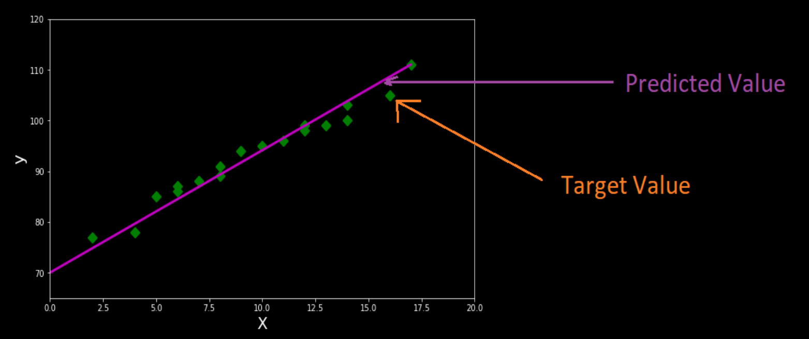
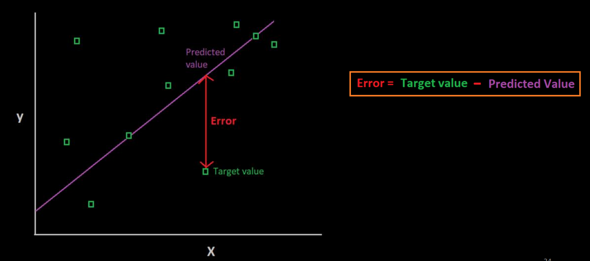
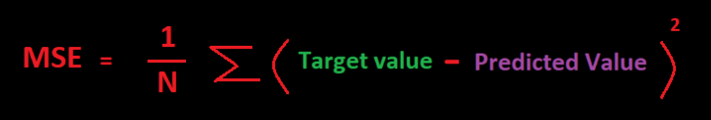
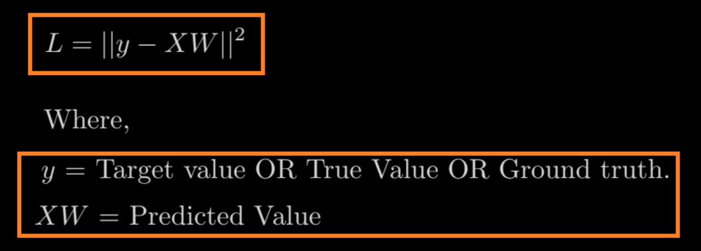
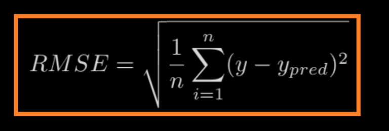
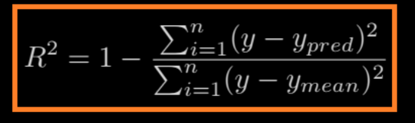

# Machine Learning - Linear Regression: Multiple Linear Regression

[Back](../index.md)

- [Machine Learning - Linear Regression: Multiple Linear Regression](#machine-learning---linear-regression-multiple-linear-regression)
  - [Multiple Linear Regression](#multiple-linear-regression)
  - [MLR Equation](#mlr-equation)
  - [Assumptions for Multiple Linear Regression:](#assumptions-for-multiple-linear-regression)
  - [Implementation of Multiple Linear Regression model](#implementation-of-multiple-linear-regression-model)
    - [1. Data Pre-processing](#1-data-pre-processing)
    - [2. Fitting our MLR model to the Training set](#2-fitting-our-mlr-model-to-the-training-set)
    - [3. Prediction of Test set results](#3-prediction-of-test-set-results)
    - [4. Check the score for training dataset and test dataset](#4-check-the-score-for-training-dataset-and-test-dataset)
    - [5. Evaluate the model with test data](#5-evaluate-the-model-with-test-data)
  - [Evaluation Metrics](#evaluation-metrics)
    - [Error](#error)
    - [Root Mean Square Error](#root-mean-square-error)
    - [R^2 Error](#r2-error)

---

## Multiple Linear Regression

- `Multiple Linear Regression`

  - a regression algorithms which models the linear relationship between a **single** `dependent continuous variable` and **more than one** `independent variable`.

- For MLR, the `dependent` or `target variable(Y)` must be the **continuous/real**, but the `predictor` or `independent variable` **may be** of _continuous_ or _categorical form_.

- **Each** feature variable must model the linear relationship with the dependent variable.
- MLR tries to fit a regression line through a multidimensional space of data-points.

---

## MLR Equation

- In Multiple Linear Regression, the `target variable(Y)` is a linear **combination of multiple** `predictor variables` x1, x2, x3, ...,xn.

```
y = w0 + w1X1 + w2X2 + ... + wnXn
```

- `Y`:

  - Output/Response variable / Target Variable

- `X`:

  - Various Independent/feature variable / predictor variables

- `wn`:

  - weight associated with Xn
  - Coefficients of the model.

- `w0`:

  - Bias

---

## Assumptions for Multiple Linear Regression:

- Assumptions

  - A linear **relationship** should **exist** between the Target and predictor variables.

  - The regression residuals must be **normally distributed**.

  - MLR assumes little or no **multicollinearity** (correlation between the independent variable) in data.

- There are mainly two applications of Multiple Linear Regression:
  - Effectiveness of **Independent** variable on prediction
  - Predicting the **impact** of changes

---

## Implementation of Multiple Linear Regression model

- **Problem Description**:

  - We have a dataset of 50 start-up companies. This dataset contains five main information: R&D Spend, Administration Spend, Marketing Spend, State, and Profit for a financial year.

- Our **goal**:
  - to create a model that can easily determine which company has a **maximum** profit, and which is the **most affecting factor** for the profit of a company.

---

### 1. Data Pre-processing

```py
# importing libraries
import numpy as np
import matplotlib.pyplot as plt
import pandas as pd

#importing datasets
data_set= pd.read_csv('50_CompList.csv')

#Extracting Independent and dependent Variable
X = dataset[['R&D Spend', 'Administration', 'Marketing Spend', 'State']]
y = dataset[['Profit']]


# Dummy Variables: Convert categorical values into numerical values.
df_dummies = pd.get_dummies(
    X[['State']], prefix='', prefix_sep='', drop_first=True)

X = pd.concat([X, df_dummies], axis=1)
X.drop(["State"], axis=1, inplace=True)
X = X.values

# Splitting the dataset into training and test set.
from sklearn.model_selection import train_test_split
X_train, X_test, y_train, y_test = train_test_split(X, y, test_size = 0.2, random_state = 0)

# Standardize the data
from sklearn.preprocessing import StandardScaler
sc = StandardScaler()
X_train = sc.fit_transform(X_train)
X_test = sc.transform(X_test)

```

---

### 2. Fitting our MLR model to the Training set

```py
#Fitting the MLR model to the training set:
from sklearn.linear_model import LinearRegression
regressor= LinearRegression()
regressor.fit(x_train, y_train)

# Intercept and Coefficient
print("Intercept:", lr.intercept_.round(2))
print("Coefficient:", lr.coef_.round(2))
```

---

### 3. Prediction of Test set results

```py
#Predicting the Test set result;
y_pred_test = regressor.predict(X_test)
```

---

### 4. Check the score for training dataset and test dataset

```py

print('Train Score: ', regressor.score(x_train, y_train))
print('Test Score: ', regressor.score(x_test, y_test))
# Train Score:  0.9501847627493607
# Test Score:  0.9347068473282446
```

- The above score tells that our model is 95% accurate with the training dataset and 93% accurate with the test dataset.

---

### 5. Evaluate the model with test data

```py
from sklearn import metrics
print('RMSE:', np.sqrt(metrics.mean_squared_error(y_test, y_pred_test)))
print('R2:', metrics.r2_score(y_test, y_pred_test))
```

---

## Evaluation Metrics

### Error

- Target Values:

  - part of dataset

- Predicted Values:
  - values predicted by Linear Model.



- Error = Target Value - Predicted Value



- `Mean Square Error (MSE)`



- `Least Square Method`
  - Define a least square as a `cost function` of a `loss function`.
  - When the value of cost function is min, it is the optimal prediction.



---

### Root Mean Square Error



- `Root Mean Square Error (RMSE)`

  - tell us how far apart the predicted values are from the observed values in a dataset, on avarage.
  - The lower the RMSE, the better a model fits a dataset.

- Python immplementation

```py
from sklearn import metrics
print('RMSE:', np.sqrt(metrics.mean_squared_error(y_test, y_pred)))
```

---

### R^2 Error



- R^2 Error
  - tells the proportion of the variance in the response variable of a regression model that can be explained by the predictor variable.
  - ranges from 0 to 1.
  - The higher the R2 value, the better a model fits a dataset.

```py
from sklearn import metrics
print('R2:', metrics.r2_score(y_test, y_pred))
```

---

[TOP](#machine-learning---linear-regression-multiple-linear-regression)
