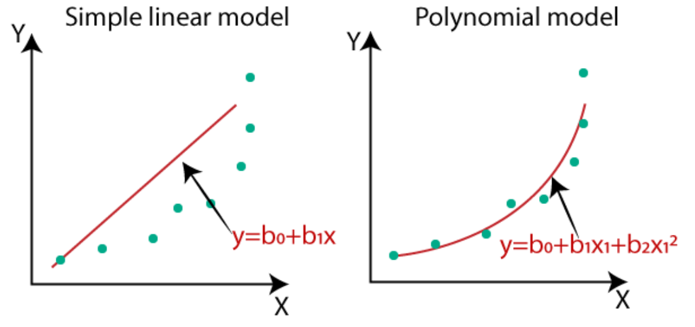
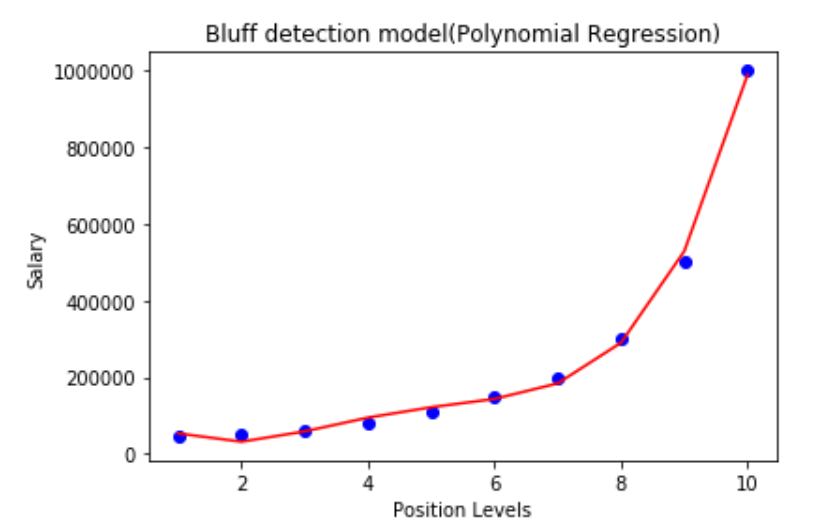

# Machine Learning - Polynomial Regression

[Back](../index.md)

- [Machine Learning - Polynomial Regression](#machine-learning---polynomial-regression)
  - [Polynomial Regression](#polynomial-regression)
  - [Benefits](#benefits)
  - [Implementation of Polynomial Regression using Python](#implementation-of-polynomial-regression-using-python)
    - [1. Data Pre-processing](#1-data-pre-processing)
    - [2. Building the Polynomial regression model](#2-building-the-polynomial-regression-model)
    - [3. Predict](#3-predict)
    - [4. Visualizing the result](#4-visualizing-the-result)
    - [5. Evaluate](#5-evaluate)

---

## Polynomial Regression

- `Polynomial Regression`

  - a regression algorithm that models the relationship between a dependent(y) and independent variable(x) as **nth degree polynomial**.
  - the special case of `Multiple Linear Regression`
    - add some polynomial terms to the `Multiple Linear regression` equation to convert it into `Polynomial Regression`.

- `y= b0+b1x^1+ b2x1^2+ b3x1^3+...... bnx1^n`

- The **dataset** used in Polynomial regression for training is of **non-linear nature**.

  - makes use of a linear regression model to fit the complicated and non-linear functions and datasets.

- "In Polynomial regression, the original features are converted into Polynomial features of required degree (2,3,..,n) and then modeled using a linear model." 将多个 features 转换为高次, 然后套用线性模型.

---

## Benefits

- If we apply a linear model on a linear dataset, then it provides us a good result as we have seen in Simple Linear Regression, but if we apply the same model without any modification **on a non-linear dataset**, then it will produce a drastic output.
  - Due to which `loss function` will **increase**, the `error rate` will be **high**, and `accuracy` will be **decreased**.
  - So for such cases, where data points are **arranged in a non-linear fashion**, we need the Polynomial Regression model. We can understand it in a better way using the below comparison diagram of the linear dataset and non-linear dataset.



- A Polynomial Regression algorithm is also called Polynomial Linear Regression because it does not depend on the variables, instead, it depends on the **coefficients**, which are arranged in a linear fashion.

---

## Implementation of Polynomial Regression using Python

- Problem Description:
  - There is a Human Resource company, which is going to hire a new candidate. The candidate has told his previous salary 160K per annum, and the HR have to check whether he is telling the truth or bluff. So to identify this, they only have a dataset of his previous company in which the salaries of the top 10 positions are mentioned with their levels. By checking the dataset available, we have found that there is a non-linear relationship between the Position levels and the salaries.
- Our goal is to build a Bluffing detector regression model, so HR can hire an honest candidate. Below are the steps to build such a model.

### 1. Data Pre-processing

- In the Polynomial Regression model, we will not use feature scaling, and also we will not split our dataset into training and test set.

  - The dataset contains very **less information** which is not suitable to divide it into a test and training set, else our model will not be able to find the correlations between the salaries and levels.
  - In this model, we **want very accurate predictions** for salary, so the model should have enough information.

- we are only considering two columns because Positions are equivalent to the levels or may be seen as the encoded form of Positions.

```py
import numpy as np
import matplotlib.pyplot as plt
import pandas as pd

dataset = pd.read_csv('Position_Salaries.csv')
X = dataset.iloc[:, 1:-1].values
y = dataset.iloc[:, -1].values
```

---

### 2. Building the Polynomial regression model

- 适用 PolynomialFeatures.fit_transform()转换 feature
- 适用线性模型 fit

```py
 #Fitting the Polynomial regression to the dataset
from sklearn.preprocessing import PolynomialFeatures
poly_reg = PolynomialFeatures(degree = 4)
X_poly = poly_reg.fit_transform(X)  # Convert matrix X into polynomial form of degree = 4

# Since polynomial Regression is also a Linear Regression, therefore we will import Linear Regression to fit on X_poly and y.
lin_reg_4 = LinearRegression()
lin_reg_4.fit(X_poly, y)
```

---

### 3. Predict

```py
y_pred = lin_reg_4.predict(X_poly)
```

---

### 4. Visualizing the result

```py
plt.scatter(X, y, color = 'red')
plt.plot(X, y_pred, color = 'blue')
plt.title('Truth or Bluff (Polynomial Regression)')
plt.xlabel('Position level')
plt.ylabel('Salary')
plt.show()
```



---

### 5. Evaluate

```py

from sklearn import metrics
print('RMSE:', np.sqrt(metrics.mean_squared_error(y, y_pred)))
print('R2:', metrics.r2_score(y, y_pred))
```

---

[Top](#machine-learning---polynomial-regression)
