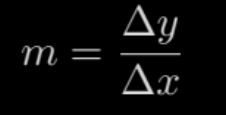
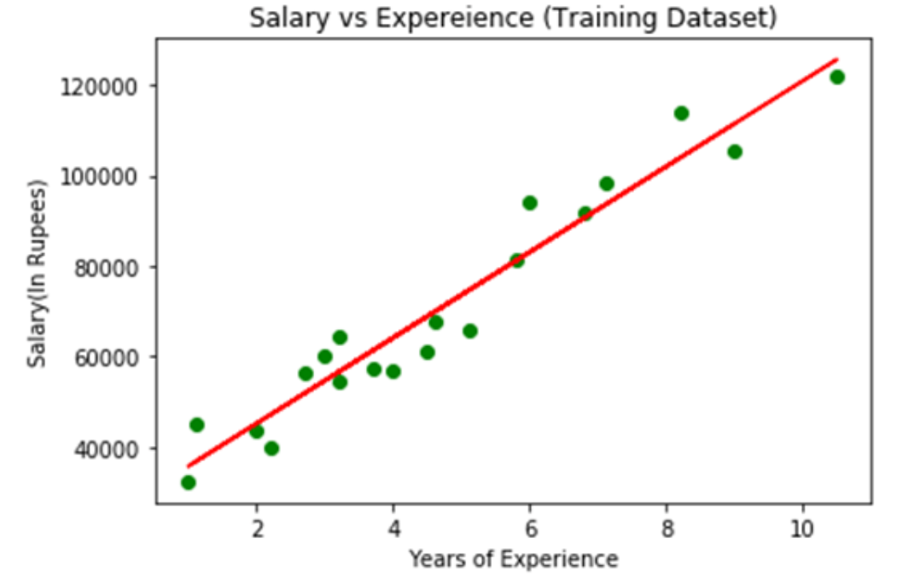
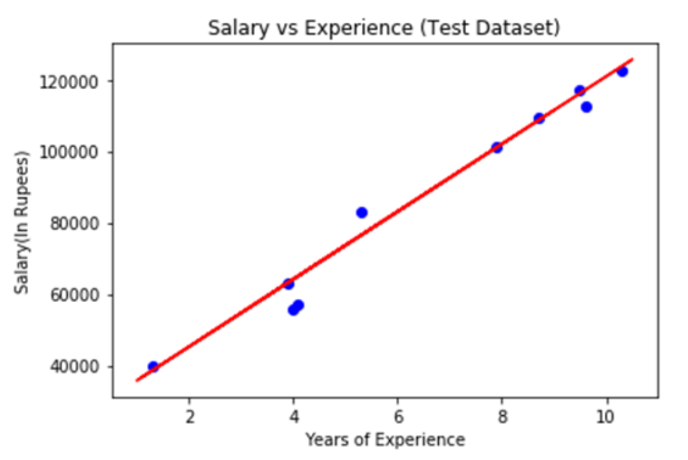

# Machine Learning - Linear Regression: Simple Linear Regression

[Back](../index.md)

- [Machine Learning - Linear Regression: Simple Linear Regression](#machine-learning---linear-regression-simple-linear-regression)
  - [Simple Linear Regression](#simple-linear-regression)
  - [Simple Linear Regression Model](#simple-linear-regression-model)
  - [Example: Implementation of Simple Linear Regression Algorithm](#example-implementation-of-simple-linear-regression-algorithm)

---

## Simple Linear Regression

- `Simple Linear Regression`

  - a type of R**egression algorithms** that models the relationship between a `dependent variable` and a **single** `independent variable`.
  - The relationship shown by a Simple Linear Regression model is **linear** or a **sloped straight line**.

- **key point** in Simple Linear Regression:

  - the `dependent variable` must be a **continuous/real value**.
  - However, the `independent variable` can be measured on **continuous** or **categorical** values.

- mainly two **objectives**:

  - **Model the relationship** between the two variables.

    - Such as the relationship between Income and expenditure, experience and Salary, etc.

  - **Forecasting new observations**.
    - Such as Weather forecasting according to temperature, Revenue of a company according to the investments in a year, etc.

---

## Simple Linear Regression Model

- Model

```
y= a0+a1x+ ε

y = wx + b
```

- `x`:

  - `Independent Variable` / `feature`

- `a1`/`w`:

  - `weight` associate with x
  - the `slope` of the regression line, which tells whether the line is increasing or decreasing.
  - When weith is zero, no relationship



- `y`:

  - `Dependent variable` / `target`

- `b`:

  - `bias`

- `a0`:

  - the `intercept` of the Regression line (can be obtained putting x=0)

- `ε`:
  - The `error` term. (For a good model it will be negligible)

---

## Example: Implementation of Simple Linear Regression Algorithm

- a dataset that has two variables:

  - salary (dependent variable)
  - experience (Independent variable).

- The goals of this problem is:

  - We want to find out if there is any **correlation** between these two variables
  - We will **find the best fit line** for the dataset.
  - How the dependent variable is **changing by changing** the independent variable.

- 1. Data processsing

```py
import numpy as nm
import matplotlib.pyplot as plt
import pandas as pd

# load data
data_set= pd.read_csv('Salary_Data.csv')

# extract the dependent and independent variables
x= data_set.iloc[:, :-1].values     # independent variable
y= data_set.iloc[:, 1].values       # dependent variable

# Splitting the dataset into training and test set.
# By executing the following code, we will get x-test, x-train and y-test, y-train dataset.
from sklearn.model_selection import train_test_split
x_train, x_test, y_train, y_test= train_test_split(x, y, test_size= 1/3, random_state=0)

# For simple linear Regression, we will not use Feature Scaling. Because Python libraries take care of it for some cases
```

---

- 2. Fitting the Simple Linear Regression to the Training Set

```py
#Fitting the Simple Linear Regression model to the training dataset
from sklearn.linear_model import LinearRegression
regressor= LinearRegression()
regressor.fit(x_train, y_train)

```

- model is ready to predict the output for the new observations

---

- 3. Prediction of test set result

- provide the test dataset (new observations) to the model to check whether it can predict the correct output or not.

```py
#Prediction of Test and Training set result
y_pred = regressor.predict(x_test)
```

---

- 4. visualizing the **Training set** results

```py
plt.scatter(X_train, y_train, color="green")
plt.plot(X_train, regressor.predict(X_train), color="red")
plt.title("Salary vs Experience (Training Dataset)")
plt.xlabel("Years of Experience")
plt.ylabel("Salary(In Rupees)")
plt.show()
```



- In the above plot, we can see the real values observations in green dots and predicted values are covered by the red regression line.

  - The regression line **shows a correlation** between the dependent and independent variable.

- The **good fit** of the line can be observed by calculating the difference between actual values and predicted values.
  - But as we can see in the above plot, **most** of the observations **are close to** the regression line, hence our model is good for the training set.

---

- 5. visualizing the **Test set** results

```py
#visualizing the Test set results
plt.scatter(X_test, y_test, color = 'blue')
plt.plot(X_train, regressor.predict(X_train), color = 'red')
plt.title('Salary vs Experience (Test set)')
plt.xlabel('Years of Experience')
plt.ylabel('Salary')
plt.show()
```

In the above plot, there are observations given by the blue color, and prediction is given by the red regression line. As we can see, most of the observations are close to the regression line, hence we can say our Simple Linear Regression is a good model and able to make good predictions.



---

[TOP](#machine-learning---linear-regression-simple-linear-regression)
