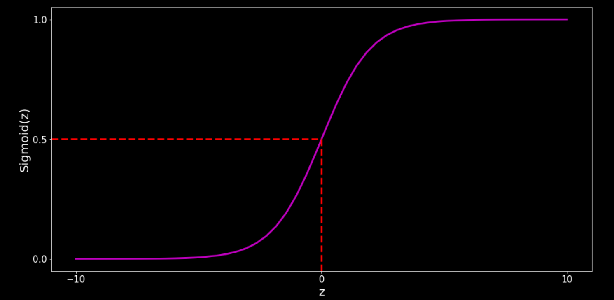
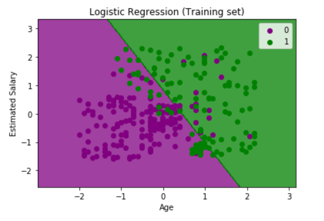
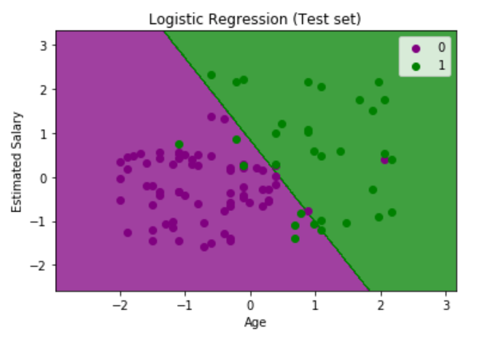

# ML - Logistic Regression

[Back](../index.md)

- [ML - Logistic Regression](#ml---logistic-regression)
  - [Logistic Regression](#logistic-regression)
    - [Assumptions for Logistic Regression:](#assumptions-for-logistic-regression)
    - [Logistic Function (Sigmoid Function)](#logistic-function-sigmoid-function)
    - [Type of Logistic Regression:](#type-of-logistic-regression)
  - [Python Implementation](#python-implementation)
    - [Data Pre-processing step](#data-pre-processing-step)
    - [Fitting Logistic Regression to the Training set](#fitting-logistic-regression-to-the-training-set)
    - [Predicting the test result](#predicting-the-test-result)
    - [Test accuracy of the result(Creation of Confusion matrix)](#test-accuracy-of-the-resultcreation-of-confusion-matrix)
    - [Visualizing the training set result.](#visualizing-the-training-set-result)
    - [Visualizing the test set result.](#visualizing-the-test-set-result)

---

## Logistic Regression

- `Logistic Regression` / `Binary logistic regression`

  - used for predicting the **categorical** / **logical** `dependent variable` using a given set of `independent variables`.

- Outcome value

  - The outcome must be a **categorical** or **discrete** value.
  - doesnot classify directly, but returns the % of class membership and then use a threshold to implement classification.
  - instead of giving the exact value as 0 and 1, it gives the **probabilistic values** which lie between `0` and `1`.

- Curve

  - In Logistic regression, instead of fitting a regression line, we **fit** an **"S" shaped logistic function**, which predicts two maximum values (0 or 1).
  - The curve from the logistic function indicates the **likelihood** of something

- Logistic Regression can be used to classify the observations **using different types of data** and can easily **determine the most effective variables** used for the classification.

- Note: Logistic regression **uses the concept of predictive modeling as regression**; therefore, it is called logistic regression, but is used to classify samples;
  - Therefore, it falls under the **classification** algorithm.

---

### Assumptions for Logistic Regression:

- The `dependent variable` must be **categorical** in nature.
- The `independent variable` should **not** have **multi-collinearity(多重共线性)**.

---

### Logistic Function (Sigmoid Function)

- `sigmoid function`:

  - The `S-form curve`
  - a mathematical function used to **map** the **predicted values** to **probabilities**.
  - It maps any real value into another value within **a range of 0 and 1**.

- Convert Linear Regression solution into Logistic Regression Solution **by placing Linear Regression in Sigmoid function**.

  - can set a cutoff point at 0.5.
    - equal and above 0.5 belong to class 1.
    - below 0.5 belong to class 0.

- `threshold value`
  - used to defin the probability of either `0` or `1`.
  - The values **above** the `threshold value` tends to `1`.
  - The a value **below** the `threshold values` tends to `0`.



---

### Type of Logistic Regression:

- On the basis of the categories, Logistic Regression can be classified into three types:

  - `Binomial`:
    - In binomial Logistic regression, there can be only **two possible types** of the _dependent variables_, such as 0 or 1, Pass or Fail, etc.
  - `Multinomial`:
    - In multinomial Logistic regression, there can be **3 or more possible unordered types** of the _dependent variable_, such as "cat", "dogs", or "sheep"
  - `Ordinal`:
    - In ordinal Logistic regression, there can be **3 or more possible ordered types** of *dependent variable*s, such as "low", "Medium", or "High".

---

## Python Implementation

### Data Pre-processing step

- Importing the dataset

```py
import numpy as np
import matplotlib.pyplot as plt
import pandas as pd

dataset = pd.read_csv('Social_Network_Ads.csv')
X = dataset.iloc[:, :-1].values
y = dataset.iloc[:, -1].values
```

- Splitting the dataset into the Training set and Test set

```py
from sklearn.model_selection import train_test_split
X_train, X_test, y_train, y_test = train_test_split(
    X, y, test_size=0.25, random_state=0)
```

- Feature Scaling

```py
from sklearn.preprocessing import StandardScaler
sc = StandardScaler()
X_train = sc.fit_transform(X_train)
X_test = sc.transform(X_test)
```

---

### Fitting Logistic Regression to the Training set

```py
from sklearn.linear_model import LogisticRegression
classifier = LogisticRegression(random_state=0)
classifier.fit(X_train, y_train)
```

---

### Predicting the test result

```py
y_pred = classifier.predict(X_test)
print(np.concatenate((y_pred.reshape(len(y_pred), 1), y_test.reshape(len(y_test), 1)), 1))
```

---

### Test accuracy of the result(Creation of Confusion matrix)

```py
from sklearn.metrics import confusion_matrix, accuracy_score
cm = confusion_matrix(y_test, y_pred)
print(cm)
accuracy_score(y_test, y_pred)
```

---

### Visualizing the training set result.

```py
from matplotlib.colors import ListedColormap
X_set, y_set = sc.inverse_transform(X_train), y_train
X1, X2 = np.meshgrid(np.arange(start=X_set[:, 0].min() - 10, stop=X_set[:, 0].max() + 10, step=0.25),
                     np.arange(start=X_set[:, 1].min() - 1000, stop=X_set[:, 1].max() + 1000, step=0.25))
plt.contourf(X1, X2, classifier.predict(sc.transform(np.array([X1.ravel(), X2.ravel()]).T)).reshape(X1.shape),
             alpha=0.75, cmap=ListedColormap(('red', 'green')))
plt.xlim(X1.min(), X1.max())
plt.ylim(X2.min(), X2.max())
for i, j in enumerate(np.unique(y_set)):
    plt.scatter(X_set[y_set == j, 0], X_set[y_set == j, 1],
                c=ListedColormap(('red', 'green'))(i), label=j)
plt.title('Logistic Regression (Training set)')
plt.xlabel('Age')
plt.ylabel('Estimated Salary')
plt.legend()
plt.show()
```



---

### Visualizing the test set result.

```py
from matplotlib.colors import ListedColormap
X_set, y_set = sc.inverse_transform(X_test), y_test
X1, X2 = np.meshgrid(
    np.arange(start=X_set[:, 0].min() - 10,
              stop=X_set[:, 0].max() + 10, step=0.25),
    np.arange(start=X_set[:, 1].min() - 1000,
              stop=X_set[:, 1].max() + 1000, step=0.25))
plt.contourf(X1, X2, classifier.predict(sc.transform(np.array([X1.ravel(), X2.ravel()]).T)).reshape(X1.shape),
             alpha=0.75, cmap=ListedColormap(('red', 'green')))
plt.xlim(X1.min(), X1.max())
plt.ylim(X2.min(), X2.max())
for i, j in enumerate(np.unique(y_set)):
    plt.scatter(X_set[y_set == j, 0], X_set[y_set == j, 1],
                c=ListedColormap(('red', 'green'))(i), label=j)
plt.title('Logistic Regression (Test set)')
plt.xlabel('Age')
plt.ylabel('Estimated Salary')
plt.legend()
plt.show()
```



---

[TOP](#ml---logistic-regression)
