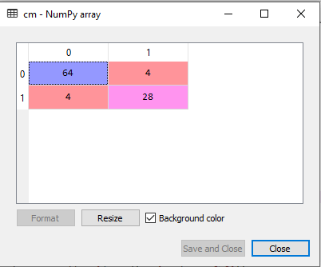
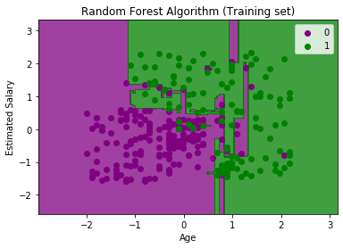
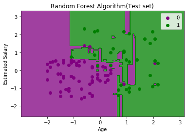

# ML - RF

[Back](../index.md)

- [ML - RF](#ml---rf)
  - [Random Forest](#random-forest)
  - [Random Forest algorithm](#random-forest-algorithm)
    - [Steps](#steps)
    - [Assumptions for Random Forest](#assumptions-for-random-forest)
  - [Hyper Parameters](#hyper-parameters)
    - [Estimators](#estimators)
    - [Number of Features](#number-of-features)
    - [Bootstrap Sampling](#bootstrap-sampling)
    - [Out of Bag Error(OOB)](#out-of-bag-erroroob)
    - [Advantages and Disadvantages](#advantages-and-disadvantages)
  - [Python Implementation](#python-implementation)
    - [Data Pre-Processing Step](#data-pre-processing-step)
    - [Fitting the Random Forest algorithm to the training set](#fitting-the-random-forest-algorithm-to-the-training-set)
    - [Predicting the Test Set result](#predicting-the-test-set-result)
    - [Creating the Confusion Matrix](#creating-the-confusion-matrix)
    - [Visualizing the training Set result](#visualizing-the-training-set-result)
    - [Visualizing the test set result](#visualizing-the-test-set-result)

---

## Random Forest

- `ensemble learning`

  - a process of **combining multiple classifiers** to solve a complex problem and to improve the performance of the model.

- `Random Forest`

  - a **supervised** learning technique.
  - used for both `Classification` and `Regression` problems in ML.
  - a type of `ensemble learning`
    - "Random Forest is a classifier that **contains a number of decision trees** on various subsets of the given dataset and **takes the average** to improve the predictive accuracy of that dataset.
    - take majority votes of predictions

- Why Forest:

  - in dt
    - the criteria might use not all features
    - always start with same root node, that will impact the tree
  - rf:
    - try to use all the features
    - select subset of features, root node not the same.

- The **greater** number of trees in the forest leads to **higher accuracy** and prevents the problem of **overfitting**.

---

## Random Forest algorithm


---

### Steps

- Random Forest works in **two-phase**:

  - first is to create the random forest by combining N decision tree,
  - second is to make predictions for each tree created in the first phase.

- The Working process can be explained in the below steps and diagram:
  - Step-1: **Select** random `K` **data points** from the training set.
  - Step-2: **Build the decision trees** associated with the selected data points (**Subsets**).
  - Step-3: Choose the number `N` for decision trees that you want to build.
  - Step-4: Repeat Step 1 & 2.
  - Step-5: For **new** data points, **find the predictions** of each decision tree, and **assign** the new data points to the category that wins the majority votes.


---

### Assumptions for Random Forest

- two assumptions for a better Random forest classifier
  - There should be **some actual values** in the feature variable of the dataset so that the classifier **can predict accurate results** rather than a guessed result.
  - The **predictions** from each tree must have very **low correlations**.

---

## Hyper Parameters

- Number of Estimators (Trees)

- Number of Features (to include in subset)

- BootStrap Sampling
- Out of Bag Error

---

### Estimators

- **more** the number of estimators, more is the **chance of contribution** of every sample of features.

- overfiting: RF do **not** or less **overfit**

  - It is save to include **as many** as we can.
  - will **not** increase the **complexity** of the algorithm.

- should be between 60 to 150

  - can be found using a **plot** between error and number of estimators.

- Increasing number of estimators will

  - **not** increase the **information**.
  - **duplicating** the results, which **cannot avoid**.

- 总结:
  - 最优: 画图
  - overfit: 勿担心
  - 增加, 提高精度,但同时不可避免地重复.

---

### Number of Features

- Number of features to include in a subset.
- number =

  - `log2(n+1)`
  - squre root of n
  - `n/3`, suggest

- Methods to find optimal are experimental based.
  - good to start `n^2`

---

### Bootstrap Sampling

- `Bootstrap`:
  - Sampling with Replacement
  - random sampling that **allows the sampling units** to occur **more than once**.
- We extract more samples **along the rows** of data.
- We get different subset of features along the columns and rows.
  - avoid correlation between the trees and repetition.
  - 允许对原始数据进行多次抽样.

---

### Out of Bag Error(OOB)

- `Out of Bag samples`

  - the samples in leftover rows when boostraping
  - few rows of features repeated in the subset, **left** some rows of data **unused**.

- We use the OOB samples to test the RF model while being trained.

- `Out of bag error`

  - `= y - y_pred `
  - the number of misclassification by rf on the OOB samples.
  - used to check whether a model is overfiting or underfitting.
    - Overfitting/not generalizing when `OOB error` > `test error`
    - Underfitting/not learning patterns when `OOB error` < `test error`

- `Out of bag score` = `1-OOB error`
  - 越接近 OOB number, OOB error 越小, 证明当前 tree 有越好的准确性.

---

### Advantages and Disadvantages

- **Advantages**

  - Random Forest is capable of performing **both** Classification and Regression tasks.
  - It takes **less training time** as compared to other algorithms.
  - It is capable of handling **large datasets** with **high dimensionality**.
  - It **enhances the accuracy** of the model and **prevents the overfitting** issue.
    - It predicts output with **high** accuracy, even for the **large** dataset it runs **efficiently**.
    - It can also maintain **accuracy** when a large proportion of data is **missing**.

- **Disadvantages**
  - Although random forest can be used for both classification and regression tasks, it is **not** more suitable for **Regression** tasks.

---

## Python Implementation

### Data Pre-Processing Step

```py
# importing libraries
import numpy as nm
import matplotlib.pyplot as mtp
import pandas as pd

#importing datasets
data_set= pd.read_csv('user_data.csv')

#Extracting Independent and dependent Variable
x= data_set.iloc[:, [2,3]].values
y= data_set.iloc[:, 4].values

# Splitting the dataset into training and test set.
from sklearn.model_selection import train_test_split
x_train, x_test, y_train, y_test= train_test_split(x, y, test_size= 0.25, random_state=0)

#feature Scaling
from sklearn.preprocessing import StandardScaler
st_x= StandardScaler()
x_train= st_x.fit_transform(x_train)
x_test= st_x.transform(x_test)
```

---

### Fitting the Random Forest algorithm to the training set

```py
#Fitting Decision Tree classifier to the training set
from sklearn.ensemble import RandomForestClassifier
classifier= RandomForestClassifier(
    n_estimators= 10,
    criterion="entropy"
)
classifier.fit(x_train, y_train)
```

- `n_estimators`:
  - The required **number of trees** in the Random Forest.
  - The default value is 10.
  - We can choose any number but need to take care of the overfitting issue.
- `criterion`:
  - It is a function to analyze the accuracy of the split.
  - Here we have taken "entropy" for the information gain.

---

### Predicting the Test Set result

```py
#Predicting the test set result
y_pred= classifier.predict(x_test)
```

---

### Creating the Confusion Matrix

```py
#Creating the Confusion matrix
from sklearn.metrics import confusion_matrix
cm= confusion_matrix(y_test, y_pred)
```



---

### Visualizing the training Set result

```py
from matplotlib.colors import ListedColormap
x_set, y_set = x_train, y_train
x1, x2 = nm.meshgrid(nm.arange(start = x_set[:, 0].min() - 1, stop = x_set[:, 0].max() + 1, step  =0.01),
nm.arange(start = x_set[:, 1].min() - 1, stop = x_set[:, 1].max() + 1, step = 0.01))
mtp.contourf(x1, x2, classifier.predict(nm.array([x1.ravel(), x2.ravel()]).T).reshape(x1.shape),
alpha = 0.75, cmap = ListedColormap(('purple','green' )))
mtp.xlim(x1.min(), x1.max())
mtp.ylim(x2.min(), x2.max())
for i, j in enumerate(nm.unique(y_set)):
    mtp.scatter(x_set[y_set == j, 0], x_set[y_set == j, 1],
        c = ListedColormap(('purple', 'green'))(i), label = j)
mtp.title('Random Forest Algorithm (Training set)')
mtp.xlabel('Age')
mtp.ylabel('Estimated Salary')
mtp.legend()
mtp.show()
```



---

### Visualizing the test set result

```py
#Visulaizing the test set result
from matplotlib.colors import ListedColormap
x_set, y_set = x_test, y_test
x1, x2 = nm.meshgrid(nm.arange(start = x_set[:, 0].min() - 1, stop = x_set[:, 0].max() + 1, step  =0.01),
nm.arange(start = x_set[:, 1].min() - 1, stop = x_set[:, 1].max() + 1, step = 0.01))
mtp.contourf(x1, x2, classifier.predict(nm.array([x1.ravel(), x2.ravel()]).T).reshape(x1.shape),
alpha = 0.75, cmap = ListedColormap(('purple','green' )))
mtp.xlim(x1.min(), x1.max())
mtp.ylim(x2.min(), x2.max())
for i, j in enumerate(nm.unique(y_set)):
    mtp.scatter(x_set[y_set == j, 0], x_set[y_set == j, 1],
        c = ListedColormap(('purple', 'green'))(i), label = j)
mtp.title('Random Forest Algorithm(Test set)')
mtp.xlabel('Age')
mtp.ylabel('Estimated Salary')
mtp.legend()
mtp.show()
```



---

[TOP](#ml---rf)
