# Unsupervised - Hierarchical Clustering Algorithm

[Back](../index.md)

- [Unsupervised - Hierarchical Clustering Algorithm](#unsupervised---hierarchical-clustering-algorithm)
  - [Hierarchical cluster analysis](#hierarchical-cluster-analysis)
  - [Agglomerative Hierarchical clustering algorithm](#agglomerative-hierarchical-clustering-algorithm)
    - [Steps](#steps)
    - [Linkage: Measure for the distance between two clusters](#linkage-measure-for-the-distance-between-two-clusters)
  - [Dendrogram](#dendrogram)
    - [Python Implementation](#python-implementation)
  - [Evaluation: Silhouette Score](#evaluation-silhouette-score)

---

## Hierarchical cluster analysis

- `hierarchical cluster analysis` / `HCA`

  - an **unsupervised machine learning algorithm**, which is used to group the unlabeled datasets into a cluster
  - develop the hierarchy of clusters **in the form of a tree**.
  - no requirement to predetermine the number of clusters

- `dendrogram`:

  - the tree-shaped structure in HCA.

- The hierarchical clustering technique has two **approaches**:
  - `Agglomerative`:
    - a **bottom-up** approach, in which the algorithm starts with taking all data points as single clusters and **merging them until one cluster** is left.
  - `Divisive`:
    - the reverse of the agglomerative algorithm as it is a **top-down** approach.

---

## Agglomerative Hierarchical clustering algorithm

- This algorithm considers each dataset as a single cluster at the beginning, and then **start combining the closest** pair of clusters together.
- It does this until all the clusters are **merged into a single cluster** that contains all the datasets.

- This hierarchy of clusters is represented in the form of the `dendrogram`.

---

### Steps

- **Step-1**:

  - Create each data point as a single cluster. Let's say there are N data points, so the number of clusters will also be N.

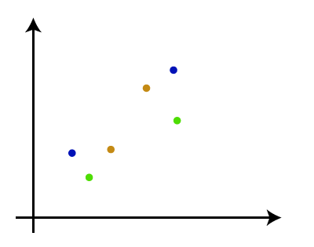

- **Step-2**:

  - Take two closest data points or clusters and merge them to form one cluster. So, there will now be N-1 clusters.

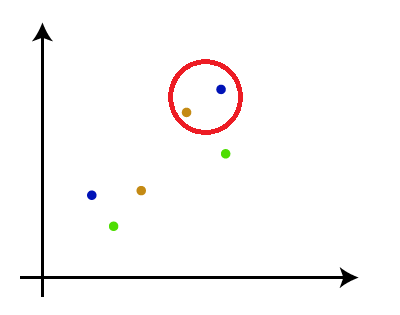

- **Step-3**:

  - Again, take the two closest clusters and merge them together to form one cluster. There will be N-2 clusters.

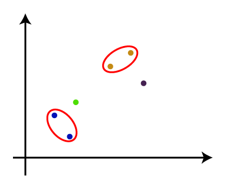

- **Step-4**:

  - Repeat Step 3 until only one cluster left. So, we will get the following clusters. Consider the below images:

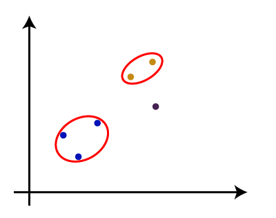

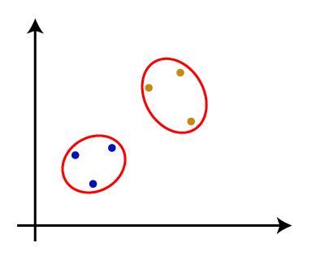

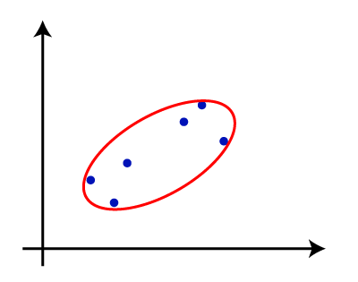

- **Step-5**:
  - Once all the clusters are combined into one big cluster, develop the dendrogram to divide the clusters as per the problem.

---

### Linkage: Measure for the distance between two clusters

- `Linkage` methods.

  - ways to measure the **closest distance** between the two clusters is crucial for the hierarchical clustering.

- `Single Linkage`:
  - the **Shortest** Distance between the closest points of the clusters.

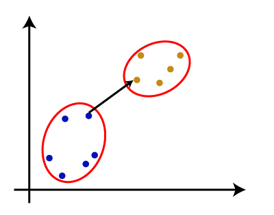

- `Complete Linkage`:
  - the farthest distance between the two points of two different clusters.
  - one of the popular linkage methods as it forms **tighter** clusters than single-linkage.

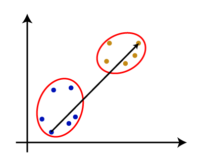

- `Average Linkage`:

  - the linkage method in which the distance between each pair of datasets is added up and then divided by the total number of datasets to **calculate the average distance** between two clusters.
  - also one of the most popular linkage methods.

- `Centroid Linkage`:
  - the linkage method in which the **distance between the centroid of the clusters** is calculated.

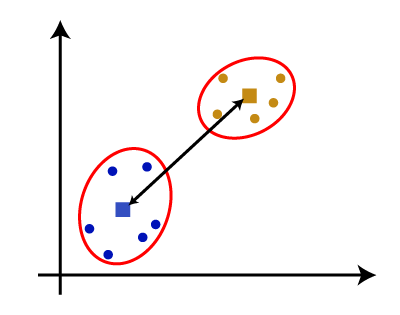

---

## Dendrogram

- The dendrogram is a **tree-like structure** that is mainly used to **store each step** as a memory that the HC algorithm performs.
  - `Y-axis` shows the **Euclidean distances between the data points**
  - `x-axis` shows **all the data points** of the given dataset

---

### Python Implementation

```py
# Importing the libraries
import numpy as nm
import matplotlib.pyplot as mtp
import pandas as pd

# Importing the dataset
dataset = pd.read_csv('Mall_Customers_data.csv')

# Extracting the matrix of features
x = dataset.iloc[:, [3, 4]].values

```

- Finding the optimal number of clusters using the Dendrogram

```py
#Finding the optimal number of clusters using the dendrogram
import scipy.cluster.hierarchy as shc
# method "ward," the popular method of linkage in hierarchical clustering.
dendro = shc.dendrogram(shc.linkage(x, method="ward"))
mtp.title("Dendrogrma Plot")
mtp.ylabel("Euclidean Distances")
mtp.xlabel("Customers")
mtp.show()
```

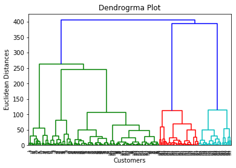

- Determine the optimal number of clusters
  - find the maximum vertical distance that does not cut any horizontal bar.

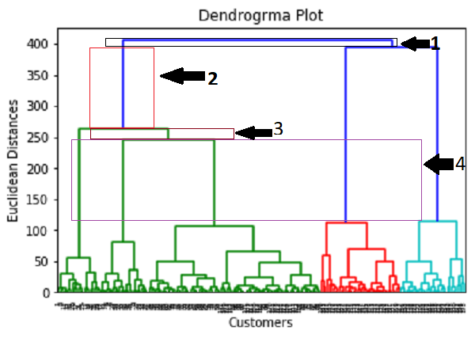

```py
#training the hierarchical model on dataset
from sklearn.cluster import AgglomerativeClustering
# a metric used to compute the linkage.
hc= AgglomerativeClustering(n_clusters=5, affinity='euclidean', linkage='ward')
y_pred= hc.fit_predict(x)


#visulaizing the clusters
mtp.scatter(x[y_pred == 0, 0], x[y_pred == 0, 1], s = 100, c = 'blue', label = 'Cluster 1')
mtp.scatter(x[y_pred == 1, 0], x[y_pred == 1, 1], s = 100, c = 'green', label = 'Cluster 2')
mtp.scatter(x[y_pred== 2, 0], x[y_pred == 2, 1], s = 100, c = 'red', label = 'Cluster 3')
mtp.scatter(x[y_pred == 3, 0], x[y_pred == 3, 1], s = 100, c = 'cyan', label = 'Cluster 4')
mtp.scatter(x[y_pred == 4, 0], x[y_pred == 4, 1], s = 100, c = 'magenta', label = 'Cluster 5')
mtp.title('Clusters of customers')
mtp.xlabel('Annual Income (k$)')
mtp.ylabel('Spending Score (1-100)')
mtp.legend()
mtp.show()
```

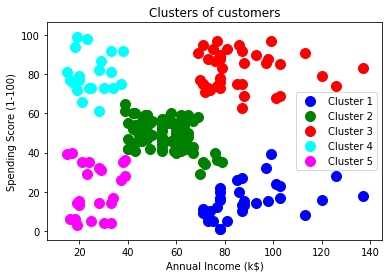

---

## Evaluation: Silhouette Score

- `Silhouette Score`:
  - ranges from `-1` to `1`
  - `1`: cluster are well apart from each other and clearly distinguished.
  - `0`: the distance between clusters is not significant.
  - `-1`: cluster are assigned in the wrong way.

```py
hc = AgglomerativeClustering(n_clusters = 5)
y_pred = hc.fit_predict(X)
print(f'Silhouette Score(n = 2) : {silhouette_score(X, y_pred)}')
```

---

[TOP](#unsupervised---hierarchical-clustering-algorithm)
