# Unsupervised - K-Means Clustering Algorithm

[Back](../index.md)

- [Unsupervised - K-Means Clustering Algorithm](#unsupervised---k-means-clustering-algorithm)
  - [K-Means Algorithm](#k-means-algorithm)
    - [Steps](#steps)
  - [Elbow Method: Optimal K](#elbow-method-optimal-k)
    - [Python Implementation](#python-implementation)
  - [CH Index: Evaluation](#ch-index-evaluation)
    - [Python Implementation](#python-implementation-1)

---

## K-Means Algorithm

- rel:

  - https://www.javatpoint.com/k-means-clustering-algorithm-in-machine-learning

- `K-Means Clustering`

  - an **unsupervised learning algorithm** that is used to solve the clustering problems in machine learning or data science.
  - groups the **unlabeled dataset** into different **clusters** on its own without the need for any training.
  - an **iterative** algorithm that divides the unlabeled dataset into k different clusters in such a way that each dataset **belongs only one group that has similar properties**,
    - repeats the process until it does not find the best clusters.
  - a **centroid-based** algorithm, where each cluster is **associated with a centroid**. The main aim of this algorithm is to **minimize the sum of distances** between the _data point_ and _their corresponding clusters_.


- `K`

  - defines the **number of pre-defined clusters** that need to be created in the process.
  - The value of k should be **predetermined** in this algorithm.

- The k-means clustering algorithm mainly performs **two tasks**:
  - Determines the **best value** for K center points or **centroids** by an iterative process.
  - **Assigns** each data point **to its closest k-center**.
    - Those data points which are **near** to the particular k-center, create a **cluster**.

---

### Steps

- **Step-1**:

  - **Select the number K** to decide the number of clusters.

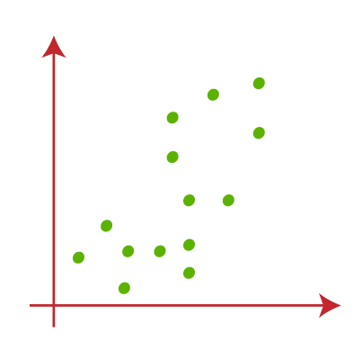

- **Step-2**:

  - Select **random** K points or **centroids**. (It can be other from the input dataset).

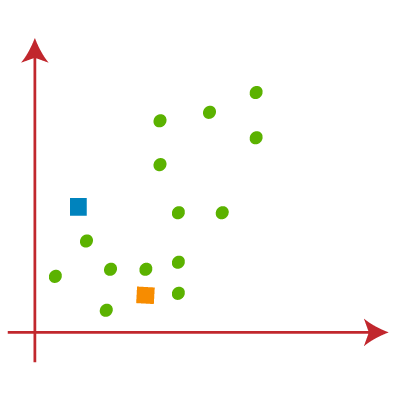

- **Step-3**:

  - **Assign** each data point to their closest centroid, which will form the predefined K clusters.

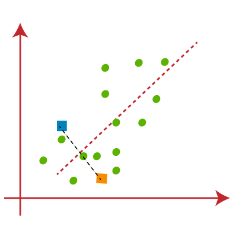

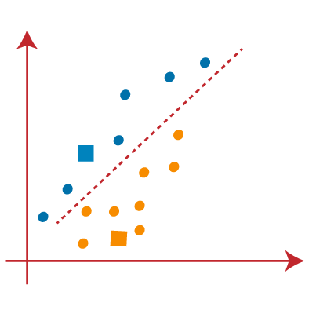

- **Step-4**:

  - Calculate the variance and place a **new centroid** of each cluster.

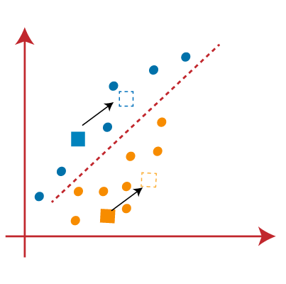

- **Step-5**:

  - **Repeat** the third steps, which means reassign each datapoint to the new closest centroid of each cluster.

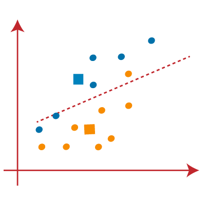

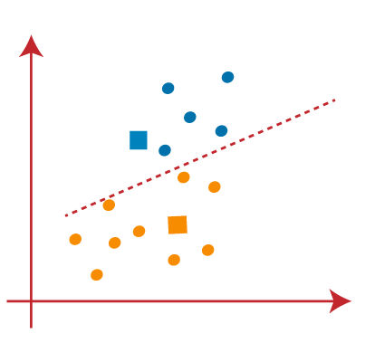

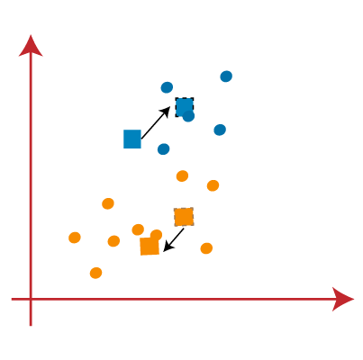

- **Step-6**:

  - If any **reassignment occurs**, then go to step-4 else go to FINISH.

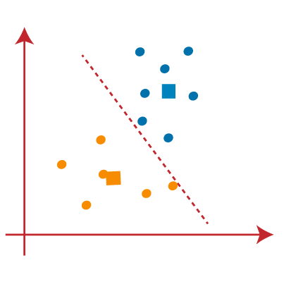

- **Step-7**:
  - The model is ready.

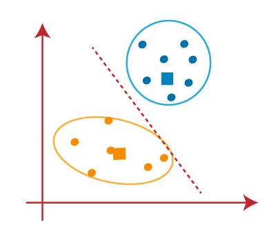

---

## Elbow Method: Optimal K

- The **performance** of the K-means clustering algorithm **depends** upon highly **efficient clusters** that it forms.

- The `Elbow method`

  - a way to find the optimal number of clusters.
  - uses the concept of `WCSS` value

- `WCSS`:

  - `Within Cluster Sum of Squares`
  - defines the total variations within a cluster.
  - the sum of the square of the distances between each data point and its centroid within a cluster1 and the same for the other two terms.

- Steps:

  - It executes the K-means clustering on a given dataset **for different K values** (ranges from 1-10).
  - For each value of K, **calculates** the `WCSS` value.
  - **Plots a curve** between calculated WCSS values and the number of clusters K.
  - The **sharp point of bend** or a point of the plot looks like an arm, then that point is considered as the best value of K.

- 性质:
  - WCSS descreases with the increase of clusters.
  - When clusters' number == points' number, WCSS = 0.

---

### Python Implementation

```py
# importing libraries
import numpy as nm
import matplotlib.pyplot as mtp
import pandas as pd

# Importing the dataset
dataset = pd.read_csv('Mall_Customers_data.csv')

# Extracting Independent Variables
x = dataset.iloc[:, [3, 4]].values

#finding optimal number of clusters using the elbow method
from sklearn.cluster import KMeans
wcss_list= []  #Initializing the list for the values of WCSS

#Using for loop for iterations from 1 to 10.
for i in range(1, 11):
    kmeans = KMeans(n_clusters=i, in_init="auto", random_state= 42)
    kmeans.fit(x)
    wcss_list.append(kmeans.inertia_)
mtp.plot(range(1, 11), wcss_list)
mtp.title('The Elobw Method Graph')
mtp.xlabel('Number of clusters(k)')
mtp.ylabel('wcss_list')
mtp.show()

```

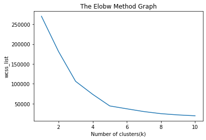

```py
#training the K-means model on a dataset
kmeans = KMeans(n_clusters=5, init='k-means++', random_state= 42)
y_predict= kmeans.fit_predict(x)

#visulaizing the clusters
mtp.scatter(x[y_predict == 0, 0], x[y_predict == 0, 1], s = 100, c = 'blue', label = 'Cluster 1') #for first cluster
mtp.scatter(x[y_predict == 1, 0], x[y_predict == 1, 1], s = 100, c = 'green', label = 'Cluster 2') #for second cluster
mtp.scatter(x[y_predict== 2, 0], x[y_predict == 2, 1], s = 100, c = 'red', label = 'Cluster 3') #for third cluster
mtp.scatter(x[y_predict == 3, 0], x[y_predict == 3, 1], s = 100, c = 'cyan', label = 'Cluster 4') #for fourth cluster
mtp.scatter(x[y_predict == 4, 0], x[y_predict == 4, 1], s = 100, c = 'magenta', label = 'Cluster 5') #for fifth cluster
mtp.scatter(kmeans.cluster_centers_[:, 0], kmeans.cluster_centers_[:, 1], s = 300, c = 'yellow', label = 'Centroid')
mtp.title('Clusters of customers')
mtp.xlabel('Annual Income (k$)')
mtp.ylabel('Spending Score (1-100)')
mtp.legend()
mtp.show()
```

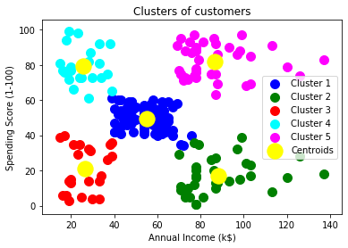

---

## CH Index: Evaluation

- `Calinski-Harabasz Index` / `Variance Ratio Criterion`

  - the ratio of between cluster scatter or dispersion and within-cluster scatter or dispersion.

- The higher the CH-Index, the better is the performance.

### Python Implementation

```py
import sklearn

kmean = KMeans(
            n_clusters=k,   # number of cluster
            n_init='auto',  # time of centroids removal
            random_state=42
        )

# Compute cluster centers and predict cluster index for each sample.
y_pred = kmean.fit_predict(data)

# (k, sklearn.metrics.calinski_harabasz_score(sample_data, y_pred))
sklearn.metrics.calinski_harabasz_score(sample_data, y_pred)

```

---

[TOP](#unsupervised---k-means-clustering-algorithm)
