# Project Mangement - Project Scope Management

[Back](./index.md)

- [Project Mangement - Project Scope Management](#project-mangement---project-scope-management)
  - [Project Scope Management](#project-scope-management)
  - [Scope Planning: `scope management plan`](#scope-planning-scope-management-plan)
    - [Collecting Requirements](#collecting-requirements)
  - [Scope Definition: `Project Scope Statement`](#scope-definition-project-scope-statement)
  - [Creating the Work Breakdown Structure (WBS): `WBS`](#creating-the-work-breakdown-structure-wbs-wbs)
    - [Approaches to Developing WBSs](#approaches-to-developing-wbss)
    - [The WBS Dictionary and Scope Baseline](#the-wbs-dictionary-and-scope-baseline)
  - [Scope Verification: `formal acceptance`](#scope-verification-formal-acceptance)
  - [Scope Control: Change](#scope-control-change)
    - [Suggestions for Improving User Input](#suggestions-for-improving-user-input)
    - [Suggestions for **Reducing Incomplete and Changing Requirements**](#suggestions-for-reducing-incomplete-and-changing-requirements)
  - [Using **Software** to Assist in Project Scope Management](#using-software-to-assist-in-project-scope-management)
  - [Considerations for Agile/Adaptive Environments](#considerations-for-agileadaptive-environments)

---

## Project Scope Management

- `Scope`

  - all **the work** involved in creating the products of the project and **the processes** used to create them

- `deliverable`

  - a product produced **as part of a project**, such as hardware or software, planning documents, or meeting minutes.

- `Project scope management`

  - includes the processes involved in **defining and controlling** what is or is not included in a project
  - includes the processes required to ensure that the project addresses all the work required, and only the work required, to complete the project successfully

  - Ensures that the project team and stakeholders have the same understanding of what products the project will produce and what processes the project team will use to produce them

- Planning

  - `Scope planning`:

    - deciding how the scope will be defined, verified, and controlled

  - `Scope definition`:

    - reviewing the **project charter** and **preliminary scope statement** and adding more information as requirements are developed and change requests are approved

  - `Creating the WBS`:

    - **subdividing** the major project deliverables **into smaller**, more manageable components

- Monitoring and Controlling

  - `Scope verification`:

    - **formalizing acceptance** of the project scope

  - `Scope control`:
    - controlling **changes** to project scope

- Main processes include:

  - Scope planning
  - Scope definition
  - Creating the WBS
  - Scope verification
  - Scope control

- Main processes
  - **Planning scope management**:
    - determining how the project’s scope and requirements will be managed
  - **Collecting requirements**:
    - defining and documenting the **features and functions** of the products produced during the project as well as **the processes** used for creating them
  - **Defining scope**:
    - reviewing the project charter, requirements documents, and organizational process assets to create a scope statement
  - **Creating the WBS**:
    - subdividing the major project deliverables into smaller, more manageable components
  - **Validating scope**:
    - formalizing acceptance of the project deliverables
  - **Controlling scope**:
    - controlling changes to project scope throughout the life of the project

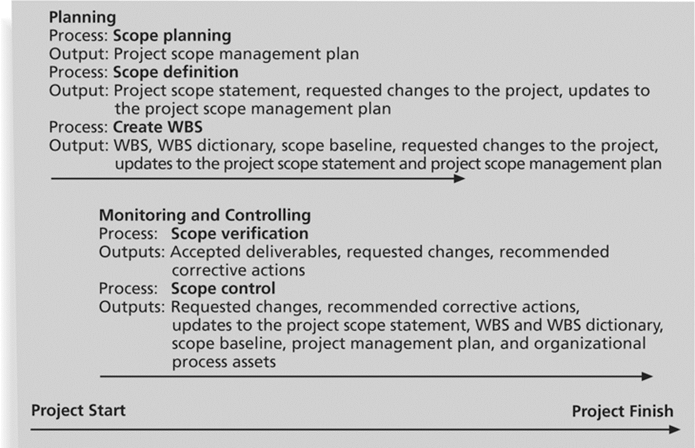

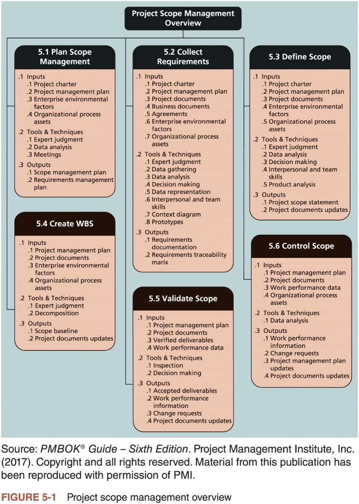

---

## Scope Planning: `scope management plan`

- `scope management plan`

  - a document that includes descriptions of how the team will prepare `the project scope statement`, create the `WBS`, verify completion of the project **deliverables**, and control requests for changes to the project scope

- Key inputs include the `project charter`, preliminary `scope statement`, and `project management plan`.

- Good example:

  - Many financial service companies use **customer relationship management (CRM) systems** to improve their understanding of and responsiveness to customers
  - A senior management team at the Canadian money management company **Dynamic Mutual Funds (DMF)** launched an enterprise-wide, national program to build and manage its customer relationships
    - They needed a faster and more organized, highly participative approach, so they proposed a new seven-step concept called project scope design
    - DMF won an eCustomer World Golden Award for world-class innovation

---

- The project team uses expert judgment, data analysis, and meetings to develop two important outputs:

  - **Scope management plan** (subsidiary part of the project management plan)
  - **Requirements management plan**

- **Scope management plan** contents:

  - Prepare a detailed project scope statement
  - Create a WBS
  - Maintain and approve the WBS
  - Obtain formal acceptance of the completed project deliverables
  - Control requests for changes to the project scope

- **Requirements Management Plan**:

  - The PMBOK® Guide, Sixth Edition, describes a requirement as ““a condition or capability that is necessary to be present in a product, service, or result to satisfy a business need”

- The **requirements management plan** documents how project requirements will be analyzed, documented, and managed
  - How to plan, track, and report requirements activities
  - How to perform configuration management activities
  - How to prioritize requirements
  - How to use product metrics
  - How to trace and capture attributes of requirements

---

- **Sample: scope management plan**

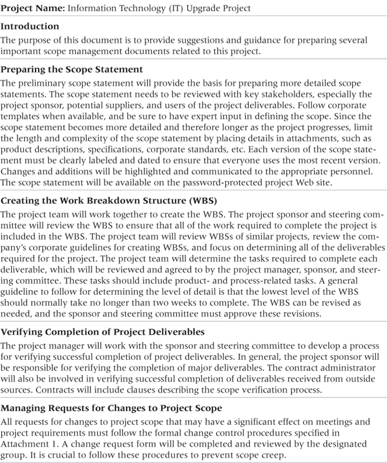

---

- **Sample: Project Charter**

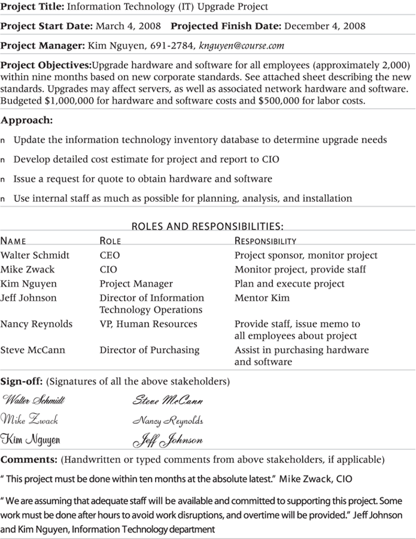

---

### Collecting Requirements

- Several ways to collect requirements:

  - Interviewing stakeholders
  - Holding focus groups and facilitated workshops
  - Using group creativity and decision-making techniques
  - Utilizing questionnaires and surveys
  - Conducting observation studies
  - Generating ideas by comparing specific project practices or product characteristics (i.e., benchmarking)

- **Requirements traceability matrix (RTM)**:
  - a table that lists requirements, various attributes of each requirement, and the status of the requirements to ensure that all requirements are addressed

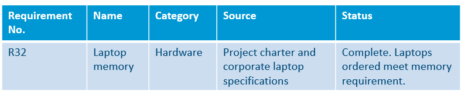

---

## Scope Definition: `Project Scope Statement`

- The preliminary scope statement, project charter, organizational process assets, and approved change requests provide a basis for creating the project scope statement
- As time progresses, the scope of a project should become more clear and specific

---

- Further Defining Project Scope

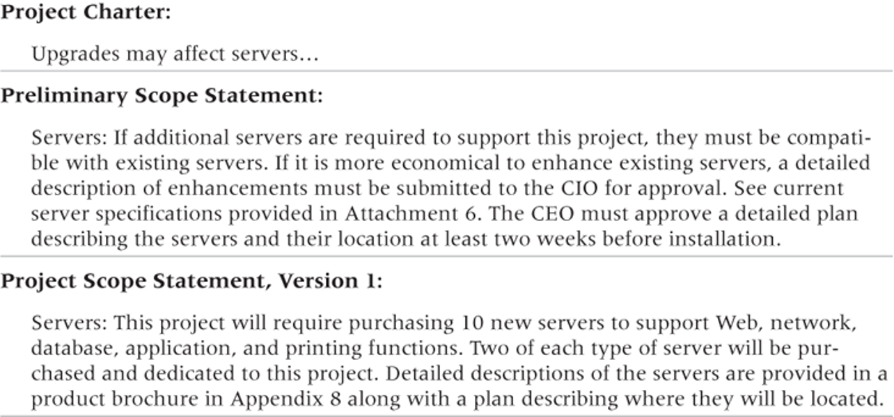

---

- Media Snapshot

  - Many people enjoy watching television shows like Changing Rooms or Trading Spaces, where participants have two days and $1,000 to update a room in their neighbor’s house. Since the time and cost are set, it’s the scope that has the most flexibility. Designers on these shows often have to change initial scope goals due to budget or time constraints.
  - Although most homeowners are very happy with work done on the show, some are obviously disappointed. Unlike most projects where the project team works closely with the customer, homeowners have little say in what gets done and cannot inspect the work along the way… What happens when the homeowners don’t like the work that’s been done? The FAQ section of tlc.com says, “Everyone on our show is told upfront that there’s a chance they won’t like the final design of the room. Each applicant signs a release acknowledging that the show is not responsible for redecorating a room that isn’t to the owner’s taste.”
  - Too bad you can’t get sponsors for most projects to sign a similar release form. It would make project scope management much easier!

---

## Creating the Work Breakdown Structure (WBS): `WBS`

- `WBS`

  - a deliverable-oriented **grouping of the work** involved in a project that defines the total scope of the project
  - a foundation document that **provides the basis** for planning and managing project schedules, costs, resources, and changes

- `Decomposition`

  - the main tool or technique for creating a WBS
  - **subdividing** project deliverables **into smaller pieces**
  - `work package` is **a task at the lowest level** of the WBS

- Outputs of creating the WBS are
  - the **scope baseline**
    - Scope baseline includes the approved project scope statement and its associated WBS and WBS dictionary
  - **project documents updates**

---

- Sample Intranet WBS Organized by Product

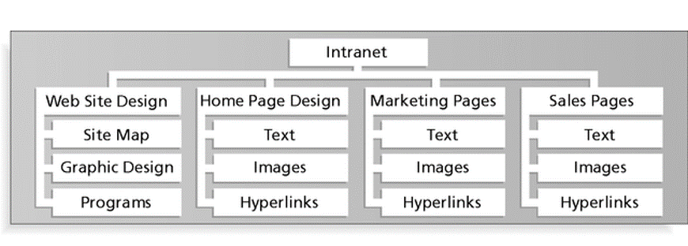

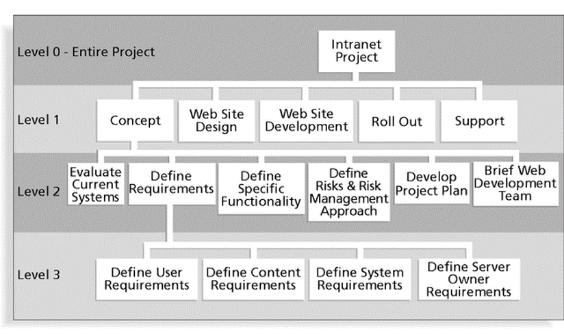

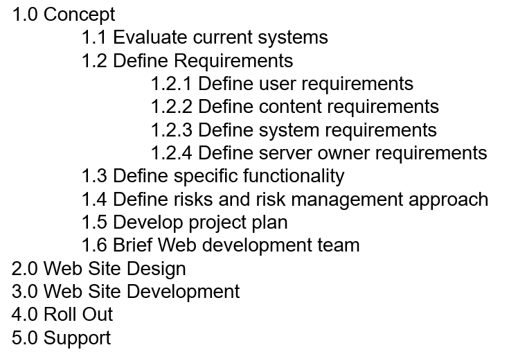

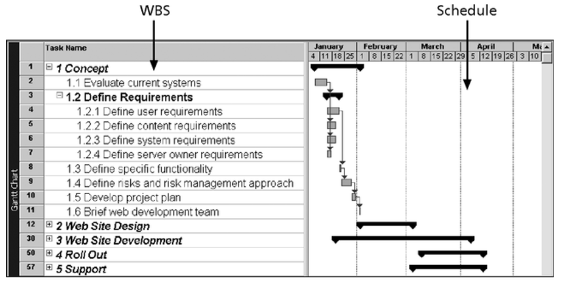

---

### Approaches to Developing WBSs

- `Using guidelines`:
  - some organizations, like the DOD, provide **guidelines** for preparing WBSs
- `The analogy approach`:

  - review WBSs of **similar projects** and tailor to your project

- `The top-down approach`:

  - start with the **largest items** of the project and break them down

- `The bottom-up approach`:

  - start with the **specific tasks** and roll them up

- `Mind-mapping approach`:
  - **mind mapping** is a technique that uses branches radiating out from a core idea to structure thoughts and ideas

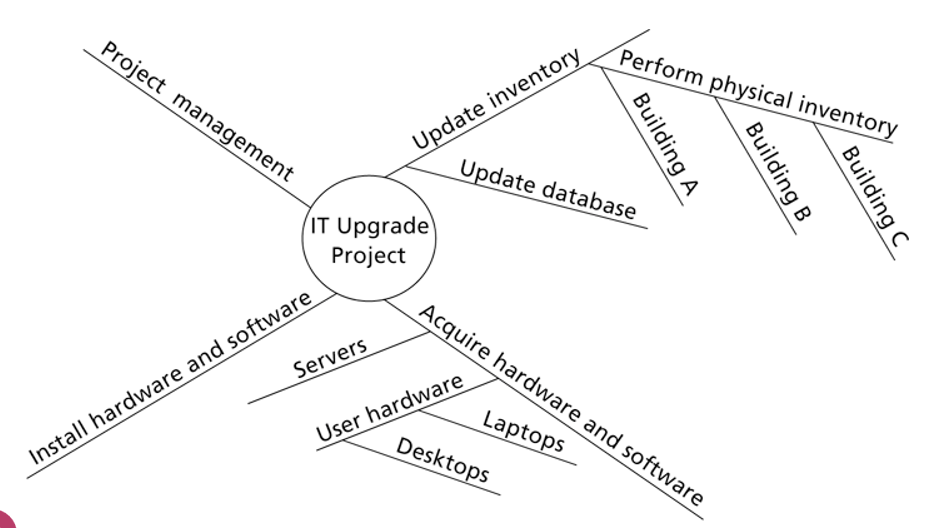

---

### The WBS Dictionary and Scope Baseline

- Many WBS tasks are vague and must be explained more so people know what to do and can estimate how long it will take and what it will cost to do the work

- `WBS dictionary`

  - a document that **describes detailed information** about each WBS **item**
  - Format of the WBS dictionary can vary based on project needs

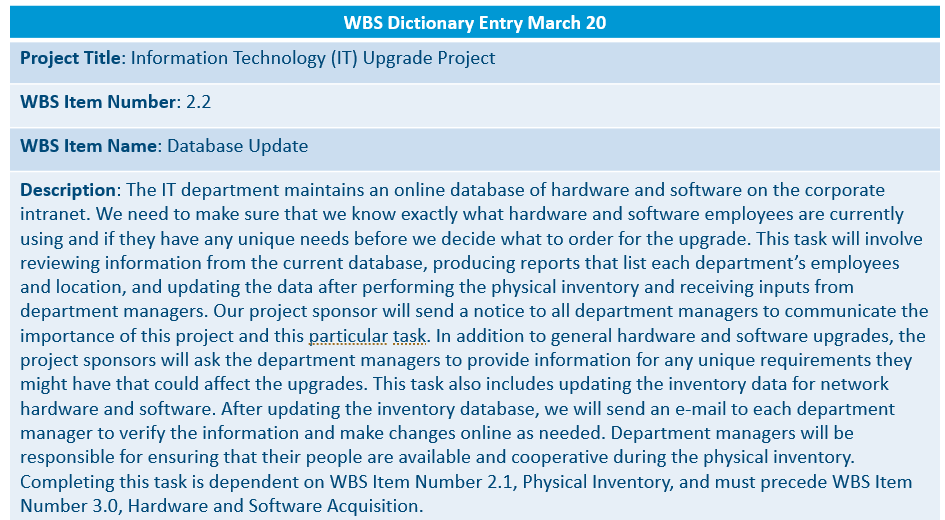

- `scope baseline`

  - used to **measure performance** in meeting project scope goals
  - formed by the approved **project scope statement** and its **WBS** and **WBS dictionary**

---

- Advice:

  - A unit of work should appear at **only one place** in the WBS
  - The work **content** of a WBS item is the **sum** of the WBS items below it
  - A WBS item is the **responsibility of only one individual**, even though many people may be working on it
  - The WBS must be consistent with the way in which work is actually going to be performed; it should serve the project team first, and other purposes only if practical

  - Project team** members should be involved** in developing the WBS to ensure consistency and buy-in
  - Each WBS **item must be documented** in a WBS dictionary to ensure accurate understanding of the scope of work included and not included in that item
  - The WBS must be a **flexible** tool to accommodate inevitable **changes** while properly maintaining control of the work content in the project according to the scope statement

- Bad example:
  - A project scope that is **too broad** and grandiose can cause severe problems
  - **Scope creep** and an **overemphasis on technology** for technology’s sake resulted in the bankruptcy of a large pharmaceutical firm, Texas-based FoxMeyer Drug
  - In 2001, McDonald’s fast-food chain initiated a project to create an intranet that would connect its headquarters with all of its restaurants to provide detailed operational information in real time; after spending $170 million on consultants and initial implementation planning, McDonald’s realized that the project was too much to handle and terminated it

---

## Scope Verification: `formal acceptance`

- It is very difficult to create a good scope statement and WBS for a project
- It is even more difficult to verify project scope and minimize scope changes
- `Scope verification`
  - involves **formal acceptance** of the completed project scope **by the stakeholders**
- Acceptance is often achieved by a **customer inspection** and then sign-off on key deliverables

---

## Scope Control: Change

- Scope control involves **controlling changes** to the project scope

- Goals of scope control are to:

  - **Influence the factors** that cause scope changes
  - Assure changes are **processed according to procedures** developed as part of integrated change control

- Manage changes when they occur

  - **Variance** is the difference between planned and actual performance

- **Best Practices** for Avoiding Scope Problems:

  - 1. Keep the scope **realistic**:

    - Don’t make projects so large that they can’t be completed; break large projects down into a series of smaller ones

  - 2. **Involve users** in project scope management:

    - Assign key users to the project team and give them ownership of requirements definition and scope verification

  - 3. Use **off-the-shelf** hardware and software whenever possible:

    - Many IT people enjoy using the latest and greatest technology, but business needs, not technology trends, must take priority

  - 4. Follow good project management **processes**:
    - As described in this chapter and others, there are **well-defined processes** for managing project scope and others aspects of projects

---

### Suggestions for Improving User Input

- Develop a good project selection process and insist that **sponsors are from the user organization**
- Have **users** on the project team in **important roles**
- Have **regular meetings** with defined agendas, and have users sign off on key deliverables presented at meetings
- Deliver something to users and sponsors **on a regular basis**
- Don’t promise to deliver when you know you can’t
  Co-locate users with developers

---

### Suggestions for **Reducing Incomplete and Changing Requirements**

- Develop and follow a **requirements management process**
- Use techniques such as **prototyping**, **use case modeling**, and JAD to get more user involvement
- Put requirements in **writing** and keep them current
- Create a **requirements management database** for documenting and controlling requirements

- Provide adequate **testing** and conduct testing throughout the project life cycle
- **Review** changes from a systems perspective
- **Emphasize completion dates** to help focus on what’s most important
- Allocate **resources** specifically for handling change requests/enhancements like NWA did with ResNet

---

## Using **Software** to Assist in Project Scope Management

- **Word-processing software** helps create several scope-related documents
- **Spreadsheets** help to perform **financial** calculations and weighed **scoring models**, and develop **charts and graphs**
- **Communication software** like e-mail and the Web help clarify and communicate scope information
- Project management software helps in creating a **WBS**, the basis for tasks on a **Gantt chart**
- Specialized software is available to assist in project scope management

---

## Considerations for Agile/Adaptive Environments

- Stakeholders define and approve the detailed scope before the start of an iteration with an adaptive or agile product life cycle, producing a usable product at the end of each iteration

  - Detailed scope develops over time

- Agile approach provides several usable products during the project

---

[Top](#project-mangement---project-scope-management)
