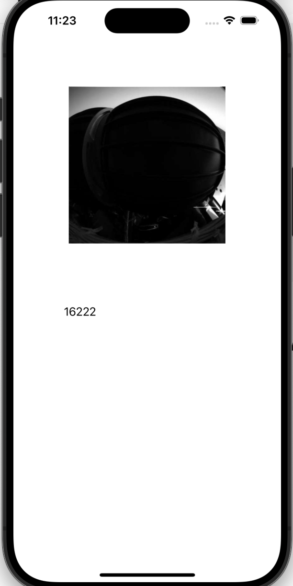

# iOS - CompletionHandler

[Back](../index.md)

- [iOS - CompletionHandler](#ios---completionhandler)
  - [Example](#example)

---

## Example

- An Example to load image and json using completionHandler+result



- Model: `AppModel`

```swift
//
//  AppModel.swift
//  networking_completionHandler
//
//  Created by Simon Fong on 09/12/2023.
//

import Foundation

class AppModel:Codable{
    var collection: collectionObj?
}

class collectionObj:Codable{
    var metadata: metadataObj?
}

class metadataObj:Codable{
    var total_hits: Int
}

```

- `APIManager`

```swift
//
//  APIManager.swift
//  networking_completionHandler
//
//  Created by Simon Fong on 09/12/2023.
//

import Foundation
import UIKit

class APIManager{

    static var shared: APIManager = APIManager()

    // fetch, convert, and pass
    func fetchJson(urlStr:String, completionHandler:@escaping(Result<AppModel,Error>)->Void){

        guard let urlObj = URL(string: urlStr) else{
            return
        }

        let task = URLSession.shared.dataTask(with: urlObj){data, response, error in

            // if error
            if let error = error {
                completionHandler(.failure(error))
            }

            // if status failure
            if let httpResponse = response as? HTTPURLResponse, !(200...299).contains(httpResponse.statusCode){
                return
            }

            // if good data
            if let googData = data{

                let jsonData = try! JSONDecoder().decode(
                    AppModel.self,
                    from: googData)
                completionHandler(.success(jsonData))
            }
        }
        task.resume()
    }


    // fetch, convert, and pass
    func fetchImage(urlStr:String, completionHandler:@escaping(Result<UIImage,Error>)->Void){

        guard let urlObj = URL(string: urlStr) else{
            return
        }


        let task = URLSession.shared.dataTask(with: urlObj){data, response, error in

            // if error
            if let error = error {
                print("err")
                completionHandler(.failure(error))
            }

            // if status failure
            if let httpResponse = response as? HTTPURLResponse, !(200...299).contains(httpResponse.statusCode){
                return
            }

            // if good data
            if let goodData = data{
                let image = UIImage(data: goodData)
                completionHandler(.success(image!))
            }
        }
        task.resume()
    }

}
```

- `ViewController`

```swift
//
//  ViewController.swift
//  networking_completionHandler
//
//  Created by Simon Fong on 09/12/2023.
//

import UIKit

class ViewController: UIViewController {

    @IBOutlet weak var imageV: UIImageView!

    @IBOutlet weak var totalLbl: UILabel!

    let url_image = "http://mars.nasa.gov/mer/gallery/all/2/f/001/2F126468064EDN0000P1001R0M1-BR.JPG"

    let url_json = "https://images-api.nasa.gov/search?q=moon&page_size=10"

    override func viewDidLoad() {
        super.viewDidLoad()

        APIManager.shared.fetchJson(
            urlStr: url_json,
            completionHandler: {result in
                switch result {

                case .failure(let error):
                    DispatchQueue.main.async {
                        self.showErrorAlert(errorStr: error.localizedDescription)
                    }
                    break
                case .success(let data):
                    print("Success")
                    DispatchQueue.main.async {
                        self.totalLbl.text = data.collection!.metadata!.total_hits.description
                    }
                    break
                }
            })

        APIManager.shared.fetchImage(urlStr: url_image){result in
            switch result {
            case .failure(let error):
                DispatchQueue.main.async {
                    self.showErrorAlert(errorStr: error.localizedDescription)
                }
                break
            case .success(let data):
                print("Success")
                DispatchQueue.main.async {
                    self.imageV.image = data
                }
                break
            }
        }
    }

    func showErrorAlert(errorStr:String){
        // create the alert
        let alert = UIAlertController(
            title: "Error",
            message: errorStr,
            preferredStyle: UIAlertController.Style.alert)

        // add an action (button)
        alert.addAction(
            UIAlertAction(
                title: "OK",
                style: UIAlertAction.Style.default,
                handler: nil)
        )
        // show the alert
        self.present(alert, animated: true, completion: nil)
    }
}
```

---

[TOP](#ios---completionhandler)
