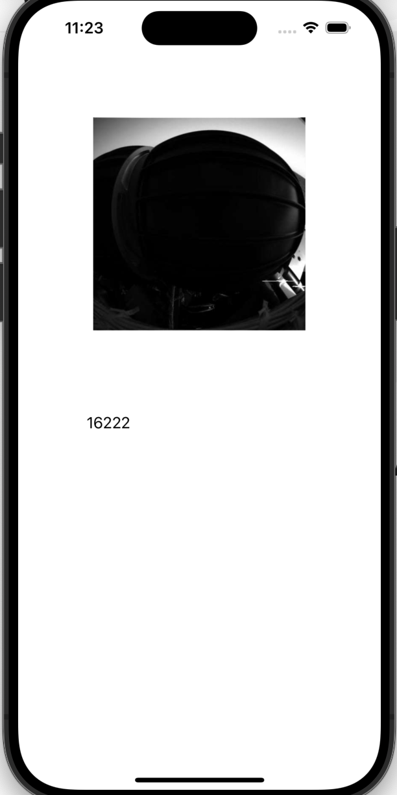

# iOS - NotificationCenter

[Back](../index.md)

- [iOS - NotificationCenter](#ios---notificationcenter)
  - [Example](#example)
    - [Model: `AppModel`](#model-appmodel)
    - [API: `APIManager`](#api-apimanager)
    - [ViewController: `ViewController`](#viewcontroller-viewcontroller)
    - [`Info`: enable http](#info-enable-http)

---

## Example

- An Example to load image and json using notification center



---

### Model: `AppModel`

```swift
//
//  AppModel.swift
//  wk12_practice02
//
//  Created by Simon Fong on 08/12/2023.
//

import Foundation
import UIKit

class AppModel{
    
    class ImageJsonModel:Codable{
        var collection: collectionObj?
    }
    
    class collectionObj:Codable{
        var metadata: metadataObj?
    }
    
    class metadataObj:Codable{
        var total_hits: Int
    }
    
    /// Function to decode Json into target type
    func decodeJson(data:Data)-> ImageJsonModel{
        return try! JSONDecoder().decode(ImageJsonModel.self, from: data)
    }
    /// Function to convert data into UIImage
    func toImage(data:Data)-> UIImage?{
        return UIImage(data:data)
    }
}

```

---

### API: `APIManager`

```swift
//
//  apimgr.swift
//  wk12_practice02
//
//  Created by Simon Fong on 08/12/2023.
//

import Foundation

class APIManager{
    
    static var shared: APIManager = APIManager()
    
    /// A function to post data to main thread
    func postNotificationCenter(notificationName:String,data:[String:Any]){
        DispatchQueue.main.async {
            NotificationCenter.default.post(
                name: Notification.Name(notificationName),
                object: nil,
                userInfo: data)
        }
    }
    
    // fetch and pass data by notificationCenter
    func fetchData(urlStr:String, notificationName:String){
        do{
            let urlObj = try URL(string: urlStr)
            
            let task = URLSession.shared.dataTask(with: urlObj!){data, response, error in
                
                // if error
                if error != nil {
                    print("error nil")
                    self.postNotificationCenter(
                        notificationName: notificationName,
                        data: ["error":"\(error!.localizedDescription)" as Any] )
                }
                
                // if status failure
                if let httpResponse = response as? HTTPURLResponse, !(200...299).contains(httpResponse.statusCode){
                    self.postNotificationCenter(
                        notificationName: notificationName,
                        data: ["error":"response code \(httpResponse.statusCode)" as Any] )
                }
                
                // if good data
                if let googData = data{
                    // when data is good, then post a notification to main thread.
                    self.postNotificationCenter(
                        notificationName: notificationName,
                        data: ["success":googData as Any] )
                }
            }
            task.resume()
        }
    }
}

```

---

### ViewController: `ViewController`

```swift
//
//  ViewController.swift
//  wk12_practice02
//
//  Created by Simon Fong on 08/12/2023.
//

import UIKit

class ViewController: UIViewController {
    
    let appModel = (UIApplication.shared.delegate as! AppDelegate).appModel
    
    @IBOutlet weak var imgV: UIImageView!
    
    @IBOutlet weak var totalLbl: UILabel!
    
    let NOTI_NAME_JSON = "NOTI_NAME_JSON"
    let NOTI_NAME_IMG = "NOTI_NAME_IMG"
    let url_image = "http://mars.nasa.gov/mer/gallery/all/2/f/001/2F126468064EDN0000P1001R0M1-BR.JPG"
    
    let url_json = "https://images-api.nasa.gov/search?q=moon"
    
    override func viewDidLoad() {
        super.viewDidLoad()
        
        // register an observer to call getJson function
        NotificationCenter.default.addObserver(
            self, // the current vc as observer
            selector: #selector(getJson), // the function to execute after a post
            name: Notification.Name(NOTI_NAME_JSON),// the name of notification
            object: nil)
        
        // register an observer to call getJson function
        NotificationCenter.default.addObserver(
            self, // the current vc as observer
            selector: #selector(loadImg), // the function to execute after a post
            name: Notification.Name(NOTI_NAME_IMG),// the name of notification
            object: nil)
        
        APIManager.shared.fetchData(
            urlStr: url_image, notificationName: NOTI_NAME_IMG)
        
        APIManager.shared.fetchData(
            urlStr: url_json, notificationName: NOTI_NAME_JSON)
    }
    
    @objc
    func loadImg (notification: Notification){
        
        if let errMsg = notification.userInfo?["error"]{
            print("error")
            showErrorAlert(errorStr: (errMsg as! String))
        }
        
        if let data = notification.userInfo?["success"]{
            print("success")
            imgV.image = UIImage(data: data as! Data)
        }
    }
    
    @objc
    func getJson(notification: Notification){
        if let errMsg = notification.userInfo?["error"]{
            print("error")
            showErrorAlert(errorStr: (errMsg as! String))
        }
        
        if let data = notification.userInfo?["success"]{
            print("success")
            let jsonData = appModel.decodeJson(data: data as! Data)
            totalLbl.text = String(jsonData.collection!.metadata!.total_hits)
        }
    }
    
    func showErrorAlert(errorStr:String){
        // create the alert
        let alert = UIAlertController(
            title: "Error",
            message: errorStr,
            preferredStyle: UIAlertController.Style.alert)
        
        // add an action (button)
        alert.addAction(
            UIAlertAction(
                title: "OK",
                style: UIAlertAction.Style.default,
                handler: nil)
        )
        // show the alert
        self.present(alert, animated: true, completion: nil)
    }
}
```

---

### `Info`: enable http

```xml
	<!-- </dict> -->
    <key>NSAppTransportSecurity</key>
    <dict>
        <key>NSAllowsArbitraryLoads</key>
        <true/>
    </dict>
<!-- </dict> -->
<!-- </plist> -->
```


---

[TOP](#ios---notificationcenter)