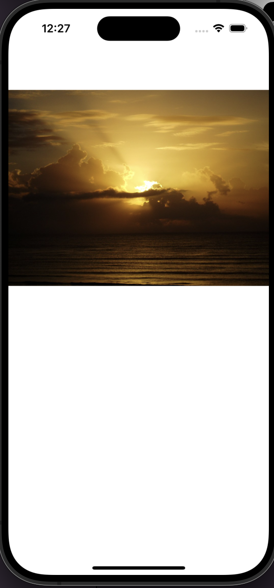

# iOS - Image

[Back](../index.md)

- [iOS - Image](#ios---image)
  - [Example](#example)

---

## Example



- `ViewControl`

```swift
//
//  ViewController.swift
//  image_example
//
//  Created by Simon Fong on 10/12/2023.
//

import UIKit

class ViewController: UIViewController {
    
    @IBOutlet weak var imageView: UIImageView!
    
    let url_img = "https://upload.wikimedia.org/wikipedia/commons/c/c8/Sunrise.PNG"
    
    override func viewDidLoad() {
        super.viewDidLoad()
        // Do any additional setup after loading the view.
        loadImageData(
            urlStr: url_img,
            imageView: self.imageView)
        
    }
    
    func loadImageData(urlStr:String, imageView: UIImageView){
        let q = DispatchQueue.init(label: "myQu")
        q.async {
            // downloading the image content in background thread
            do {
                let imageData = try Data(contentsOf: URL(string: urlStr)!)
                DispatchQueue.main.async {
                    imageView.image = UIImage(data: imageData)
                }
            }catch {
                print(error)
            }
        }
    }
}

```


---

[TOP](#ios---image)