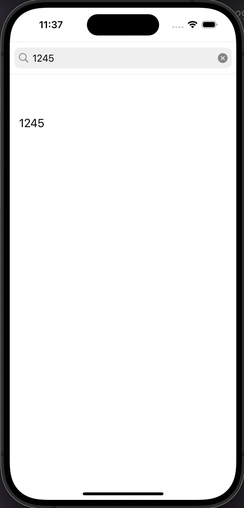

# UI - UISearchBar

[Back](../index.md)

- [UI - UISearchBar](#ui---uisearchbar)
  - [UISearchBar](#uisearchbar)
  - [Example](#example)
    - [`ViewController`](#viewcontroller)

---

## UISearchBar

- `UISearchBar`
  - A specialized view for receiving search-related information from the user.

---

## Example

- An example to limit input as number and output in a label.



---

### `ViewController`

```swift
//
//  ViewController.swift
//  SearchBar_example01
//
//  Created by Simon Fong on 10/12/2023.
//

import UIKit

class ViewController: UIViewController, UISearchBarDelegate {

    @IBOutlet weak var searchBar: UISearchBar!

    @IBOutlet weak var label: UILabel!


    override func viewDidLoad() {
        super.viewDidLoad()
        // Do any additional setup after loading the view.
    }

    func searchBar(_ searchBar: UISearchBar, textDidChange searchText: String){
        // called when text changes (including clear)
        print(searchText)
        label.text = searchText
    }

    func searchBar(_ searchBar: UISearchBar, shouldChangeTextIn range: NSRange, replacementText text: String) -> Bool{
        // called before text changes

        // a regular expression
        let numericPattern = "^[0-9]*$"

        // Create a regular expression object
        if let regex = try? NSRegularExpression(pattern: numericPattern, options: .caseInsensitive) {
            // Check if the replacement text matches the pattern
            let isNumeric = regex.matches(in: text, options: [], range: NSRange(location: 0, length: text.utf16.count)).count > 0

            // Allow the change only if it's a numeric character or the text is empty (backspace)
            return isNumeric || text.isEmpty
        }

        // Default to allowing the change if there's an issue with the regular expression
        return true
    }
}

```

---

[TOP](#ui---uisearchbar)
