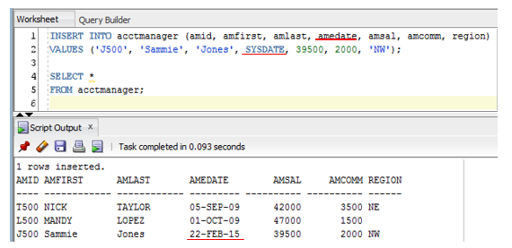

# Insert Data

[Back](../index.md)

- [Insert Data](#insert-data)
  - [INSERT INTO](#insert-into)
    - [NULL Value](#null-value)
    - [DEFAULT](#default)
    - [Built-in Function](#built-in-function)
    - [Single Quotes 插入单引号](#single-quotes-插入单引号)
    - [Virtual Column 虚拟列](#virtual-column-虚拟列)
  - [INSERT INTO SELECT](#insert-into-select)

---

## INSERT INTO

- Syntax

```SQL

-- adds values for specified columns
INSERT INTO table_name (column1, column2, column3, ...)
VALUES (value1, value2, value3, ...);

-- adds values for all the columns of the table
INSERT INTO table_name
VALUES (value1, value2, value3, ...);

```

- The data specified in the VALUES clause must be **in the same sequence** as the columns in the INSERT INTO clause. 相同顺序

- If more than one column is listed, column names must be **separated by commas** 使用逗号分隔列名

- If more than one data value is entered, they must be **separated by commas** 使用逗号分隔数据

- **non-numeric data** is enclosed in <u>single quotation marks</u> and **numeric data** requires <u>**no** quotation marks</u> 非数字类型,使用单引号.<br>包括字符类型的字段 character field 和日期类型的字段 date field.

- Remember that stored data is case sensitive. 要注意插入的字符串的大小写是否有统一的大小写,否则使用 select 时会因为大小写而出错.

---

### NULL Value

- Three methods to enter a NULL value.
  1. Uses specified column names. 使用指定列名, 没有指定的列会默认为`NULL`.
  2. Uses two single quotes. 对非数字类型字段,使用单引号`''`.
  3. Uses keyword `NULL`

### DEFAULT

- 特定字段有 default 约束. 当插入数据且忽略列名时,会自动在该字段适用默认值.

- 也可以在插入时,使用关键字`DEFAULT`关键字作为该字段的值 value.
  

### Built-in Function

- 可以使用内建函数作为插入的值.
  

### Single Quotes 插入单引号

- Enter two single quotes together in the value. 当值中含有单引号时,使用两个单引号表示`''`.

- do not use the double quote!!! 注意,不是双引号.

### Virtual Column 虚拟列

- If a virtual column is included in a table in will affect how the INSERT command can be used. The virtual column **must be ignored** in an INSERT command. 插入数据时,必须忽略虚拟列,否则会报错.

例子: 尝试向虚拟列插入值.报错.


应该去除虚拟列.


---

## INSERT INTO SELECT

- The `INSERT INTO SELECT` statement **copies data** from one table and inserts it into another table.

- The `INSERT INTO SELECT` statement requires that the <u>data types</u> in source and target tables **match**.

```sql
-- Copy all columns from one table to another table

INSERT INTO table2
SELECT * FROM table1
WHERE condition;

-- Copy only some columns from one table into another table
INSERT INTO table2 (column1, column2, column3, ...)
SELECT column1, column2, column3, ...
FROM table1
WHERE condition;

```

- Unlike other commands, the INSERT INTO command does not require the subquery to be enclosed in **parentheses**. 插入语句的查询无需使用括号.

---

[Top](#insert-data)

[Back](../index.md)
