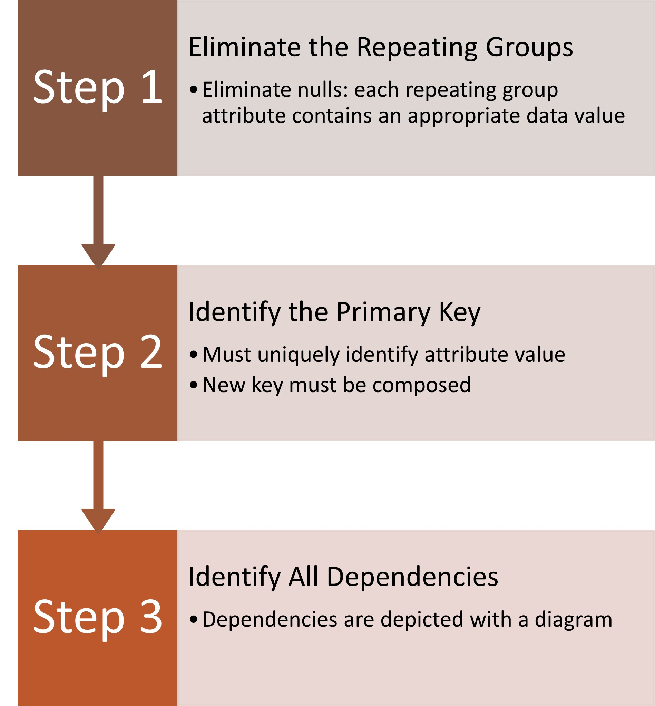
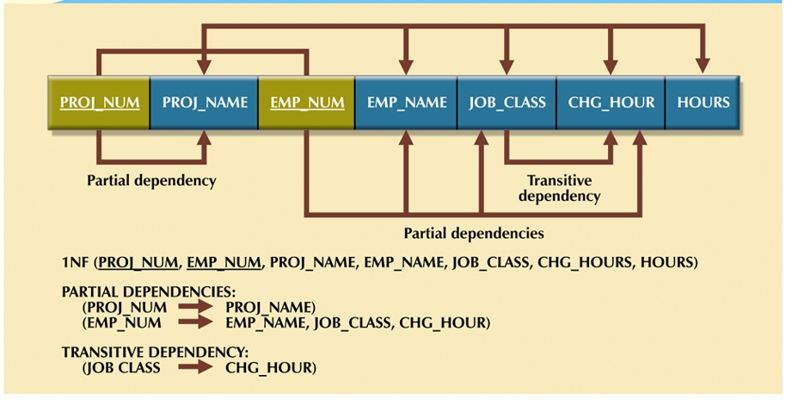
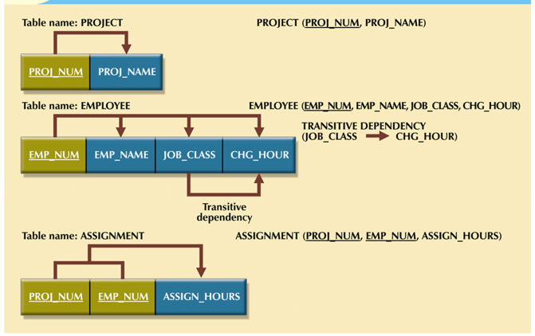
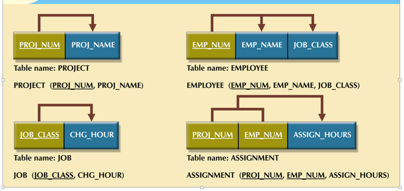

# Normalization

[Back](../index.md)

[TOC]

---

## Normalization 规范化

- `Normalization`: Process for evaluating and correcting table structures to **minimize data redundancies**.

  - Reduces data anomalies

- Series of **stages** called normal forms:

  - First normal form (1NF)
  - Second normal form (2NF)
  - Third normal form (3NF)

- `2NF` is better than `1NF`; `3NF` is better than `2NF`

  - For most business database design purposes, `3NF` is as high as needed in normalization.
  - Highest level of normalization is not always most desirable

- `Denormalization` produces a **lower** normal form

  - Increased **performance** but greater data **redundancy**

- Progressively breaks table into new set of relations based on identified dependencies.逐步分表.

- Normalization is three-step procedure.

## Conversion to First Normal Form

- First normal form describes tabular format:

  - All key attributes are defined 列定义
  - No repeating groups in the table 行唯一值
  - All attributes are dependent on primary key 主键

- All relational tables satisfy 1NF requirements
  - Some tables contain partial dependencies 部分依靠
  - Dependencies are based on part of the primary key 依靠部分主键
  - Should be used with caution

### Dependency Diagram

- Depicts all dependencies found within given table structure
- Helpful in getting bird’s-eye view of all relationships among table’s attributes
- Makes it less likely that you will overlook an important dependency

---

## Conversion to Second Normal Form

- Table is in second normal form (2NF) when:
  - It is in 1NF and
  - It includes no partial dependencies:
    - No attribute is dependent on only portion of primary key 没有依靠部分主键, 但非主键的列之间可能存在依靠(3nf 解决).
    - 在2nf中消除partial functional dependencies. 实现所有列对主键都是fully functional dependencies.

1. Step 1: Make New Tables to **Eliminate Partial Dependencies**
   - Write each key component on separate line, then write original (composite) key on last line
   - Each component will become key in new table
2. Step 2: Assign Corresponding Dependent Attributes
   - Determine attributes that are dependent on other attributes
   - At this point, most anomalies have been eliminated

---

## Conversion to Third Normal Form

- A table is in third normal form (`3NF`) when both of the following are true:
  - It is in 2NF
  - It contains **no transitive dependencies**

1. Step 1: Make New Tables to **Eliminate Transitive Dependencies**
   - For every transitive dependency, write its determinant as PK for new table
   - Determinant: any attribute whose value determines other values within a row
2. Step 2: Reassign Corresponding Dependent Attributes - Identify attributes dependent on each determinant identified in Step 1 - Name table to reflect its contents and function

---

## Improve the Design(略)

---

[TOP](#normalization)
